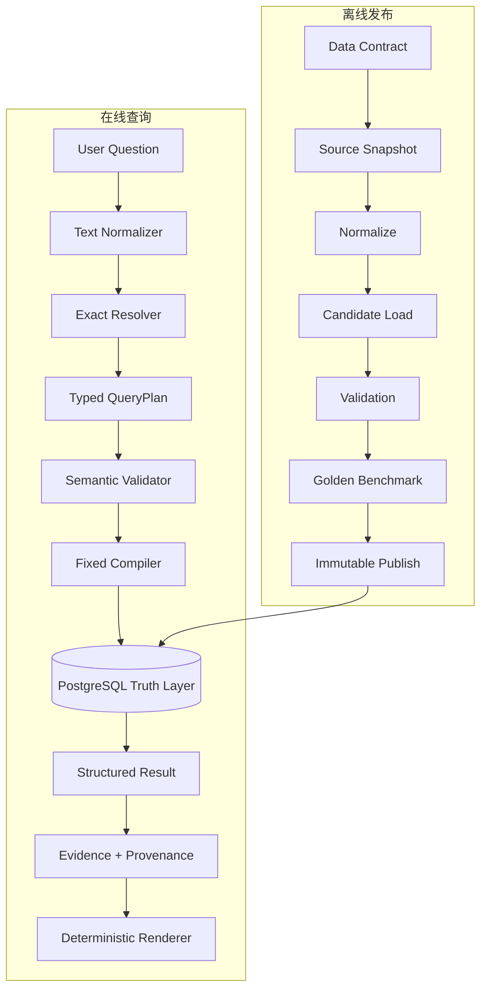

# EVE Relation V0 — 通用可审计数据检索流程规范

> **状态：** Proposed baseline  
> **版本：** V0.1  
> **更新日期：** 2026-08-13  
> **适用对象：** 结构化科研数据、公共数据目录、证据型数据库及其自然语言查询接口  
> **对应通俗说明：** [EVE_RELATION_V0_PLAIN_LANGUAGE_GUIDE.md](./EVE_RELATION_V0_PLAIN_LANGUAGE_GUIDE.md)  
> **EVE—真核系谱领域包：** [技术规范](./EVE_RELATION_V0_EVE_LINEAGE_APPLICATION.md) · [病毒学研究者 AI 入门指南](./EVE_RELATION_V0_EVE_LINEAGE_PLAIN_GUIDE.md)

“EVE Relation”在本文中只是现有项目名，不表示核心规范采用 EVE 或其他特定研究定义。

## 0. 文档边界

本规范只定义可跨研究领域复用的数据工程和检索合同，包括：

- 数据如何获得稳定身份和版本；
- 来源、处理过程、证据和责任方如何被记录；
- 数据如何校验、发布、查询和复现；
- 系统如何避免把未知、歧义或不支持的问题回答成貌似精确的事实；
- 精确统计、文档检索和生成式模型之间的边界。

本规范**不定义任何领域科学概念**，也不规定某个研究结论的判断条件、阈值、分类标准或结果词表。领域团队必须把这些内容作为独立、版本化、可引用的“领域协议包”提供；平台只验证它是否完整、自洽、可执行和可追溯，不裁定其科学正确性。

因此，本文中的 `Record` 只表示“由数据合同定义的一条可寻址记录”；`Annotation` 只表示“按照某个已声明方案做出的标注”；`Assessment` 只表示“按照某个已声明方法产生的结果”。它们都不等于永久真理。

### 0.1 规范用语

- **MUST / 必须**：不满足就不能称为 V0 合格实现。
- **SHOULD / 应当**：通常应满足；例外必须在 ADR 中解释。
- **MAY / 可以**：可选能力，不影响 V0 合格性。

### 0.2 参考基线

本规范不发明新的通用科学标准，而是参考以下广泛使用的原则、规范和数据库能力：

| 基线 | 在 V0 中的用途 |
|---|---|
| [FAIR Guiding Principles](https://doi.org/10.1038/sdata.2016.18) | 参考其可发现、可访问、可互操作、可复用的高层指导原则；FAIR 不等于开放数据 |
| [W3C PROV](https://www.w3.org/TR/prov-overview/) | 用 Entity、Activity、Agent 的关系表达来源和处理过程 |
| [JSON Schema 2020-12](https://json-schema.org/specification) | 对导入合同、QueryPlan 和 API 响应做机器可读的结构校验 |
| [PostgreSQL constraints](https://www.postgresql.org/docs/current/ddl-constraints.html) | 用主键、外键、唯一、非空和 CHECK 约束阻止无效数据落库 |

V0 采用的是这些原则和规范的工程化映射，不声称获得 FAIR 合规认证，也不声称完整实现 W3C PROV 或其他规范的所有条款。访问控制下的数据也可以按 FAIR 思想提供可发现元数据和明确访问流程。

JSON Schema 校验实例结构、类型和值约束，不会验证数据库外键、领域含义或远程 URI 是否真实存在。在 2020-12 中 `format` 默认可作为 annotation；V0 对日期、时间和 URI 必须显式启用 format assertion 或增加应用层校验。PostgreSQL `CHECK` 只适合当前行条件；跨行和跨表一致性使用复合 FK、UNIQUE、EXCLUDE，必要时使用受测 trigger 或发布 validator。

---

## 1. V0 的目标和非目标

### 1.1 一句话目标

把一份经过校验的查询计划，从指定的不可变数据发布版中取回精确记录，再连同证据和来源链一起返回。自然语言解析是位于核心合同之前的可选适配器。

```text
QueryRequest
→ UI/客户端直接提交 Typed QueryPlan，或可选 NL adapter 产生 QueryPlan proposal
→ 对 proposal 中的 label/alias 做精确对象解析（已是 stable key 时跳过）
→ Canonical Typed QueryPlan
→ 结构与语义校验
→ 固定查询编译器
→ PostgreSQL 事实层
→ 结构化结果
→ Evidence + Provenance
→ 确定性答案
```

### 1.2 V0 必须支持

| 能力 | 通用定义 |
|---|---|
| `record_detail` | 按稳定 key 返回一条记录及其公开字段 |
| `list_records` | 按已注册的字段、类别或标注条件列出记录 |
| `aggregate` | 执行已注册、定义清楚的聚合指标 |
| `compare` | 在相同基础条件下比较两个或多个分组 |
| `explain_record` | 返回记录、标注或评估所连接的证据和来源链 |
| hierarchy expansion | 当某个受控词表声明父子层级时，可查询某术语及其后代 |
| exact no-answer | 合法查询没有匹配项时返回 `no_match` |
| fail-closed | 未知、歧义、不支持或非法请求不执行事实查询 |
| release reproducibility | 每个答案明确绑定数据发布版、依赖版本和查询指纹 |

### 1.3 V0 明确不做

- 不定义任何领域对象的科学含义。
- 不把某个领域的判断结果写成平台全局布尔字段。
- 不假定所有数据都只有一个主分类、一个父节点或一套分类体系。
- 不允许用户、文档或语言模型直接生成并执行任意 SQL。
- 不让语言模型重新计算精确数量、集合关系或权威状态。
- 不把“数据库没有一行记录”解释为现实世界中的不存在。
- 不在没有明确定义分子、分母、总体范围和缺失值策略时计算比例。
- 不要求 V0 使用向量数据库、图数据库或生成式模型。
- 不把网页搜索结果临时混入已发布的结构化事实层。

---

## 2. V0 平台概念合同

这些定义只说明 V0 数据系统中的角色，不定义领域科学，也不声称这些字段名、状态值和表名是跨行业统一标准。除明确引用的外部规范外，枚举均为本项目的工程词表。

### 2.1 Dataset 和 DatasetRelease

`Dataset` 是一条长期存在的数据产品线，例如一个目录、一个项目数据集或一个公共数据库。它提供稳定的 `dataset_key` 和所有权/访问政策。

`DatasetRelease` 是该 Dataset 的一个版本化工作副本或已发布快照。candidate/validated 阶段允许在隔离区重建；进入 published 后其数据内容不可变。`current` 指针必须属于具体 Dataset；系统不存在跨所有 Dataset 的全局 current。

它必须至少包含：

- `release_key`：全局唯一、稳定、对外可见的身份；`dataset_key` 仍必须随元数据返回；
- `schema_version`：数据合同版本；
- `status`：`candidate | validated | published | deprecated | rejected`；
- `published_at`：candidate 时为空，进入 published 时写入且不再修改；
- `manifest_sha256`；
- 所包含记录和所依赖资源的确定清单；
- 许可证和访问条件；
- 生成该发布版的过程引用。

允许的生命周期是：

```text
candidate → validated → published → deprecated
                    ↘ rejected
```

只有 `published` 时数据内容才被冻结；进入 `deprecated` 只增加状态事件和原因，不改业务数据。修正必须创建新 release，并通过 `supersedes_release_key` 说明关系。默认查询只接受 `published`；具有明确权限且显式指定 key 时可以读取 `deprecated` 历史版本。

### 2.2 SourceArtifact

作为输入、输出或证据的可定位资源，例如文件、表格、数据库导出、网页快照、图片或模型文件。Artifact 独立存在；SourceSnapshot 通过关联表声明它在某次来源快照中包含哪些 artifact。处理过程生成的新 artifact 不会被误归入原始 snapshot。

最小字段：

```text
artifact_key
media_type
uri
checksum_algorithm
checksum_value
retrieved_at
license_key
access_policy
```

远程 URL 不是完整身份；内容校验和、获取时间和版本也必须记录。

### 2.3 Agent

对数据或活动负有责任的人、组织或软件。V0 至少区分：

```text
person | organization | software
```

软件 Agent 应记录名称、版本和构建标识；人和组织的公开标识应遵守隐私与授权要求。

### 2.4 ProcessRun

一次实际发生的处理活动。它引用：

- 使用的 `MethodDefinition`；
- 所有输入 `SourceArtifact` 或 Record；
- 所有输出 `SourceArtifact` 或记录；
- 一个或多个参与 Agent，以及每个 Agent 的 `role_key`；
- 开始和结束时间；
- 参数快照、代码版本和环境摘要；
- 技术执行状态。

推荐的技术状态为：

```text
not_started | running | succeeded | failed | cancelled
```

这是平台执行状态，不是领域结果。

Artifact 输入/输出分别走 `ProcessRunInput` / `ProcessRunOutput`；Record 输入走 `ProcessRunInputRecord`，Record 输出走 `Record.generated_by_run_id`。不要把不同目标塞进一个无真实外键的多态 output 表。

### 2.5 Record

某个 release 中由数据合同定义的最小可寻址业务记录。

```text
record_key          release 内稳定且唯一
logical_key         可选；用于跨 release 连接同一逻辑对象
record_type         来自受控词表
attributes_json     只允许通过已发布 schema 校验的字段
source_artifact_id  直接来源
source_locator      来源内位置及其坐标约定
```

V0 不预设 Record 是文档、样本、图像、事件还是分析结果。具体含义由 `DataContract` 声明。

### 2.6 VocabularySnapshot 和 Term

`VocabularySnapshot` 是一个受控词表或本体的明确版本。`Term` 是其中的一个术语。若该词表存在层级，可选用 `TermEdge` 和 `TermClosure` 表示父子与祖先—后代关系。

平台不得假定：

- 所有词表都是树；
- 一个术语只有一个父节点；
- 术语在不同版本中身份不变；
- 名称相同就代表同一概念。

术语身份至少由 `vocabulary_snapshot_id + term_key` 决定。

### 2.7 AnnotationScheme 和 AnnotationAssignment

`AnnotationScheme` 定义“可以如何给记录加标签”，包括：

- 方案 key 和版本；
- 使用的词表快照；
- 允许的来源类型；
- 基数规则，例如 `zero_or_more`、`zero_or_one`；
- 状态和置信度字段的 schema；
- 冲突与替代策略。

`AnnotationAssignment` 表示“某条记录在某个方案下被分配到某个术语”。release 由其 Record 确定；assignment 必须引用 scheme、term 和 run。是否要求断言级 evidence、要求何种关系和覆盖率，由版本化 AnnotationScheme evidence policy 声明并在发布时执行。

标注是有来源、有版本的断言，不是平台宣布的绝对事实。

### 2.8 MethodDefinition 和 Assessment

`MethodDefinition` 是一个版本化的方法说明，包含：

```text
method_key
version
title
definition_artifact_id
input_schema
output_schema
result_vocabulary_snapshot_id   可选
software_requirements
```

方法文档通过 SourceArtifact 的真实 FK 和 checksum 固定，不能只保存可能变化的裸 URI。离散结果可以引用 VocabularySnapshot；连续值或复杂结果只需通过 output_schema。

`Assessment` 是某次 `ProcessRun` 按该方法对某个对象产生的结果：

```text
assessment_key
record_id
process_run_id
result_code
result_payload
```

Assessment 通过 `process_run_id` 得到唯一 MethodDefinition，避免同一结果同时声称两种方法。`result_code` 和可选的 applicability 字段都由对应 MethodDefinition 的 `output_schema` 或结果词表定义；平台不固定它们的领域取值，也不要求每种方法都必须有离散结果词表。没有全局通用的“通过/失败”科学含义。

### 2.9 EvidenceItem 和 EvidenceLink

`EvidenceItem` 是可以直接定位的支持材料，例如某个文件区域、网页快照、表格行或处理输出。它必须引用 SourceArtifact 和 locator。

EvidenceLink 用真实外键把证据连接到具体断言。V0 至少支持：

```text
supports | contradicts | context
```

应使用分类型连接表：

```text
record_evidence（含 field_path 或 assertion_key）
annotation_evidence
assessment_evidence
```

Record 级连接必须进一步指明 `field_path` 或 `assertion_key`，除非证据明确支持整条记录的存在。否则“这份证据支持发布日期”与“支持标题”无法机械区分。复杂项目可以把字段级断言提升为独立 Assertion 实体。

禁止仅用 `target_type + target_id` 模拟多态外键，因为数据库无法保证目标真实存在。`supports | contradicts | context` 是 V0 的本地关系词表，不是 W3C PROV 或 FAIR 规定的全球统一枚举；项目可以通过版本化 evidence vocabulary 扩展，但不得改变已有码的含义。

### 2.10 Provenance

Provenance 回答：谁使用什么输入、按照什么方法、在何时产生了什么输出。

V0 采用 W3C PROV 的核心思路进行关系型映射：

| W3C PROV 概念 | V0 映射 |
|---|---|
| Entity | SourceArtifact、Record、DatasetRelease、方法文档 |
| Activity | ProcessRun、导入、校验、发布 |
| Agent | 人、组织、软件 |

MethodDefinition 可映射为 W3C PROV 中的 Plan/Entity；`RunAgent` 关联必须保存 `role_key`，用于区分执行、审核、发布等责任。这仍只是 V0 的关系型映射，不是完整 PROV 序列化。

Evidence 和 Provenance 不同：

```text
Evidence   = 某条断言的直接依据在哪里
Provenance = 这份数据由谁、用什么输入和过程产生
```

### 2.11 MetricDefinition

任何可查询指标都必须先注册。定义至少包括：

```text
metric_key
label
unit
subject_type
aggregation
distinct_key
allowed_filters
allowed_group_by
null_policy
population_scope
numerator_definition      比例类指标必填
denominator_definition    比例类指标必填
```

名称相同不代表计算相同。API 只接受 `metric_key`，不接受自由文本指标名。

### 2.12 FieldDefinition、OperatorDefinition 和 Alias

可查询字段不能只是代码里的自由字符串。每个 DataContract 必须发布 FieldDefinition：

```text
field_key
value_type
source_record_type
allowed_operator_keys
compiler_expression_key
required_join_keys
sensitivity
filterable
sortable
groupable
```

OperatorDefinition 是核心白名单，例如 `eq`、`in`、`gte`、`lt`、`is_a`；每个 operator 明确支持的值类型和 null 语义。`compiler_expression_key` 只能映射到经过测试的编译器函数，不能保存或接受客户端 SQL。

若支持名称解析，还必须有 typed Alias/Label 模型，至少记录目标类型和真实 FK、locale、alias 类型、normalization profile，以及适用 release 或 vocabulary snapshot。Alias 可以冲突；冲突时 resolver 返回候选，不按 OR 自动合并。

---

## 3. 通用系统架构



### 3.1 推荐实现栈

| 层 | V0 推荐技术 | 原因 |
|---|---|---|
| API | FastAPI | 明确 HTTP/JSON 边界，自动生成 OpenAPI |
| Python validation | Pydantic 2 | Typed model、跨字段校验、结构化错误 |
| 公共合同 | JSON Schema 2020-12 | 与语言无关、可版本化、可由客户端复用 |
| ORM/compiler | SQLAlchemy 2 | 参数绑定和可测试的固定查询构造 |
| 数据库 | PostgreSQL | 事务、约束、索引、只读角色和成熟运维 |
| schema migration | Alembic | 数据库结构变更可审计、可升级、可回退 |
| tests | pytest | 单元、集成和 golden cases |
| packaging | `uv` + lockfile | 固定依赖解析结果，减少环境漂移 |
| container | Docker/Compose | 本地集成和部署边界；不替代生产编排 |

向量检索、知识图谱和 LLM 都是后续可选适配器，不是结构化事实层的依赖。

### 3.2 信任边界

```text
不可信：用户文本、上传文件、网页、检索文档、LLM 输出
   ↓ 必须解析和校验
可信合同：已发布 schema、stable key、metric registry、compiler whitelist
   ↓ 只允许参数化执行
事实层：指定 release 的只读 PostgreSQL
```

语言模型将来可以提出 QueryPlan proposal，但不得：

- 直接执行 SQL；
- 引入 schema 中不存在的字段；
- 删除无法解析的条件后扩大查询；
- 用文献文本覆盖结构化事实；
- 修改数据库返回的数字和 ID 集合。

---

## 4. 离线发布流程

### Stage 0：注册数据合同

#### 输入

- 记录单位和身份规则；
- 字段、类型、单位和允许值；
- 缺失值与适用性表达；
- 受控词表、标注方案和方法定义；
- 指标、过滤器和分组定义；
- 证据最低要求；
- 许可证、访问和隐私要求。

#### 技术

- Markdown 决策文档；
- JSON Schema；
- 数据字典；
- ERD；
- 受控词表；
- ADR；
- 领域专家与数据管理员联合评审。

#### 解决的问题

防止不同数据生产者用同一个字段表达不同意思，也防止查询层对未定义概念自行猜测。

#### 输出

```text
contracts/<contract_version>/
├── data-contract.schema.json
├── record.schema.json
├── query-plan.schema.json
├── response.schema.json
├── data-dictionary.md
├── metric-registry.yaml
├── annotation-schemes/
├── method-definitions/
├── vocabulary-dependencies.yaml
└── limitations.md
```

#### 发布门禁

- 所有公开字段有类型、单位或格式说明；
- stable key 的生成和作用域明确；
- 每个指标有精确计算合同；
- 每个领域结果码都能追到具体方法版本；
- 未定义的问题明确标成 unsupported，而不是临时推断。

### Stage 1：封存来源快照

#### 输入

- 原始文件或数据库导出；
- 外部词表和方法文档；
- 来源元数据；
- 获取地址、时间和版本；
- 许可证与访问条件。

#### 技术

- 只读 source snapshot；
- SHA-256 manifest；
- 内容寻址或对象存储；
- 许可证清单；
- W3C PROV 风格的 Agent/Activity/Entity 元数据。

#### 解决的问题

防止远程来源更新后无法解释旧答案，也防止来源许可不清的数据被误公开。

#### 输出

```text
source_snapshot/<snapshot_key>/
├── artifacts/
├── source-metadata.jsonl
├── agents.jsonl
├── licenses.json
└── manifest.sha256
```

#### 发布门禁

- 每个 artifact 都有 checksum；
- 每个远程资源记录 retrieved_at；
- 每个公开资源有明确许可或使用依据；
- 下载失败、内容漂移和许可未知都会阻止发布。

### Stage 2：标准化和转换

#### 输入

- 冻结的 source snapshot；
- 数据合同；
- 每种来源格式对应的 adapter；
- stable key 规则；
- 受控词表映射表。

#### 技术

- Python adapter；
- ETL；
- Pydantic/JSON Schema validation；
- Unicode normalization；
- 显式类型转换；
- 确定性 stable key；
- 结构化错误报告。

#### 解决的问题

把列名、日期、标识符和空值表达不同的来源，转换成同一份可验证合同，同时保留每个值来自哪里。

#### 标准输出

```text
normalized/<release_key>/
├── dataset_releases.csv
├── data_contracts.csv
├── release_contracts.csv
├── source_snapshots.csv
├── release_snapshots.csv
├── snapshot_artifacts.csv
├── release_vocabularies.csv
├── release_annotation_schemes.csv
├── release_methods.csv
├── source_artifacts.csv
├── agents.csv
├── method_definitions.csv
├── process_runs.csv
├── process_run_agents.csv
├── process_run_inputs.csv
├── process_run_input_records.csv
├── process_run_outputs.csv
├── records.csv
├── vocabulary_snapshots.csv
├── terms.csv
├── term_edges.csv
├── annotation_schemes.csv
├── annotation_assignments.csv
├── assessments.csv
├── evidence_items.csv
├── record_evidence.csv
├── annotation_evidence.csv
├── assessment_evidence.csv
├── field_definitions.csv
├── operator_definitions.csv
├── term_aliases.csv
├── metric_definitions.csv
├── expected_statistics.yaml
└── validation-report.json
```

没有层级词表、标注或评估的数据集可以省略相应可选文件；省略必须由数据合同允许。

#### 发布门禁

- 相同输入、代码和参数产生相同 normalized manifest；
- 不能解析的行进入 quarantine，不得静默丢弃；
- `null`、未知、不适用、未采集和空字符串不得混为一个值；
- adapter 报告读取数、输出数、隔离数和原因统计。

### Stage 3：导入 candidate release

#### 输入

- 已通过 schema validation 的 normalized package；
- Alembic migration；
- 空的 candidate database/schema。

#### 技术

- PostgreSQL；
- SQLAlchemy；
- Alembic；
- 单事务导入；
- PK/FK/UNIQUE/CHECK/NOT NULL；
- 可选 hierarchy closure 构建；
- rollback。

#### 解决的问题

把“文件看起来能读”提升为“数据库可以机械保证引用完整和关键约束成立”。任何一步失败，整次导入不留下半成品。

#### 发布门禁

- release 存在且状态为 candidate；
- 所有外键可解析；
- release-scoped key 无重复；
- 所有 run 输入和输出关系完整；
- 词表层级无合同禁止的循环；
- 导入计数与 adapter 报告一致；
- 不允许启动 API 时自动建表或自动灌 demo 数据。

### Stage 4：质量、完整性和可复现性校验

#### 输入

- candidate database；
- 数据合同；
- expected statistics；
- source manifest；
- evidence coverage policy。

#### 技术

- SQL reconciliation；
- schema and referential validation；
- checksum verification；
- property/invariant tests；
- provenance graph traversal；
- 机器可读 validation report。

#### 必查项目

1. 必填字段、数据类型、数值和日期范围；
2. 主键、外键和 release 作用域；
3. Record → SourceArtifact 的可追溯性；
4. Annotation → Scheme → VocabularySnapshot → Term 的版本一致性；
5. Assessment → MethodDefinition → ProcessRun 的版本一致性；
6. ProcessRun 的所有输入、输出、Agent 和参数记录；
7. 公开断言的 supporting evidence 覆盖；
8. 数据库重算值与 expected statistics 一致；
9. source、normalized 和 database 数量对账；
10. release manifest 可从数据库重新生成并得到相同 checksum。

#### 不允许的通用推断

- 没有 AnnotationAssignment，不等于记录属于“未分类”类别；
- 没有 Assessment，不等于某个结果码；
- ProcessRun 失败，不等于领域结果为负；
- 查询无匹配行，不等于现实世界不存在相应对象；
- 低置信度、缺失值和不适用不是同一种状态。

#### 输出

```json
{
  "release_key": "release:example-2026-08",
  "validator_version": "1.0.0",
  "status": "passed",
  "checks": [],
  "errors": [],
  "warnings": [],
  "generated_at": "2026-08-13T00:00:00Z"
}
```

任何 required check 失败都必须阻止发布。

### Stage 5：Golden benchmark

#### 输入

- candidate database；
- 版本化 gold questions；
- 期望的解析对象、QueryPlan、结果集合、聚合值和响应状态。

#### 技术

- pytest；
- JSONL/YAML fixtures；
- 临时 PostgreSQL；
- exact set equality；
- deterministic snapshots；
- adversarial cases。

#### 解决的问题

证明系统不仅能返回一个合理答案，还必须解析正确对象、保留全部条件、不多返回、不少返回，并在不能回答时停止。

#### 每个案例至少断言

```text
resolution_status
resolved_keys
query_plan
applied_filter_ids
fact_retrieval_executed
record_keys（完整集合相等）
metric_values
response_status
evidence_links
release_key
```

只验证 `expected ⊆ actual` 不合格；额外错误记录也必须导致失败。

#### 最小案例类别

- 精确 ID；
- canonical label；
- alias；
- 未知对象；
- 歧义对象；
- 无匹配；
- 单条件与多条件交集；
- 层级展开；
- 比较查询；
- 分页不改变总数；
- 不支持的 metric；
- release 隔离；
- 证据和 provenance；
- 文本提示注入不改变 QueryPlan；
- 每个已修复 bug 的回归案例。

### Stage 6：原子发布

#### 输入

- 所有 required validation 通过的 candidate；
- 通过的 golden benchmark；
- release manifest；
- 审批记录。

#### 技术

- 不可变 release；
- PostgreSQL transaction；
- 原子 `current_release` 指针切换；
- Git tag/commit；
- signed manifest（推荐）；
- rollback pointer；
- readiness check。

#### 解决的问题

避免查询流量看到一半旧数据、一半新数据；发现问题时可以切回前一发布版，同时保留出错版本用于审计。

#### 发布后必须成立

- 旧 release 仍可按 key 查询；
- 每个 Dataset 最多有一个 `current`，且它只指向该 Dataset 的 published release；
- API 的 release 信息来自数据库，不来自可任意漂移的环境变量；
- 从空数据库可以用 manifest、migration 和 normalized package 重建；
- 重建后的关键表 checksum 与发布记录一致。

---

## 5. 关系数据模型

### 5.1 核心 ERD

```mermaid
erDiagram
    DATASET ||--o{ DATASET_RELEASE : publishes
    PROCESS_RUN o|--o{ DATASET_RELEASE : generates
    DATASET_RELEASE ||--o{ RECORD : contains
    DATASET_RELEASE ||--o{ METRIC_DEFINITION : exposes
    DATA_CONTRACT ||--o{ FIELD_DEFINITION : declares
    OPERATOR_DEFINITION }o--o{ FIELD_DEFINITION : allowed_for

    DATASET_RELEASE ||--o{ RELEASE_CONTRACT : pins
    DATA_CONTRACT ||--o{ RELEASE_CONTRACT : selected_by
    DATASET_RELEASE ||--o{ RELEASE_SNAPSHOT : pins
    SOURCE_SNAPSHOT ||--o{ RELEASE_SNAPSHOT : selected_by
    DATASET_RELEASE ||--o{ RELEASE_VOCABULARY : pins
    VOCABULARY_SNAPSHOT ||--o{ RELEASE_VOCABULARY : selected_by
    DATASET_RELEASE ||--o{ RELEASE_SCHEME : pins
    ANNOTATION_SCHEME ||--o{ RELEASE_SCHEME : selected_by
    DATASET_RELEASE ||--o{ RELEASE_METHOD : pins
    METHOD_DEFINITION ||--o{ RELEASE_METHOD : selected_by

    SOURCE_SNAPSHOT ||--o{ SNAPSHOT_ARTIFACT : contains
    SOURCE_ARTIFACT ||--o{ SNAPSHOT_ARTIFACT : member_of
    SOURCE_ARTIFACT o|--o{ RECORD : directly_sources
    PROCESS_RUN o|--o{ RECORD : generates
    SOURCE_ARTIFACT ||--o{ EVIDENCE_ITEM : contains

    METHOD_DEFINITION ||--o{ PROCESS_RUN : defines
    PROCESS_RUN ||--o{ RUN_AGENT : has
    AGENT ||--o{ RUN_AGENT : participates
    PROCESS_RUN ||--o{ PROCESS_RUN_INPUT : uses
    SOURCE_ARTIFACT ||--o{ PROCESS_RUN_INPUT : input_to
    PROCESS_RUN ||--o{ PROCESS_RUN_INPUT_RECORD : uses
    RECORD ||--o{ PROCESS_RUN_INPUT_RECORD : input_to
    PROCESS_RUN ||--o{ PROCESS_RUN_OUTPUT : generates
    SOURCE_ARTIFACT ||--o{ PROCESS_RUN_OUTPUT : output_of

    VOCABULARY_SNAPSHOT ||--o{ TERM : contains
    TERM ||--o{ TERM_ALIAS : named_by
    TERM ||--o{ TERM_EDGE : parent
    TERM ||--o{ TERM_EDGE : child
    TERM ||--o{ TERM_CLOSURE : ancestor
    TERM ||--o{ TERM_CLOSURE : descendant

    ANNOTATION_SCHEME }o--|| VOCABULARY_SNAPSHOT : uses
    RECORD ||--o{ ANNOTATION_ASSIGNMENT : annotated_by
    ANNOTATION_SCHEME ||--o{ ANNOTATION_ASSIGNMENT : governs
    TERM ||--o{ ANNOTATION_ASSIGNMENT : assigns
    PROCESS_RUN ||--o{ ANNOTATION_ASSIGNMENT : produced

    RECORD ||--o{ ASSESSMENT : assessed
    PROCESS_RUN ||--o{ ASSESSMENT : produced

    RECORD ||--o{ RECORD_EVIDENCE : has
    EVIDENCE_ITEM ||--o{ RECORD_EVIDENCE : linked
    ANNOTATION_ASSIGNMENT ||--o{ ANNOTATION_EVIDENCE : has
    EVIDENCE_ITEM ||--o{ ANNOTATION_EVIDENCE : linked
    ASSESSMENT ||--o{ ASSESSMENT_EVIDENCE : has
    EVIDENCE_ITEM ||--o{ ASSESSMENT_EVIDENCE : linked
```



### 5.2 Release 依赖

Release 不能只是一个显示字符串。它必须固定所使用的：

```text
vocabulary_snapshot
annotation_scheme
method_definition
source_snapshot
software_build
contract_version
```

`ReleaseDependency` 可以作为 API 或导入文件中的逻辑总称，但关系数据库实现必须使用带真实外键的 typed association，例如 `ReleaseContract`、`ReleaseSnapshot`、`ReleaseVocabulary`、`ReleaseScheme` 和 `ReleaseMethod`。禁止使用只有 `dependency_type + dependency_id`、却无法建立外键的多态引用。

同一 release 可以固定多个依赖，但每种角色的基数由数据合同声明。软件构建、配置和模型文件作为 SourceArtifact 进入相应 ProcessRun 的 inputs；不能只写一个无法校验的版本字符串。

### 5.3 Record 的来源路径

直接导入的 Record 可以引用 SourceArtifact；处理过程生成的 Record 可以引用 ProcessRun。每条公开 Record 必须至少存在一条可遍历的来源路径：

```text
Record → SourceArtifact
或
Record → ProcessRun → ProcessRunInput → SourceArtifact
```

两条路径可以同时存在。数据库的 nullable FK、CHECK 约束和发布 validator 必须共同保证不会出现完全无来源的公开 Record。

### 5.4 身份与唯一性

- `UNIQUE(release_key)`；
- `UNIQUE(release_id, record_key)`；
- `UNIQUE(vocabulary_snapshot_id, term_key)`；
- `UNIQUE(annotation_scheme_id, scheme_local_key)`；
- `UNIQUE(method_key, version)`；
- alias 不要求全局唯一；碰撞必须返回歧义候选；
- 数据库内部整数 ID 不得作为公共 API 的持久身份；
- 同一个 `logical_key` 可以出现在多个 release 中。

`Dataset.current_release_id` 应通过 `(dataset_id, current_release_id) → DatasetRelease(dataset_id, id)` 复合外键限制在本 Dataset 内；发布事务或受测 trigger/validator 还要确认目标状态为 published。`supersedes_release_id` 同样必须指向同一 Dataset 的历史 release。

### 5.5 Locator

来源位置必须显式声明类型和坐标约定，例如：

```json
[
  {"type":"page","page":12},
  {"type":"line_range","start":40,"end":51,"end_inclusive":true},
  {"type":"character_range","start":100,"end":160,"index_base":0,"end_inclusive":false},
  {"type":"time_range","start_ms":1500,"end_ms":4200}
]
```

V0 不规定所有领域使用同一种坐标体系；它只要求约定不能被隐含。

### 5.6 Annotation 基数

平台不硬编码“每条记录恰好一个主分类”。基数由 `AnnotationScheme.cardinality` 声明并由数据库或发布 validator 执行。允许的例子包括：

```text
zero_or_one
exactly_one
zero_or_more
one_or_more
```

如果方案支持 primary assignment，primary 的唯一性也必须在“record + scheme + release”作用域内约束。

### 5.7 评估结果

如果 MethodDefinition 声明了受控结果词表，`Assessment.result_code` 必须属于该词表；如果输出是连续值或复杂对象，则 `result_payload` 必须通过该方法的 `output_schema`。平台不解释结果的科学意义，只能展示：

> 该对象在方法 M 的版本 V 下得到结果 R。

方法更新后必须创建新 MethodDefinition、新 ProcessRun 和新 Assessment，不得覆盖旧结果。Assessment 不再单独保存一个可能与 Run 冲突的 method FK；方法由 `Assessment → ProcessRun → MethodDefinition` 唯一确定。

### 5.8 跨表版本一致性

只靠单列外键无法保证“引用存在且属于同一版本”。实现必须优先使用 composite UNIQUE/FK；无法由 PostgreSQL 声明式表达的条件进入发布 validator。`CHECK` 只用于当前行，不能承担跨行或跨表检查。至少保证：

- `TermEdge(snapshot_id,parent_id,child_id)` 和 TermClosure 的两端通过复合 FK 引用同一 snapshot 下的 Term；
- AnnotationAssignment 通过 `(scheme_id,snapshot_id)` 和 `(snapshot_id,term_id)` 复合关系，或等价 trigger/validator，保证 Term 属于 AnnotationScheme 固定的 VocabularySnapshot；
- Record、AnnotationAssignment、Assessment、ProcessRun 及其依赖都被当前 DatasetRelease 明确包含或固定；
- Assessment 的方法只由其 ProcessRun 确定；
- DatasetRelease 的 `generated_by_run_id` 指向成功完成的发布活动；
- Release typed association 中的每个依赖 ID 与声明角色一致。

这些检查必须有数据库 constraint test 或 validator integration test，不能只写在文档中。

---

## 6. 在线查询流程

### Step 1：API 接收请求

#### 输入

- QueryPlan proposal；
- 可选自然语言文本；只有启用并声明相应 adapter 时才解析；
- 可选 `release_key`；
- 分页和输出格式。

#### 技术

- FastAPI；
- Pydantic；
- OpenAPI；
- request ID；
- auth/rate limit（公开部署时）。

#### 输出

合法的 `QueryRequest`，或结构化 4xx 错误。输入长度、编码和字段必须在此处限制。V0 核心保证 Typed QueryPlan API；自然语言端点属于可选 adapter，并且必须声明支持的语言、语法范围和独立 benchmark。

### Step 2：文本规范化

#### 技术

- 按 identifier namespace 注册的 normalization policy；
- 仅在合同允许时使用 Unicode NFKC 或大小写折叠；
- 空白和标点规范化；
- 保留原始文本；
- 语言和 locale 明确记录。

#### 解决的问题

为允许规范化的名字或 ID 生成 lookup key，同时永远保留并返回 canonical/raw value。URL path、checksum 和部分外部 ID 可能大小写或 Unicode 敏感；没有 namespace policy 时不得改写。这样既处理允许的表面差异，也避免把不同概念做模糊合并。

### Step 3：精确对象解析

解析顺序：

```text
稳定公开 ID
→ stable key
→ 指定 scheme/snapshot 内的 canonical label
→ 人工维护 alias
→ 无法唯一解析则停止
```

#### 允许的元数据查询

- release 是否存在并已发布；
- key 或 alias 对应哪些候选；
- scheme、term、method 和 metric 是否存在；
- 某字段是否可过滤或分组。

#### 失败状态

| 状态 | 行为 |
|---|---|
| `UNKNOWN_ENTITY` | 不执行事实查询，返回未知片段 |
| `AMBIGUOUS_ENTITY` | 不执行事实查询，返回候选及区分信息 |
| `RELEASE_NOT_FOUND` | 不执行事实查询 |
| `RELEASE_NOT_QUERYABLE` | 非公开状态下不执行；授权预览或显式历史模式按 policy 单独判定 |

禁止把未识别条件删除后查询全库。

### Step 4：构造 Typed QueryPlan

通用贯穿问题：

> 在 2026-08 发布版中，2025 年发布、访问状态为 public、主题属于 Database（包含子主题）的 report 有多少条？

示例 QueryPlan：

```json
{
  "plan_version": "1.0",
  "release_key": "release:example-2026-08",
  "intent": "aggregate",
  "filters": [
    {
      "filter_id": "f1",
      "field": "record_type",
      "operator": "in",
      "value": ["report"]
    },
    {
      "filter_id": "f2",
      "field": "annotation_term",
      "operator": "is_a",
      "value": {
        "scheme_key": "topic-scheme-v1",
        "term_key": "topic:database",
        "include_descendants": true
      }
    },
    {
      "filter_id": "f3",
      "field": "published_at",
      "operator": "gte",
      "value": "2025-01-01T00:00:00Z"
    },
    {
      "filter_id": "f3b",
      "field": "published_at",
      "operator": "lt",
      "value": "2026-01-01T00:00:00Z"
    },
    {
      "filter_id": "f4",
      "field": "access_status",
      "operator": "eq",
      "value": "public"
    }
  ],
  "metric_key": "distinct_record_count",
  "group_by": [],
  "page": {"limit": 50, "cursor": null}
}
```

注意：`field` 和 `operator` 不是任意字符串。它们必须来自当前 schema 的白名单注册表。

### Step 5：语义校验

Validator 必须检查：

1. JSON Schema 和 Pydantic 结构；
2. release 存在、已发布且依赖完整；
3. 所有 stable key 在相应作用域中存在且唯一；
4. filter field、operator 和 value 类型兼容；
5. scheme 确实使用该 term 所属 vocabulary snapshot；
6. `include_descendants` 只用于声明层级关系的 scheme；
7. metric 支持这些 filters 和 group_by；
8. 比较组共享的 base filters 没有丢失；
9. 比例指标的总体、分子、分母和缺失策略齐全；
10. 查询规模、分页、超时和权限符合策略；
11. 每个用户条件都有对应 filter，且无未消费条件。

输出只能是：

```text
ValidatedQueryPlan
或
needs_clarification / invalid / unsupported
```

后面三种状态的 `fact_retrieval_executed` 必须为 `false`。

### Step 6：固定编译器

#### 技术

- SQLAlchemy expression API；
- 参数绑定；
- intent-specific compiler；
- filter/metric whitelist；
- statement timeout；
- 最大返回行数；
- query fingerprint。

#### 编译合同

编译器输入只能是 `ValidatedQueryPlan`。编译结果必须报告：

```text
compiler_version
sql_template_hash
bound_parameter_summary
applied_filter_ids
estimated_cost_class
```

必须满足：

```text
set(input_filter_ids) == set(applied_filter_ids)
```

任何未知 intent、metric、field、operator 或 join 都立即拒绝，不允许降级。

### Step 7：PostgreSQL 执行

#### 技术约束

- 查询账号只读；
- 固定 `statement_timeout`；
- 参数化查询；
- release 条件强制加入每个事实查询；
- 聚合在分页前计算；
- 列表使用稳定排序和 cursor pagination；
- 请求取消时取消数据库查询；
- 审计日志不记录敏感原文或凭据。

#### 解决的问题

提供单一结构化事实源，让同一 QueryPlan 在同一 release 上产生相同结果。

### Step 8：构造 StructuredResult

```json
{
  "status": "ok",
  "answer_facts": {
    "metric_key": "distinct_record_count",
    "value": 3,
    "matched_record_count": 3
  },
  "evidence_coverage": {
    "policy_key": "evidence-policy-v1",
    "status": "complete",
    "audit_export_handle": "audit:query-example"
  },
  "provenance": {
    "dataset_key": "dataset:example-reports",
    "release_key": "release:example-2026-08",
    "contract_version": "1.0",
    "source_snapshot_keys": ["snapshot:reports-2026-08"],
    "annotation_scheme_keys": ["topic-scheme-v1"],
    "vocabulary_snapshot_keys": ["topic-vocabulary-v1"],
    "query_plan_hash": "sha256:...",
    "compiler_version": "1.0.0",
    "sql_template_hash": "sha256:...",
    "generated_at": "2026-08-13T00:00:00Z"
  },
  "execution": {
    "metadata_lookup_executed": true,
    "fact_retrieval_executed": true,
    "applied_filter_ids": ["f1", "f2", "f3", "f3b", "f4"]
  },
  "warnings": [],
  "errors": []
}
```

### Step 9：连接 Evidence 和 Provenance

- detail/list 对返回的公开断言按 scheme policy 返回 typed evidence links；
- aggregate/compare 不内嵌全部匹配记录及其证据，而返回 evidence coverage summary 和受权限控制的审计导出句柄；
- evidence locator 应足以让使用者找到原位置；
- provenance 至少包含 release、contract、source snapshot、相关 run 和软件版本；
- 若证据覆盖不足，结果必须显式标记，不能由 renderer 补写理由；
- deprecated 或被新版本替代的 release 仍保留历史来源链；默认查询与显式历史查询行为必须由 release policy 明确。

### Step 10：确定性渲染

Renderer 只读取 StructuredResult，不重新访问数据库，也不重新计算。

示例：

> 发布版 `release:example-2026-08` 中共有 3 条记录符合全部条件。

`no_match` 示例：

> 查询已在指定发布版执行，没有找到同时符合这些条件的记录。这只描述该发布版中的匹配结果，不代表现实世界中不存在相应对象。

未知对象示例：

> 无法唯一识别 “Databse”。事实查询未执行。请从候选主题中选择或提供稳定 key。

生成式模型不得把 `no_match`、方法定义中的不同 `result_code`、执行失败或缺失值互相改写。

---

## 7. QueryPlan 和响应状态合同

### 7.1 Intent 白名单

```text
record_detail
list_records
aggregate
compare
explain_record
```

QueryPlan 和 Result 必须是以 `intent` 为 discriminator 的 tagged union，而不是一个所有字段都可选的“大对象”：

| intent | 必填字段 | 禁止/不适用字段 | 结果主体 |
|---|---|---|---|
| `record_detail` | `release_key`, `record_key` | `metric_key`, `groups`, `page` | 单条 Record，或 `no_match` |
| `list_records` | `release_key`, `filters`, `page` | `metric_key`, `groups` | 稳定排序的当前页、total、cursor |
| `aggregate` | `release_key`, `filters`, `metric_key` | `record_key`, `groups`, `page` | metric value、matched count、coverage summary；不内嵌全集 |
| `compare` | `release_key`, `base_filters`, `groups`, `metric_key` | `record_key`, `page` | 每组 metric、matched count 和 group status |
| `explain_record` | `release_key`, `record_key`, `evidence_policy_key` | `metric_key`, `groups`, `page` | Record assertions、Evidence、Provenance |

公共字段至少包括 `plan_version`、`release_key`、`intent` 和可选 `request_locale`。每个 variant 使用独立 JSON Schema/Pydantic model；非法字段必须报错，不能静默忽略。

若计划来自自然语言 adapter，还必须保存唯一的 `condition_id`、来源片段引用，以及 `condition_id → filter_id` 映射。所有 filter ID 唯一，重复即非法；validator 同时检查“原始条件全覆盖”和“计划 filters 全编译”。原始敏感文本不进入普通日志，只保存允许的 hash/offset 或受保护审计引用。

### 7.2 响应状态

| 状态 | 是否执行事实查询 | 含义 |
|---|---:|---|
| `ok` | 是 | 合法执行且有结果 |
| `no_match` | 是 | detail/list 查询合法执行但无匹配记录 |
| `needs_clarification` | 否 | 对象或意图不唯一 |
| `invalid` | 否 | 请求或计划违反合同 |
| `unsupported` | 否 | V0 没有对应能力或指标 |
| `forbidden` | 否 | 请求方无权限 |
| `error` | 可能 | 技术失败；不得伪装成领域结果 |

聚合查询即使匹配数为 0，也返回 `status=ok`、`value=0`、`matched_record_count=0`；它不是传输错误，也不使用 `no_match`。Golden benchmark 必须覆盖这一区别。

顶层响应状态与各阶段错误码分开。确定映射至少包括：

```text
UNKNOWN_ENTITY / AMBIGUOUS_ENTITY → needs_clarification
PLAN_SCHEMA_INVALID / TYPE_MISMATCH → invalid
UNSUPPORTED_INTENT / UNSUPPORTED_METRIC → unsupported
RELEASE_NOT_FOUND → invalid
RELEASE_NOT_QUERYABLE → forbidden 或 invalid（取决于是否泄露其存在）
QUERY_EXECUTION_FAILED → error
```

`execution` 另有独立状态：

```text
not_attempted | running | succeeded | failed | cancelled
```

它不能由顶层 `status` 猜测。compare 中某组匹配数为 0 时，该组仍是 `group_status=ok`、`value=0`，整个 compare 仍可成功。

### 7.3 比较查询

比较计划必须显式分开：

```json
{
  "base_filters": ["所有组共同条件"],
  "groups": [
    {"group_key": "a", "filters": ["A 独有条件"]},
    {"group_key": "b", "filters": ["B 独有条件"]}
  ]
}
```

编译器不得在构造组条件时清空 base filters。测试必须断言每组的完整 record set，以及 overall 与 group values 的关系。

### 7.4 比例和比率

V0 不一概禁止比例，但只有以下信息齐全时才可注册：

- numerator；
- denominator；
- population scope；
- eligibility/applicability policy；
- missing-data policy；
- 去重单位；
- 时间或 release 范围；
- reconciliation tests。

否则返回 `unsupported`，不能退化成一个计数。

---

## 8. Evidence、Provenance 和引用政策

### 8.1 最低证据覆盖

- 每条公开 Record 至少可追到一个 SourceArtifact；
- 每条公开 AnnotationAssignment 至少有一条 `supports` evidence，或按方案明确标为“无需断言级证据”；
- 每条公开 Assessment 至少可追到 MethodDefinition、ProcessRun 和输入 artifact；
- `contradicts` 和 `context` 不能替代 required supporting evidence；
- evidence 自身的来源也必须进入 manifest。

### 8.2 来源冲突

系统可以同时保存互相冲突的断言，但必须：

- 分别记录来源；
- 不覆盖历史记录；
- 不把冲突自动合并成一个结论；
- 按已发布的 resolution policy 选择默认展示；
- 在解释结果中显式暴露冲突。

### 8.3 可复现响应

每个成功事实响应至少返回：

```text
release_key
contract_version
query_plan_hash
compiler_version
sql_template_hash
source_snapshot keys
relevant method/scheme/vocabulary versions
generated_at
```

---

## 9. RAG 和 LLM 的位置

### 9.1 V0 默认路由

| 问题 | 执行层 |
|---|---|
| 哪些记录、多少、比较、字段值 | PostgreSQL 结构化查询 |
| 某条公开断言的证据在哪里 | Evidence tables + source locator |
| 某份方法文档讲了什么 | 可选文档 RAG |
| 不明确的对象或指标 | 澄清或拒答 |

### 9.2 后续引入文档 RAG 时

- 使用单独、版本化、许可清楚的 document corpus；
- chunk 必须记录 document ID、页码/章节、checksum、parser version 和 corpus release；
- 文档 RAG 只能解释和引用，不能改写 PostgreSQL 返回的精确事实；
- Hybrid 查询必须先获得结构化锚点，再检索相关文档；
- RAG 评价与结构化查询评价分开；
- 文档内容按不可信输入处理，防止 prompt injection。

### 9.3 图数据库

只有当 benchmark 证明关系型 closure/recursive CTE 无法经济支持真实多跳需求时，才考虑图投影。若引入：

- PostgreSQL 仍是唯一写入真值层；
- 图是可重建的只读派生视图；
- 每个图节点和边保留 release/source/version；
- 同一 gold set 对 SQL 与图查询做 exact comparison；
- 不允许形成两个可独立修改的真值源。

---

## 10. 测试和验收

### 10.1 测试金字塔

1. **Schema tests**：输入、QueryPlan、响应模型。
2. **Unit tests**：normalizer、resolver、validator、compiler、renderer。
3. **Database constraint tests**：FK、UNIQUE、CHECK、release isolation。
4. **Integration tests**：真实 PostgreSQL + migrations + read-only role。
5. **Golden tests**：从问题到结果的 exact assertions。
6. **Security tests**：SQL injection、prompt injection、权限、超时、超大请求。
7. **Rebuild tests**：从空库重建并校验 manifest。
8. **Performance tests**：代表性规模、并发、分页和最坏查询。

### 10.2 Definition of Done

- [ ] 通用 data contract 已版本化；
- [ ] 领域定义全部位于独立协议包，不在核心代码硬编码；
- [ ] published release 不可变并真实连接所有业务记录；
- [ ] SourceArtifact、ProcessRun、Agent 和 typed evidence links 可遍历；
- [ ] Alembic 是唯一 schema 变更方式；
- [ ] PostgreSQL FK/UNIQUE/CHECK 等关键约束已启用；
- [ ] resolver 对未知和歧义 fail-closed；
- [ ] QueryPlan 使用 stable key 和白名单 metric/filter；
- [ ] compiler 证明所有 filter 已消费；
- [ ] 只读角色和 statement timeout 已验证；
- [ ] benchmark 使用完整集合相等，不接受额外错误结果；
- [ ] `no_match` 与 invalid/unsupported/error 可机械区分；
- [ ] pagination 不改变 aggregate total；
- [ ] Evidence 和 Provenance 随答案返回；
- [ ] CI 运行 PostgreSQL integration、migration、golden 和 container smoke tests；
- [ ] 从零重建得到相同 manifest；
- [ ] secrets 不进入源码、镜像层或日志。

---

## 11. API 草案

```text
GET  /health/live
GET  /health/ready
GET  /v1/releases
GET  /v1/releases/{release_key}
GET  /v1/releases/{release_key}/records/{record_key}
GET  /v1/releases/{release_key}/records/{record_key}/evidence
POST /v1/query/plan
POST /v1/query/execute
POST /v1/query/natural-language
```

原则：

- release-qualified URL 是规范入口；
- `current` 可以作为便利别名，但响应必须返回解析后的真实 release；
- `plan` 只做解析和验证，不执行事实查询；
- `execute` 只接受通过 schema 的 stable keys，不接受内部数据库 ID；
- `ready` 必须检查数据库、migration 状态和 published release；
- 管理导入 API 与公开只读 API 使用不同权限和数据库角色。

---

## 12. 部署和安全基线

- 使用非 root 容器用户；
- 固定基础镜像和依赖 lockfile；
- `.env`、密钥和本地数据库不进入镜像；
- 生产环境不发布数据库端口到公网；
- API 具备 auth、rate limit、request size limit 和审计策略；
- query role 无 DDL/DML 权限；
- ingestion/publish role 与 query role 分离；
- `statement_timeout`、连接池上限和最大分页固定；
- readiness 检查真实数据库和 release；
- demo seed 只允许显式开发环境；
- 导入工具拒绝默认覆盖非开发数据库；
- backup/restore 和 release rollback 定期演练；
- 日志脱敏，不记录凭据和受限数据。

---

## 13. 实施顺序

### Phase 0：冻结合同

1. 建立通用词典、数据字典和 JSON Schema；
2. 建立 metric/filter/operator registry；
3. 把所有领域判断迁到外部版本化定义；
4. 建立未知、歧义、不支持和 no-match 状态合同。

### Phase 1：重建真值层

1. DatasetRelease 与 Record 建立真实 release 关联；
2. 增加 SourceArtifact、Agent、ProcessRun 和 run input/output；
3. 增加 VocabularySnapshot、AnnotationScheme、MethodDefinition；
4. 增加 typed evidence links；
5. 用 Alembic 和 PostgreSQL 约束实现 ERD。

### Phase 2：严格查询链

1. exact resolver fail-closed；
2. QueryPlan v1；
3. semantic validator；
4. fixed compiler；
5. StructuredResult 和 deterministic renderer；
6. read-only role、timeout、cursor pagination。

### Phase 3：发布和验证

1. source snapshot 和 manifest；
2. normalized package；
3. candidate validator；
4. 30+ golden cases，随后扩展到 100+；
5. atomic publish 和 rebuild test；
6. PostgreSQL、Docker 和安全 CI。

### Phase 4：可选检索扩展

1. 先建立版本化文档 corpus；
2. 用独立 benchmark 评估文档 RAG；
3. 实现 structured-first hybrid route；
4. 只有真实多跳 benchmark 达到预设门槛时才试验只读图投影。

---

## 14. 最小仓库结构

```text
project/
├── contracts/
│   └── v1/
├── domain_packages/
├── migrations/
├── src/
│   ├── api/
│   ├── contracts/
│   ├── ingest/
│   ├── provenance/
│   ├── resolver/
│   ├── planner/
│   ├── validator/
│   ├── compiler/
│   ├── repository/
│   └── renderer/
├── tests/
│   ├── unit/
│   ├── integration/
│   ├── golden/
│   ├── security/
│   └── rebuild/
├── benchmark/
├── data/
│   ├── source_snapshot/
│   ├── normalized/
│   └── manifests/
├── docs/
│   ├── architecture.md
│   ├── data-dictionary.md
│   ├── provenance.md
│   ├── release-process.md
│   └── limitations.md
├── Dockerfile
├── compose.yaml
├── pyproject.toml
└── uv.lock
```

`domain_packages/` 可以声明特定领域对象、结果码和方法，但不得绕过核心 release、evidence、provenance 和 QueryPlan 校验。

---

## 15. 架构决策记录

### ADR-001：PostgreSQL 是结构化真值层

**决定：** 精确记录、关系和指标由 PostgreSQL 返回。  
**原因：** 约束、事务、可审计查询和精确集合更适合关系数据库。  
**后果：** 文档 RAG 和图投影只能作为可重建侧车。

### ADR-002：科学/业务定义外置

**决定：** 核心平台只保存版本化 MethodDefinition、AnnotationScheme 和 result vocabulary，不硬编码领域判断。  
**原因：** 不同项目、时间和方法可能给出不同合法定义。  
**后果：** 任何结果都必须带定义版本；平台不能只保存失去上下文的布尔值。

### ADR-003：未知或歧义时 fail-closed

**决定：** 不删除无法解析的条件，不自动扩大到全库。  
**原因：** 在证据型检索中，答非所问的精确数字比明确拒答更危险。  
**后果：** 客户端必须支持澄清状态和候选列表。

### ADR-004：发布版不可变

**决定：** published release 不能原地修改。  
**原因：** URL、引用和历史答案必须可复现。  
**后果：** 更正通过新 release 和 supersedes 关系表达。

### ADR-005：证据使用真实外键

**决定：** Record、Annotation 和 Assessment 各自使用 typed evidence link table。  
**原因：** 数据库可以机械阻止孤儿引用，并精确说明证据支持哪条断言。  
**后果：** 表数量增加，但审计含义清楚。

### ADR-006：LLM 只能提出计划

**决定：** 若后续引入 LLM，它只能输出 QueryPlan proposal。  
**原因：** 生成结果不稳定，且不能获得数据库执行权限。  
**后果：** 规则 parser 和 semantic validator 始终保留。

---

## 16. 最终原则

V0 的核心不是“让 AI 更聪明”，而是让系统具备四种诚实：

1. **身份诚实**：清楚说明查的是哪个对象和哪个 release；
2. **计算诚实**：清楚说明使用哪个指标、过滤器和去重单位；
3. **证据诚实**：清楚说明每条断言直接依据什么；
4. **来源诚实**：清楚说明数据由谁、用什么输入和过程产生。

平台可以保证合同、版本、执行和审计链正确；领域结论是否成立，仍由明确的方法定义、证据和专业评审负责。
