# EVE Relation V0 — 内源性病毒元件—真核生物系谱关系 RAG 领域应用规范

> **状态：** Proposed domain package  
> **版本：** V0.1  
> **更新日期：** 2026-08-13  
> **依赖核心规范：** [EVE_RELATION_V0.md](./EVE_RELATION_V0.md)  
> **对应通俗指南：** [EVE_RELATION_V0_EVE_LINEAGE_PLAIN_GUIDE.md](./EVE_RELATION_V0_EVE_LINEAGE_PLAIN_GUIDE.md)

本文件把通用 V0 套到“内源性病毒元件（endogenous viral element，EVE）—真核生物系谱关系”主题。它只增加领域对象、来源适配器、查询字段和安全边界；发布版、证据、来源链、QueryPlan、响应状态和权限仍遵守通用核心。

---

## 0. 先给结论

这个产品不应做成“把论文切块以后直接问大模型”的纯向量 RAG，而应做成：

```text
PostgreSQL 结构化真值层
    + 版本化 taxonomy / phylogeny / 方法 / 证据
    + 许可明确的文献 RAG 解释层
    + fail-closed 的 QueryPlan 查询链
```

系统的基本关系不是“病毒 X 感染了真核生物 Y”，而是以下可审计链：

```text
真核分类单元的版本化指派
← 基因组组装
← 组成序列
← 规范化的候选物理位点（locus）及其检测报告（calls）
→ 方法产生的内源性评估
→ 面向病毒分类单元的亲缘断言，或面向参考树 edge 的 placement
→ 可定位证据和处理过程
```

由此生成的“真核类群—病毒类群关联”只是一个可重建查询视图：两端通过同一个 included locus 及其 calls、assessments、affinity/placement evidence 连接。它默认不表示现代感染宿主、古代宿主已被证明、一次独立整合事件、共分化或因果关系。

### 0.1 一句话目标

> 在指定数据发布版、基因组版本、分类体系版本和方法版本下，精确回答哪些真核生物组装中记录了哪些病毒来源候选位点，这些位点如何被评估、与哪些病毒分类单元具有方法限定的亲缘关系或被放置到哪条参考树 edge，以及直接依据与原始来源在哪里。

### 0.2 V0 的输入和非目标

V0 接受：

- 固定版本的真核基因组组装、组成序列和来源元数据；
- 固定快照的真核分类层级；
- 固定版本的病毒分类与病毒参考序列；
- 论文、补充材料或外部分析流程已经产生的候选位点、评估、比对和树；
- 许可允许进入语料库的文献文本；
- 项目团队发布的版本化方法、纳入政策和证据政策。

V0 不负责在线完成：

- 从原始基因组重新发现 EVE；
- 新建序列比对或系统发育树；
- 自动裁定污染、祖先宿主、共分化、宿主转换或功能；
- 在没有筛查总体和可比方法时推断不存在、流行率或生物学频率。

如果用户要求这些新分析，系统选择 `route=analysis_required`，并返回核心合同已有的 `status=unsupported`，同时说明还缺什么输入和方法；不能让语言模型临时猜一个结论。`analysis_required` 是内部路由，不是新增顶层响应状态。

---

## 1. 科学概念与工程合同

### 1.1 EVE

EVE 通常指病毒来源的遗传物质进入非病毒宿主的可遗传（在经典动物语境中常指生殖系）基因组，并能够随宿主纵向遗传。很多已知 EVE 是古老、残缺或失活序列，但“古老遗迹”不是定义的必要条件；较新的、多态的、较完整乃至在特定情形仍具活性的内源病毒序列也可能属于讨论范围。经典综述可参见 [Katzourakis 与 Gifford（2010）](https://doi.org/10.1371/journal.pgen.1001191)，一篇 [2024 年 EVE 数据可用性综述](https://pmc.ncbi.nlm.nih.gov/articles/PMC11631435/) 也概述了宿主基因组中的病毒来源遗传物质及当前资源在标准化和持续维护方面的缺口。

平台仍然不得把 `is_eve=true` 当作无条件事实。数据库保存的是：

```text
某个规范物理位点及一条或多条检测报告
+ 某个版本的方法或来源
+ 该方法产生的结果
+ 支持、质疑或提供背景的证据
```

是否进入某个公开 EVE 查询视图，由该 `DatasetRelease` 固定的、版本化 `DatasetInclusionPolicy` 决定。政策可以更新，但旧判断不能原地覆盖。

### 1.2 “真核生物系谱”必须拆成两种对象

| 模式 | 它回答什么 | V0 中的对象 | 不能冒充什么 |
|---|---|---|---|
| taxonomy lineage | 某分类单元在一个固定分类快照中的祖先—后代层级 | `TaxonomySnapshot + TaxonTerm + TermClosure` | 有模型、分支长度和支持率的系统发育树 |
| phylogenetic relationship | 某篇研究或一次分析中的树拓扑、分支和支持度 | `PhylogenySnapshot + TreeNode/Edge + ProcessRun` | 官方分类名称的永久真值 |

[NCBI Taxonomy FAQ](https://www.ncbi.nlm.nih.gov/books/NBK54428/) 明确说明其 Common Tree 是分类信息的展示，不是系统发育树。因此：

- “Mollusca 及其后代有哪些记录？”可以使用固定 NCBI Taxonomy 快照；
- “两个物种是否为姐妹群？”或“EVE 是否在共同祖先中出现？”必须使用另存的、有来源和方法的系统发育树及相应断言；
- taxonomy 的父子边与 phylogeny 的树边禁止共用一张 closure 表。

可选的系统发育来源包括带 DOI 的原始研究、用户提供的固定树，或固定 synthesis release 的 [Open Tree of Life](https://opentreeoflife.github.io/)。即便使用 Open Tree，也要保存具体版本、输入来源和“该路径由系统发育研究支持还是仅由 taxonomy 补齐”。

### 1.3 病毒分类与病毒系统发育也要分开

| 对象 | 例子 | 身份范围 |
|---|---|---|
| 正式病毒分类单元 | 固定 ICTV MSL 中的 realm、family、genus、species | `ICTV release + taxon key` |
| 病毒 exemplar / isolate | ICTV VMR 中连接到参考序列的具体实例 | `VMR release + isolate key` |
| 病毒参考序列 | GenBank/RefSeq `accession.version` | accession.version + 内容摘要 |
| 分析树位置 | 某篇论文或某棵参考树中的 node、edge 或在明确定根下派生的 clade | `tree snapshot + node/edge key` |

[ICTV Virus Metadata Resource](https://ictv.global/vmr) 可以提供每个正式病毒种的 exemplar、isolate、序列 accession、基因组组成和来源宿主字段，但它不判断宿主基因组中的某段序列是不是 EVE；VMR 的 `host source` 也不能直接当作古代整合宿主或真核—EVE 关系证据。

[ICTV Code](https://ictv.global/about/code) 规定经批准的病毒 taxa、名称和 exemplar genome 要求；它也说明正式分类针对符合相应分类要求的 virosphere members，而不是让任意短片段自动成为一个正式 taxon 成员。因此本包把 EVE 片段到 ICTV term 的关系命名为“taxonomic affinity assertion”，而不是官方 taxon membership。

### 1.4 四层信息不得自动合并

| 层级 | 示例 | 系统如何处理 |
|---|---|---|
| 可定位事实 | 序列 S 的 `[start,end)` 区间来自 assembly A | 真实 FK、版本和校验和 |
| 分析结果 | 方法 M 报告该区间与某病毒 profile 匹配 | `ProcessRun + Assessment + raw output` |
| 科学断言 | 来源认为该位点是 EVE，或与某病毒分类单元/树分支有亲缘关系 | 带方法、证据和版本的 assessment/affinity/placement assertion |
| 演化解释 | 多物种位点可能是正交插入、早于某次分化 | 单独的 typed relation assertion，不由联表或 LLM 推出 |

必须坚持：

```text
检测到病毒相似序列
≠ 已证明是 EVE
≠ 已证明多个物种的位点正交
≠ 已证明来自同一次祖先整合
≠ 已证明宿主—病毒共分化
```

### 1.5 本领域包自己的工程词表

`EVELocus`、`EVEDetectionCall`、`SurveyDesign/Attempt`、`ViralTaxonomicAffinityAssertion`、`ViralPhylogeneticPlacementSet`、typed relation assertions、纳入政策、路由状态和指标 key 都是本项目的版本化工程合同，不是国际统一科学定义。

本包不定义统一置信等级、相似性阈值、附近命中合并距离或“主分类”选择规则。以后确需使用时，只能进入版本化的 `MethodDefinition`、`AnnotationScheme` 或 `DatasetInclusionPolicy`，并连同输入、参数、证据和版本公开。

---

## 2. V0 可以回答和必须拒绝的问题

### 2.1 可以可靠回答

- 某个 EVE locus 位于哪个 `assembly accession.version`、组成序列、坐标和链方向？哪些 detection calls 报告了它？
- 哪篇论文、哪张表、哪个输出文件或哪次分析报告了它？
- 某个方法版本对该位点产生了什么结果？
- 在某个固定病毒 taxonomy snapshot 下，哪些 taxonomic affinity assertions 指向了哪些层级？是否存在竞争 target，或已分析但没有 target 的 outcome？
- 在某个真核 taxonomy snapshot 中，哪些 assembly 的来源分类单元属于给定类群及其后代？
- 某个病毒类群在当前 release 的哪些真核 assembly 中有记录？
- 按 distinct locus、assembly 或 taxon 计数分别是多少？
- 哪些 assembly 已按 compatible survey design 完成指定范围的 attempt？这些 attempts 是否报告合格 calls/loci？
- 某篇研究如何描述识别方法、限制或演化解释，原文位置在哪里？
- 已导入的树、正交位点或事件年代断言说了什么，使用了哪些输入和方法？

### 2.2 只有存在显式断言时才能回答

- 两个位点是否为正交插入位点；
- 多个位点是否属于同一次内源化事件；
- 一次整合是否早于某个物种分化节点；
- 事件年龄的上界或下界；
- 是否支持共分化、宿主转换、表达、功能或宿主征用。

系统可以返回“论文 P / 分析运行 R 按方法 M 提出了该断言”，不能把有争议的断言改写为平台事实。

### 2.3 默认必须拒绝或纠正

| 用户说法 | 安全响应 |
|---|---|
| “没搜到，所以这个物种没有这种 EVE” | 只可说指定 release 中没有匹配记录；若有完整 survey，再说指定方法和范围内未报告 |
| “有 EVE，所以这种现代病毒感染这个现生物种” | EVE 关联不等于现代宿主范围 |
| “一个 reference assembly 有，所以整个物种固定存在” | 单一组装不能证明种群固定 |
| “两个物种都有相似片段，所以来自同一次整合” | 需要位点正交、侧翼、共线性或其他显式证据 |
| “taxonomy 说明它们的真实进化家谱” | taxonomy 只提供该快照中的分类层级 |
| “两棵树看起来相似，所以发生共分化” | 需要预先定义的树比较或 reconciliation 分析 |
| “共有 40 个位点，所以发生过 40 次整合” | locus 数不等于独立事件数 |
| “检出率就是物种 prevalence” | 需要明确采样总体、分母、方法可比性与缺失策略 |

---

## 3. 推荐的数据来源与责任边界

### 3.1 来源矩阵

| 来源 | V0 使用内容 | 必须固定 | 它不能证明 |
|---|---|---|---|
| [NCBI Datasets genome package](https://www.ncbi.nlm.nih.gov/datasets/docs/v2/reference-docs/data-packages/genome/) | assembly 元数据、组成序列 FASTA、sequence report、可选 GFF3/GTF/GBFF | accession.version、下载时间、文件 SHA-256、工具/接口版本、assembly 状态 | 某个位点是 EVE |
| [NCBI Taxonomy](https://www.ncbi.nlm.nih.gov/datasets/docs/v2/data-processing/taxonomy-processing/taxonomy/) | TaxId、名称、同义词、rank、父子分类关系 | snapshot 日期/版本、原文件和 SHA-256、merged/deleted TaxId | 真实系统发育树、分化时间 |
| [ICTV MSL / VMR](https://ictv.global/vmr) | 病毒正式分类、exemplar/isolate 与参考序列桥梁 | MSL 与 VMR 各自的精确 release、DOI、原文件和 SHA-256 | 任意片段的 EVE 身份、古代宿主 |
| GenBank / RefSeq | 具体 sequence accession.version、序列和记录元数据 | accession.version、内容摘要、获取时间、原始记录 | 注释一定正确、一定无污染 |
| 原始论文与补充材料 | 已发表的位点、方法、树、表格和解释 | DOI/PMID/PMCID、文章版本、locator、许可、checksum | 平台可忽略方法而直接升级为真值 |
| 项目分析输出 | 候选坐标、比对、profile、树、QC 和人工审核 | 工具/容器/代码/参数/输入/输出 checksum | 脱离方法版本的永久结论 |
| 可选 phylogeny source | 真核或病毒树的固定快照 | tree artifact、版本、来源、模型、定根、支持度含义 | taxonomy 名称与永久分类 |

现有 EVE 专题数据库可以作为候选种子和交叉核对来源，但不能直接充当唯一权威真值。前述 [2024 年数据可用性综述](https://pmc.ncbi.nlm.nih.gov/articles/PMC11631435/) 指出相关资源在覆盖、标准化、更新和可访问性方面仍有明显缺口；每条导入记录仍必须回到原始论文、序列、方法或可重现分析。

### 3.2 文献语料的许可边界

[Europe PMC Open Access](https://europepmc.org/downloads/openaccess) 可提供开放全文获取说明，但不是每篇可阅读文章都允许批量复制和再分发。V0 只将许可明确的 PMC/Europe PMC OA 全文或其他已授权文本放入全文语料库；其余文献只保存允许范围内的题录、摘要和外部链接。

每个 document chunk 必须保存：

```text
document_key
doi / pmid / pmcid
article_version
license_key / access_policy
section / page / figure / table / supplement locator
text_checksum
parser_version
corpus_release_key
embedding_model_version
```

在线回答不实时抓取任意网页混入结构化事实。新的文献或数据库版本必须经过离线快照、校验和发布。

### 3.3 标识和坐标

- assembly 必须保存完整 `GCA_...版本` 或 `GCF_...版本`；不带版本的 accession 不能作为精确身份。
- 位点必须落到具体组成序列的 `accession.version`，不能只写 `chromosome 1`、`contig A` 等昵称。
- 内部计算推荐采用 0-based、右端不含的 `[start,end)`，因为长度恒为 `end - start`。
- 原始的 GenBank/INSDC、GFF3 或 BED location 与坐标规则必须原样保留，转换必须可逆并经边界测试。
- `join(...)`、不确定边界、反向链、环形跨原点等情况使用 `EVELocusSegment`，不能强塞进一个简单 start/end。
- 跨 assembly 版本不得直接复用坐标；liftover 必须是单独、可追溯的 `ProcessRun`。

转换器必须按来源规范分别实现并测试：[INSDC Feature Table](https://www.insdc.org/submitting-standards/feature-table/) 和 [GFF3](https://github.com/The-Sequence-Ontology/Specifications/blob/master/gff3.md) 使用 1-based、两端包含的位置语义；[UCSC BED](https://genome.ucsc.edu/FAQ/FAQformat) 使用 0-based、右端不含。原始 location 永远保留，不能只留下转换后的两个整数。

### 3.4 证据类型

可以使用 [Evidence & Conclusion Ontology（ECO）](https://www.evidenceontology.org/) 标注“实验、计算、人工推断”等证据类型，但 ECO 不等于统一置信度，也不替代实际结果、阈值、参数和原始 locator。

本领域常见 evidence 内容包括：

```text
sequence_similarity_output
profile_match_output
host_flanking_context
assembly_context
phylogenetic_placement
synteny_or_orthology
publication_assertion
manual_curation_record
```

这些 key 是版本化领域词表。每项仍需连接 `SourceArtifact + locator + ProcessRun`，并使用通用核心的 `supports | contradicts | context` typed link。

---

## 4. 领域数据模型

### 4.1 通用对象到主题对象的映射

| 通用核心 | EVE—系谱领域用途 |
|---|---|
| `DatasetRelease` | 一次不可变的 EVE relation 数据发布版 |
| `SourceArtifact` | 数据库快照、FASTA/GBFF/GFF3、分析输出、树、论文或补充材料 |
| `ProcessRun` | 下载、解析、候选检测、评估、分类、树构建、人工审核或发布活动 |
| `Record` | assembly、sequence、survey attempt、EVE locus、detection call、publication 等可寻址对象 |
| `VocabularySnapshot` | 真核 taxonomy、病毒 taxonomy、ECO 或领域词表的固定版本 |
| `AnnotationAssignment` | assembly 的来源 taxonomy 指派；locus 的病毒关系使用独立 typed affinity assertion |
| `Assessment` | 方法对 locus、detection call、survey attempt 或 relation hypothesis 产生的结果 |
| `EvidenceItem` | 文件区域、表格行、论文段落、alignment/jplace/edge/score locator 或图片区域 |
| `MetricDefinition` | distinct locus/detection call/assembly/taxon/survey attempt 等有精确定义的计数 |

### 4.2 最小领域实体

#### `GenomeAssemblyRecord`

```text
record_id                  PK/FK → Record；record_key/release_id 仅在 Record
assembly_namespace
assembly_accession_version
assembly_status_at_snapshot
source_artifact_id
assembly_report_checksum
```

来源物种的分类指派通过 `AnnotationAssignment` 连接到固定 `TaxonomySnapshot`。这只是 assembly source metadata assignment；如果存在污染或鉴定争议，作为并存 evidence/assessment 返回。

#### `AssemblySequenceRecord`

```text
record_id                  PK/FK → Record
assembly_record_id
sequence_accession_version
sequence_length
sequence_checksum
source_artifact_id
```

#### `VirusIsolateRecord` 与 `ViralReferenceSequenceRecord`

ICTV taxon、VMR 中的 virus/isolate 与实际参考序列是三种对象，不能压成一列：

```text
VirusIsolateRecord
  record_id                  PK/FK → Record
  vmr_release_key              可空；并非所有参考都来自 VMR
  vmr_row_key                  可空
  isolate_name_raw
  source_artifact_id

ViralReferenceSequenceRecord
  record_id                  PK/FK → Record
  virus_isolate_record_id      可空；不得把参考库限制为 VMR exemplars
  sequence_accession_version
  segment_key                  可空；分节段病毒必须保留
  sequence_length
  sequence_checksum
  source_artifact_id
```

VMR 不是全部病毒参考序列目录。非 VMR、尚未正式分类或来自研究参考集的序列也可导入，只要 source、版本、checksum、许可和方法完整；它们不能伪造 VMR row。isolate 与 reference sequence 到正式 ICTV taxon 的关系分别使用版本化的 `IsolateTaxonomicAffinityAssertion` 和 `ReferenceSequenceTaxonomicAffinityAssertion`，并连接固定 evidence。VMR 的 `host source` 只按原始字段保存，禁止直接连接成 EVE—真核类群关系或古代宿主断言。

#### `SurveyDesign`、`SurveyCohortMember` 与 `GenomeSurveyAttemptRecord`

```text
SurveyDesign
  design_key
  version
  definition_artifact_id
  target_scope_schema
  method_definition_id
  inclusion_policy_id
  missing_data_policy_key

SurveyDesignTaxonomyTarget
  survey_design_id
  taxonomy_snapshot_id
  target_term_or_scope_key

SurveyDesignReferenceSetTarget
  survey_design_id
  reference_set_artifact_id
  reference_set_checksum

SurveyCohortMember
  release_id                  typed join 的 release guard
  survey_design_id
  assembly_record_id
  eligibility_code
  eligibility_reason

GenomeSurveyAttemptRecord
  record_id                  PK/FK → Record
  cohort_member_id
  per_assembly_execution_status
  scope_status
  coverage_payload
  exclusion_reason
```

`ProcessRun.execution_status` 表示整次批处理是否成功；`per_assembly_execution_status` 和 `scope_status` 表示某个 assembly 是否实际完成目标范围。两者不能互相代替，并由约束保证 attempt 不可能在整体 run 失败时声称成功。一个 eligible cohort member 没有 attempt 表示尚未执行；成功、部分完成、失败、不可评估和成功但零 call 必须可机械区分。只有设计兼容、eligible、per-assembly succeeded 且 scope complete 的 attempts 才能进入某个比例指标的分母。

#### `EVELocusRecord`

```text
record_id                  PK/FK → Record
sequence_record_id
raw_location
raw_coordinate_system
normalized_span_summary
strand
locus_identity_policy_key
```

它表示某个 release 中按固定 identity policy 归一化后的物理候选位点。名称中的 EVE 是产品主题，不代表创建记录时已证明其内源性。坐标重叠不能自动合并；identity policy 改变必须产生新 release 或新 logical mapping。

#### `EVEDetectionCallRecord`

```text
record_id                  PK/FK → Record
locus_record_id
survey_attempt_record_id      可空；文献报告可能没有完整 survey
native_call_key
native_result_payload
source_locator
```

一次方法运行或一篇来源报告对应一个 detection call；多个 calls 可以指向同一个 locus。这样重复论文、复跑或不同方法不会制造多个物理 locus，也不会丢掉“哪个 run 报告了它”的 lineage。`distinct_locus_count` 与 `distinct_detection_call_count` 必须分开注册。

#### `EVELocusSegment`

```text
locus_record_id
segment_index
start0
end0
strand
is_partial
is_circular_wrap
```

核心约束：

```text
0 <= start0 < end0 <= sequence_length
UNIQUE(locus_record_id, segment_index)
```

跨表长度检查通过 deferred trigger 或发布 validator；普通 PostgreSQL CHECK 不能验证另一张表的 sequence length。

#### `EndogeneityAssessment`

通用 `Assessment` 仍只指向核心 `Record`。领域层用两个互斥 typed detail 说明被评估层级：

```text
LocusEndogeneityAssessment
  assessment_id              PK/FK → Assessment
  locus_record_id            FK → EVELocus Record

DetectionCallEndogeneityAssessment
  assessment_id              PK/FK → Assessment
  detection_call_record_id   FK → EVEDetectionCall Record
```

每个 assessment 必须恰好属于其中一种 detail，由 deferred constraint/发布 validator 保证。结果由 `ProcessRun → MethodDefinition` 的 output schema 解释；可以有多个相互支持或冲突的 assessment，不提供平台全局 `is_eve`。

#### `DatasetInclusionPolicy`

这是发布版固定的机器可读政策，不是新的科学标准：

```text
policy_key
version
definition_artifact_id
definition_checksum
accepted_input_scheme_keys
decision_output_schema
```

政策实体通过 release dependency 和真实 FK 固定。每次应用政策还必须生成：

```text
LocusInclusionDecision
  release_id                  typed join 的 release guard；不创建第二业务身份
  locus_record_id
  inclusion_policy_id
  process_run_id
  decision_code              include | exclude | review（本地工程码）
  decision_payload
```

它只决定哪些 loci 进入该 release 的公开 EVE relation view；真实 assessments 和 calls 原样保留。修改政策必须创建新版本、重新生成 decisions 并发布新 release，不能在查询时临时换规则。

#### `ViralSequenceAnalysisSubject`

病毒亲缘分析与树上 placement 必须先固定“到底分析了 locus 的哪一部分、实际 query sequence 是什么”。两类结果共用一个真实对象，避免同一 mosaic locus 的不同片段被误当成同一结论：

```text
ViralSequenceAnalysisSubject
  analysis_subject_id
  release_id                  typed join 的 release guard
  locus_record_id
  subject_scope_type          whole_locus | locus_segment | feature | query_interval
  query_sequence_artifact_id
  query_sequence_checksum

EVELocusFeature
  locus_record_id
  feature_key
  start0 / end0
  feature_term_id
  source_artifact_id
  UNIQUE(locus_record_id, feature_key)
```

`subject_scope_type` 只是 discriminator。每个 subject 必须恰好有一个 typed detail：`WholeLocusAnalysisSubject`；以 `(locus_record_id, segment_index)` 复合 FK 指向 `EVELocusSegment` 的 `LocusSegmentAnalysisSubject`；以 `(locus_record_id, feature_key)` 复合 FK 指向 `EVELocusFeature` 的 `FeatureAnalysisSubject`；或在 query artifact 上保存合法 `[start0,end0)` 的 `QueryIntervalAnalysisSubject`。发布 validator 检查 scope 与父 subject 的 locus/artifact 一致，并验证 checksum 与区间边界。禁止使用可指向任意表的 `scope_type + scope_id` 伪多态字段。

#### `ViralAffinityAnalysis`、target assertion 与 no-target outcome

一次方法运行对一个精确 subject 的亲缘分析先形成共同父实体：

```text
ViralAffinityAnalysis
  affinity_analysis_id
  analysis_subject_id
  scheme_id
  process_run_id
  result_kind                 targeted | no_target
  UNIQUE(analysis_subject_id, scheme_id, process_run_id)

ViralTaxonomicAffinityAssertion
  target_assertion_id
  affinity_analysis_id
  taxon_term_id
  predicate_term_id
  supported_rank_or_scope
  result_payload

ViralAffinityNoTargetOutcome
  affinity_analysis_id        PK/FK → ViralAffinityAnalysis
  outcome_code                unclassified | ambiguous_no_target | insufficient_data
  reason_payload
```

target assertion 以真实 FK 指向固定 ICTV taxonomy snapshot 中的 `TaxonTerm`。它表达“在方法 M 下，这段 query 与 taxon T 具有某种已定义的亲缘断言”，不声称古老片段本身是 ICTV 已分类病毒或正式 taxon 成员。一次 `targeted` analysis 可以保留一个或多个竞争 target；每个 assertion 的 `taxon_term_id` 必填。predicate、rank 语义和冲突策略由版本化 scheme/method 定义，不能因为最佳命中属于某病毒 species，就自动把短片段精确到该 species。

成功运行但没有得到可接受 target 时，`result_kind=no_target` 且必须恰有一条 `ViralAffinityNoTargetOutcome`，不能制造假的 ICTV term。`unclassified` 表示方法成功但没有 target 达到声明条件；`ambiguous_no_target` 表示无法形成任何具体 target 断言；`insufficient_data` 表示输入被处理但不足以给出科学结果。未执行、失败或取消只记录在 `ProcessRun.execution_status`，不得伪装成这些科学 outcome。

数据库用 `result_kind`、复合 `UNIQUE` 和 deferred constraint trigger 保证：`targeted` 必有至少一条 target assertion 且没有 no-target outcome；`no_target` 必有且仅有一条 outcome 且没有 target assertion；两类科学结果的 `ProcessRun` 必须为 `succeeded`。互斥范围由共同 `analysis_subject + scheme + run` 精确限定，因此同一 mosaic locus 的不同 segment 可以合法产生不同结果。发布 validator 再核对 scheme、taxon snapshot、typed scope 与 evidence policy 的 release closure。

#### `ViralPhylogeneticPlacementSet` 与 `ViralPhylogeneticPlacementCandidate`

标准 query-to-reference-tree placement 通常落在参考树的 edge，而不是直接落到一个 node。一次运行先生成 placement set，再保留一个或多个候选 edge 和方法原生权重。这一数据形状参考 [jplace 标准论文](https://pmc.ncbi.nlm.nih.gov/articles/PMC3284489/) 对 reference-tree edges、多 placement candidates 和不确定性的表达：

```text
ViralPhylogeneticPlacementSet
  analysis_subject_id
  phylogeny_snapshot_id
  process_run_id
  placement_artifact_id        例如完整 jplace
  query_key

ViralPhylogeneticPlacementCandidate
  placement_set_id
  phylogeny_edge_id
  candidate_rank
  likelihood_weight_ratio      方法输出时保存
  posterior_probability        方法输出时保存
  native_weight_payload
```

一个 locus 允许零个、一个或多个 taxonomic affinity assertions 和 placement sets。候选 placement 不得只保留“最佳节点”而丢弃不确定性；edge 到某个 clade 的成员关系是指定 tree/rooting 下的派生结果或单独 assertion。taxonomy affinity 与 tree placement 分别用真实 FK，禁止用 `target_kind + target_id` 伪造多态外键，也不能因名称相似而合并。

Affinity analysis 与 placement set 都 FK 到同一个 `ViralSequenceAnalysisSubject`。一个 gene、segment 或 query interval 的结果不能自动扩展成整个 locus；碎片、嵌套或 mosaic locus 可同时存在不同 scope 的结果。响应必须公开 subject key、scope、实际 query sequence artifact 和 checksum。

#### `PhylogenySnapshot`

```text
tree_key
release_dependency_role      tree 由 typed release dependency 固定，不复制 Record 身份
tree_kind                   eukaryote_species_tree | viral_gene_tree | other
tree_artifact_id
alignment_artifact_id       可空，但缺失必须暴露
model_artifact_id           可空；保存模型/参数文件或等价 artifact
source_citation_id
method_run_id
rooting_status
rooting_artifact_id          可空；若已定根则保存定根定义/方法
branch_length_unit
support_schema
tip_mapping_artifact_id
reproducibility_status       source_only | partially_reproducible | reproducible
```

树 tip 到 taxonomy term、sequence 或 EVE locus 的映射必须显式保存在不同 typed mapping tables 中，并允许 `unmapped | ambiguous`；不能按 label 模糊连接。

`source_only` 允许保存论文中可引用、但缺少该方法所需输入、模型或参数的树；它只能支持“该来源报告了这棵树”，不能声称能够重建。只有 `MethodDefinition` 声明的全部必需 input artifacts（可能是 alignment、gene trees、character/distance matrix、source trees 或其他输入）、tree、模型/参数、软件版本、tip mapping 和必要的 rooting 信息全部固定并通过重建检查时，才可标为 `reproducible`；介于两者之间使用 `partially_reproducible` 并列出缺失项。

#### Typed relation assertions

只保存来源或分析明确提出的更强关系，并按目标类型使用真实 FK：

```text
LocusRelationAssertion
  subject_locus_id
  predicate_term_id
  object_locus_id
  process_run_id

IntegrationEventHypothesisRecord
  event_record_key
  process_run_id

IntegrationEventMember
  event_record_id
  locus_record_id

EventTimingAssertion
  event_record_id
  phylogeny_node_id
  relation_term_id
  estimate_kind               relative_order | minimum_age | maximum_age | interval | point
  age_value / lower_bound / upper_bound
  time_unit
  calibration_source_artifact_id
  uncertainty_payload
  process_run_id
```

可选 predicate 例如 `orthologous_locus_with`、`member_of_proposed_integration_event`、`integration_predates_node`。它们均来自本领域包的版本化词表，不是平台自动推断的通用真理。每条 assertion 必须有 typed evidence links。这个拆分比一个任意 `subject_type/object_type` 表更啰嗦，但数据库能真正保证目标存在。

`integration_predates_node` 只表达相对先后，不等于该 taxonomy/phylogeny node 自带绝对年代。正交同位点结合经验证的宿主树和分化时间通常支持的是整合的 minimum age（“至少这么早”），不能默认写成精确日期；任何数值都必须带时间单位、校准来源、estimate kind 和不确定性。这一使用正交插入提供最低年代界限的边界可参照 [Katzourakis & Gifford 2010](https://doi.org/10.1371/journal.pgen.1001191)。

Validator 还必须确认：`integration_predates_node` 引用的是已定根宿主 phylogeny，event members、host tips 和 tip mappings 相容；未定根树的 node 不能自动解释成祖先时间节点。`minimum_age | maximum_age | interval | point` 必须引用已定年/校准的树或独立 divergence calibration artifact，普通 taxonomy node 或无时间单位的 branch length 不合格。

### 4.3 ERD

```mermaid
erDiagram
    DATASET_RELEASE ||--o{ RECORD : contains
    DATASET_RELEASE ||--o{ RELEASE_TAXONOMY_DEPENDENCY : pins
    TAXONOMY_SNAPSHOT ||--o{ RELEASE_TAXONOMY_DEPENDENCY : reused_by
    DATASET_RELEASE ||--o{ RELEASE_PHYLOGENY_DEPENDENCY : pins
    PHYLOGENY_SNAPSHOT ||--o{ RELEASE_PHYLOGENY_DEPENDENCY : reused_by
    DATASET_RELEASE ||--o{ RELEASE_CORPUS_DEPENDENCY : pins
    CORPUS_RELEASE ||--o{ RELEASE_CORPUS_DEPENDENCY : reused_by
    DATASET_RELEASE ||--o{ RELEASE_INCLUSION_POLICY_DEPENDENCY : pins
    DATASET_INCLUSION_POLICY ||--o{ RELEASE_INCLUSION_POLICY_DEPENDENCY : reused_by

    GENOME_ASSEMBLY ||--o{ ASSEMBLY_SEQUENCE : contains
    ASSEMBLY_SEQUENCE ||--o{ EVE_LOCUS : locates
    EVE_LOCUS ||--|{ EVE_LOCUS_SEGMENT : has
    EVE_LOCUS ||--o{ EVE_LOCUS_FEATURE : annotates
    SURVEY_DESIGN ||--o{ SURVEY_COHORT_MEMBER : defines
    GENOME_ASSEMBLY ||--o{ SURVEY_COHORT_MEMBER : eligible_or_excluded
    SURVEY_COHORT_MEMBER ||--o{ GENOME_SURVEY_ATTEMPT : attempted_by
    GENOME_SURVEY_ATTEMPT o|--o{ EVE_DETECTION_CALL : reports
    EVE_LOCUS ||--o{ EVE_DETECTION_CALL : normalized_as

    VIRUS_ISOLATE o|--o{ VIRAL_REFERENCE_SEQUENCE : optional_isolate
    VIRUS_ISOLATE ||--o{ ISOLATE_TAXONOMIC_AFFINITY_ASSERTION : has_affinity
    VIRAL_REFERENCE_SEQUENCE ||--o{ REFERENCE_SEQUENCE_TAXONOMIC_AFFINITY_ASSERTION : has_affinity
    TAXON_TERM ||--o{ ISOLATE_TAXONOMIC_AFFINITY_ASSERTION : target_taxon
    TAXON_TERM ||--o{ REFERENCE_SEQUENCE_TAXONOMIC_AFFINITY_ASSERTION : target_taxon

    TAXONOMY_SNAPSHOT ||--o{ TAXON_TERM : contains
    TAXONOMY_SNAPSHOT ||--o{ TAXON_CLOSURE : materializes
    TAXON_TERM ||--o{ TAXON_CLOSURE : ancestor
    TAXON_TERM ||--o{ TAXON_CLOSURE : descendant
    GENOME_ASSEMBLY ||--o{ EUK_TAXON_ASSIGNMENT : source_assignment
    TAXON_TERM ||--o{ EUK_TAXON_ASSIGNMENT : assigns

    ENDOGENEITY_ASSESSMENT ||--o| LOCUS_ENDOGENEITY_ASSESSMENT : locus_detail
    EVE_LOCUS ||--o{ LOCUS_ENDOGENEITY_ASSESSMENT : target
    ENDOGENEITY_ASSESSMENT ||--o| DETECTION_CALL_ENDOGENEITY_ASSESSMENT : call_detail
    EVE_DETECTION_CALL ||--o{ DETECTION_CALL_ENDOGENEITY_ASSESSMENT : target
    DATASET_INCLUSION_POLICY ||--o{ LOCUS_INCLUSION_DECISION : applied_as
    EVE_LOCUS ||--o{ LOCUS_INCLUSION_DECISION : receives
    EVE_LOCUS ||--o{ VIRAL_SEQUENCE_ANALYSIS_SUBJECT : scopes
    VIRAL_SEQUENCE_ANALYSIS_SUBJECT ||--o| WHOLE_LOCUS_ANALYSIS_SUBJECT : whole_scope
    VIRAL_SEQUENCE_ANALYSIS_SUBJECT ||--o| LOCUS_SEGMENT_ANALYSIS_SUBJECT : segment_scope
    EVE_LOCUS_SEGMENT ||--o{ LOCUS_SEGMENT_ANALYSIS_SUBJECT : target
    VIRAL_SEQUENCE_ANALYSIS_SUBJECT ||--o| FEATURE_ANALYSIS_SUBJECT : feature_scope
    EVE_LOCUS_FEATURE ||--o{ FEATURE_ANALYSIS_SUBJECT : target
    VIRAL_SEQUENCE_ANALYSIS_SUBJECT ||--o| QUERY_INTERVAL_ANALYSIS_SUBJECT : interval_scope
    VIRAL_SEQUENCE_ANALYSIS_SUBJECT ||--o{ VIRAL_AFFINITY_ANALYSIS : analyzed_for_affinity
    VIRAL_AFFINITY_ANALYSIS ||--o{ VIRAL_TAXONOMIC_AFFINITY_ASSERTION : targeted_results
    TAXON_TERM ||--o{ VIRAL_TAXONOMIC_AFFINITY_ASSERTION : target_taxon
    VIRAL_AFFINITY_ANALYSIS ||--o| VIRAL_AFFINITY_NO_TARGET_OUTCOME : no_target_result
    VIRAL_SEQUENCE_ANALYSIS_SUBJECT ||--o{ VIRAL_PHYLOGENETIC_PLACEMENT_SET : placed_by
    VIRAL_PHYLOGENETIC_PLACEMENT_SET ||--|{ VIRAL_PHYLOGENETIC_PLACEMENT_CANDIDATE : contains
    PHYLOGENY_EDGE ||--o{ VIRAL_PHYLOGENETIC_PLACEMENT_CANDIDATE : candidate_edge

    PHYLOGENY_SNAPSHOT ||--o{ PHYLOGENY_NODE : contains
    PHYLOGENY_SNAPSHOT ||--o{ PHYLOGENY_EDGE : contains
    PHYLOGENY_NODE ||--o{ PHYLOGENY_EDGE : parent
    PHYLOGENY_NODE ||--o{ PHYLOGENY_EDGE : child
    PHYLOGENY_NODE ||--o{ TAXON_TREE_TIP_MAPPING : maps
    TAXON_TERM ||--o{ TAXON_TREE_TIP_MAPPING : target
    PHYLOGENY_NODE ||--o{ SEQUENCE_TREE_TIP_MAPPING : maps
    ASSEMBLY_SEQUENCE ||--o{ SEQUENCE_TREE_TIP_MAPPING : target
    PHYLOGENY_NODE ||--o{ VIRAL_REFERENCE_SEQUENCE_TREE_TIP_MAPPING : maps
    VIRAL_REFERENCE_SEQUENCE ||--o{ VIRAL_REFERENCE_SEQUENCE_TREE_TIP_MAPPING : target
    PHYLOGENY_NODE ||--o{ LOCUS_TREE_TIP_MAPPING : maps
    EVE_LOCUS ||--o{ LOCUS_TREE_TIP_MAPPING : target

    PROCESS_RUN ||--o{ GENOME_SURVEY_ATTEMPT : generates
    PROCESS_RUN ||--o{ EVE_DETECTION_CALL : generates
    PROCESS_RUN ||--o{ EVE_LOCUS : normalizes
    PROCESS_RUN ||--o{ ENDOGENEITY_ASSESSMENT : generates
    PROCESS_RUN ||--o{ LOCUS_INCLUSION_DECISION : generates
    PROCESS_RUN ||--o{ EUK_TAXON_ASSIGNMENT : generates
    PROCESS_RUN ||--o{ VIRAL_AFFINITY_ANALYSIS : generates
    PROCESS_RUN ||--o{ VIRAL_PHYLOGENETIC_PLACEMENT_SET : generates

    EVE_LOCUS ||--o{ LOCUS_RELATION_ASSERTION : subject
    EVE_LOCUS ||--o{ LOCUS_RELATION_ASSERTION : object
    INTEGRATION_EVENT_HYPOTHESIS ||--o{ INTEGRATION_EVENT_MEMBER : contains
    EVE_LOCUS ||--o{ INTEGRATION_EVENT_MEMBER : member
    INTEGRATION_EVENT_HYPOTHESIS ||--o{ EVENT_TIMING_ASSERTION : timed_by
    PHYLOGENY_NODE ||--o{ EVENT_TIMING_ASSERTION : relative_to
    EVIDENCE_ITEM ||--o{ ASSESSMENT_EVIDENCE : supports_or_questions
    ENDOGENEITY_ASSESSMENT ||--o{ ASSESSMENT_EVIDENCE : has
    EVIDENCE_ITEM ||--o{ ASSIGNMENT_EVIDENCE : supports_or_questions
    VIRAL_TAXONOMIC_AFFINITY_ASSERTION ||--o{ ASSIGNMENT_EVIDENCE : has
    EVIDENCE_ITEM ||--o{ AFFINITY_OUTCOME_EVIDENCE : supports_or_questions
    VIRAL_AFFINITY_NO_TARGET_OUTCOME ||--o{ AFFINITY_OUTCOME_EVIDENCE : has
    EVIDENCE_ITEM ||--o{ PHYLOGENY_PLACEMENT_EVIDENCE : supports_or_questions
    VIRAL_PHYLOGENETIC_PLACEMENT_SET ||--o{ PHYLOGENY_PLACEMENT_EVIDENCE : has
    EVIDENCE_ITEM ||--o{ LOCUS_RELATION_EVIDENCE : supports_or_questions
    LOCUS_RELATION_ASSERTION ||--o{ LOCUS_RELATION_EVIDENCE : has
    EVIDENCE_ITEM ||--o{ EVENT_HYPOTHESIS_EVIDENCE : supports_or_questions
    INTEGRATION_EVENT_HYPOTHESIS ||--o{ EVENT_HYPOTHESIS_EVIDENCE : has
    EVIDENCE_ITEM ||--o{ EVENT_TIMING_EVIDENCE : supports_or_questions
    EVENT_TIMING_ASSERTION ||--o{ EVENT_TIMING_EVIDENCE : has
```



V0 选定 class-table inheritance：`Record` 保存主身份、`record_type` 和唯一 `release_id`；每个领域 detail table 以 `record_id` 作为 PK/FK，不再复制 release。跨领域对象关系使用带 `release_id` 的 typed join table 与复合 FK；禁止实现者再任选 JSON-only 或重复 release 字段的另一套身份模型。

Mermaid 不能表达 `ViralSequenceAnalysisSubject` 四种 scope details 的 exactly-one，也不能表达 affinity `targeted | no_target` 的跨表 XOR；这些约束以复合 FK/UNIQUE 加 deferred constraint trigger 实现，并在发布 validator 中重复核验。ERD 中的四条 `o|` scope 边表示“各自可空”，不表示可以同时出现。

### 4.4 可重建关系视图

系统可以建立只读 SQL view：

```text
eve_eukaryote_lineage_association_v1
- release_key
- eve_locus_key
- assembly_key
- assembly_taxon_assignment_key
- euk_taxonomy_snapshot_key
- euk_taxon_key
- endogeneity_assessment_key
- inclusion_policy_key
- viral_affinity_or_placement_key
- viral_basis_kind
- viral_snapshot_or_tree_key
- viral_target_kind           taxon | edge | versioned_clade_assertion
- viral_target_key
- placement_candidate_policy_key
- placement_native_weight_payload
- subject_scope_key
- evidence_coverage
```

每一行只表示：同一个 included locus 可以沿真实 FK 追到 assembly 来源分类指派，以及一个带 basis 的病毒 taxonomic affinity assertion 或 phylogenetic placement candidate/clade assertion。该 view 保留 target kind、subject scope、candidate policy 和原生权重，不额外保存一条可独立修改的“病毒—宿主真值边”。

这个统一 view 必须通过显式 `UNION ALL` 从两条 typed 路径构建：`analysis subject → targeted ViralAffinityAnalysis → ViralTaxonomicAffinityAssertion → taxon`，以及 `analysis subject → placement set → candidate → edge`。若项目以后另建 `PhylogenyCladeAssertion`，它作为第三条有真实 FK、run 和 evidence 的路径加入；V0 不假设它已经存在。所有路径保留 `viral_basis_kind`，底层不能退回 `target_kind + target_id` 多态表。`no_target` outcome 可在审计/detail 查询中返回，但不会制造一条带病毒 target 的关系边。

### 4.5 必须实施的领域一致性约束

1. `AssemblySequence → GenomeAssembly → DatasetRelease` 与 `EVELocus → AssemblySequence → DatasetRelease` 必须同 release；用复合 FK 保证。
2. detection call 引用 survey attempt 和 locus 时，三者必须同 release、同 assembly，且 call 的生成运行必须与 survey 声明的处理链兼容。
3. assembly source taxonomy assignment 的 scheme 必须固定到该 release 指定的真核 taxonomy snapshot；viral taxonomic affinity scheme 必须固定到该 release 指定的 ICTV snapshot。
4. placement set 的 tree、candidate edge 和 query locus 必须属于同 release 固定的 phylogeny snapshot；public `tree_key + edge_key` 是稳定身份，不能暴露内部整数 ID。reference tips 必须通过 typed mapping 连接 `ViralReferenceSequenceRecord`，若树使用蛋白/feature 则连接相应 reference feature 与母序列；tip/sequence/locus mapping 有歧义时不得生成确定 clade 结果。
5. taxonomic affinity 与 phylogenetic placement 使用不同真实 FK 和字段 registry；编译器禁止跨 basis 自动转换。
6. `LocusRelationAssertion` 两端 loci 必须同 release；event members、timing node、方法和 evidence 也必须在 release manifest 中闭合。
7. 每种 assertion 使用自己的 evidence link table；禁止用 `target_type + target_id` 连接证据。
8. public EVE relation view 只包含具有该 release 固定 `LocusInclusionDecision=include` 的 loci；被排除或待审记录及原始 calls 仍可在有权限的审计接口中查看，但不能悄悄混入公开计数。
9. assembly、sequence 和外部数据库对象保存完整版本；同名、无版本 accession、GCA/GCF 配对关系或坐标重叠都不能自动合并逻辑对象。
10. ICTV taxon、VMR virus/isolate 与 reference sequence 分开；VMR `host source` 不得自动变成 EVE host/lineage assertion。
11. 所有领域 detail tables 采用 class-table 模式：主身份和 `release_id` 只存在于 `Record`，detail table 以 `record_id` 为 PK/FK，不再复制 release 字段。所有同 release 父子关系以 `(release_id,id)` 复合 FK 或带 release 的 typed join table 实现；scheme/term、tree/node 同样使用 `(snapshot_id,id)` 复合 FK。
12. `ReleaseInclusionPolicyDependency` 必须为 public EVE view 固定且仅固定一个 active policy role；每个 `LocusInclusionDecision` 通过 `(release_id, inclusion_policy_id)` 复合 FK 证明使用的是该 release 的政策。
13. 同一 cohort member 可以有多个重试 attempts，但公开统计必须固定版本化 `SurveyAttemptSelectionPolicy`，每个 cohort member 只选择一个 published attempt（例如最后一次合格成功 attempt）；重试次数不得改变 assembly-level denominator。若直接按 attempts 计数，指标必须明确命名为运行级指标。
14. 所有比例的 denominator 只能来自选择政策选中的、兼容、eligible、per-assembly succeeded 且 scope complete 的 survey attempts；整体/局部失败、取消、未执行和范围不完整不进入分母，也不产生生物学阴性结论。

---

## 5. 离线数据发布流程

每一步都必须明确输入、技术、解决的问题和输出；任何一步失败都不能发布残缺快照。

### Stage 0：冻结领域合同

**输入**

- 本文件；
- 试点真核类群和病毒类群的明确范围；
- 拟导入的来源与许可；
- 项目采用的方法、纳入政策和 evidence policy。

**技术**

- JSON Schema 2020-12；
- YAML/CSV 数据字典；
- `FieldDefinition`、`MetricDefinition`、`AnnotationScheme` 注册表；
- ADR 和版本控制。

**解决的问题**

先定义“位点、assembly、分类、计数单位、未检出和不支持推断”是什么意思，避免导完数据才临时改变规则。

**输出**

```text
domain-contract.json
field-definitions.yaml
metric-definitions.yaml
annotation-schemes.yaml
method-definitions/
inclusion-policy.yaml
evidence-policy.yaml
unsupported-inferences.yaml
```

### Stage 1：封存来源和许可

**输入**

- NCBI genome/taxonomy 下载清单；
- ICTV MSL/VMR 文件；
- 参考序列；
- 论文和补充材料；
- 外部分析输出和方法文档。

**技术**

- 官方 API/CLI/FTP；
- 内容 SHA-256；
- manifest；
- 许可与访问策略登记；
- 重试、速率限制和下载日志。

**解决的问题**

URL 和 `latest` 会变化；只有封存具体内容、版本和许可，答案才能复现并合法使用。

**输出**

```text
source_snapshots/
source_artifacts/
licenses.csv
source_manifest.json
download_runs.csv
```

### Stage 2：标准化 taxonomy、assembly、sequence 与坐标

**输入**

- Stage 1 的原始快照；
- namespace-specific ID 和坐标转换政策。

**技术**

- NCBI Datasets JSON/TSV parser；
- ICTV MSL/VMR parser；
- accession.version validator；
- taxonomy closure 构建；
- GenBank/GFF3/BED location parser；
- 0-based half-open 规范化与可逆测试。

**解决的问题**

消除名称、版本、坐标和分类快照混用造成的假匹配，同时保留原始值供审计。

**输出**

```text
taxonomy_snapshots.csv
taxon_terms.csv
taxon_edges.csv
taxon_closure.csv
genome_assemblies.csv
assembly_sequences.csv
virus_isolates.csv
viral_reference_sequences.csv
viral_reference_taxonomic_affinity_assertions.csv
external_identifiers.csv
coordinate_conversion_audit.csv
quarantine/
```

### Stage 3：导入 survey attempts、detection calls 与规范 loci

**输入**

- 论文表格/补充材料；
- 已运行的 EVE 发现流程输出；
- assembly、sequence 与坐标映射；
- 方法定义、软件、参数和输入数据库版本。

**技术**

- source-specific adapter；
- typed `ProcessRun` input/output；
- schema validation；
- exact accession/coordinate reconciliation；
- 无法解析项进入 quarantine。

**解决的问题**

把“论文里一句话”“某个 BLAST/HMM call”“一个规范物理 locus”和“完整 per-assembly survey attempt”拆成可追溯记录，不在导入时擅自升级为已确认 EVE，也不让重复报告重复计算 locus。

**输出**

```text
survey_designs.csv
survey_cohort_members.csv
genome_survey_attempts.csv
eve_detection_calls.csv
eve_loci.csv
eve_locus_segments.csv
eve_locus_features.csv        可选；存在 feature scope 时必需
process_runs.csv
run_inputs.csv
run_outputs.csv
import_issues.csv
```

### Stage 4：导入评估、纳入决定与病毒分类亲缘断言

**输入**

- Stage 3 loci 与 detection calls；
- 比对、profile、基因组上下文和人工审核结果；
- 固定病毒 taxonomy snapshot；
- 方法 output schema 和 evidence policy。

**技术**

- `Assessment`；
- `ViralSequenceAnalysisSubject` 与 exactly-one typed scope；
- `ViralAffinityAnalysis` 的 targeted/no-target XOR；
- `ViralTaxonomicAffinityAssertion`；
- `LocusInclusionDecision`；
- ECO 可选证据术语；
- evidence/provenance FK closure。

**解决的问题**

允许多种方法和相互冲突结论并存，防止一个裸布尔值或单一“主分类”抹掉真实不确定性。

**输出**

```text
endogeneity_assessments.csv
locus_inclusion_decisions.csv
viral_sequence_analysis_subjects.csv
viral_sequence_analysis_subject_scopes/
viral_affinity_analyses.csv
viral_taxonomic_affinity_assertions.csv
viral_affinity_no_target_outcomes.csv
evidence_items.csv
typed_evidence_links/
```

### Stage 5：可选导入系统发育树

**输入**

- 已发表或预计算的 alignment/tree；
- 构树方法、模型、参数、定根和支持度定义；
- tip 到 sequence/taxon/locus 的 typed 映射。

**技术**

- Newick/PhyloXML parser；
- tree artifact checksum；
- exact tip mapping；
- node/edge 或 materialized path；
- tree QC。

**解决的问题**

让“分类层级”和“系统发育结果”各自可查询，避免用 taxonomy 假装 phylogeny。

**输出**

```text
phylogeny_snapshots.csv
phylogeny_nodes.csv
phylogeny_edges.csv
tree_tip_mappings.csv
tree_validation_report.json
```

缺失某棵必需树时，V0 的 taxonomy 查询仍可发布；依赖该 tree 的请求按合同返回 `unsupported`。只有用户要求生成新的树或新的 placement 时，才选择内部 `route=analysis_required`。已导入的 placement 和 tree assertions 始终走结构化查询。

### Stage 5b：导入 placement 与树依赖关系断言

**输入**

- 已验证的 Stage 5 tree/edge/node/tip mappings；
- placement 原始 artifact（优先完整 jplace 或等价可审计格式）；
- Stage 3 loci 与 calls；
- 实际用于 placement 的 query sequence artifact 与精确 subject scope；
- 位点正交、事件成员或相对定年分析输出。

**技术**

- 复用或创建 `ViralSequenceAnalysisSubject`；
- `ViralPhylogeneticPlacementSet/Candidate`；
- edge-based typed FK；
- `LocusRelationAssertion`、`IntegrationEventHypothesis`、`EventTimingAssertion`；
- 方法原生权重、边 key 与 evidence links。

**解决的问题**

树必须先存在才能让 placement 或 timing assertion 建立真实 FK；同时保留多个候选 edge 和不确定性，不只保存一个“最佳 clade”。

**输出**

```text
viral_sequence_analysis_subjects.csv   新建或复用
viral_sequence_analysis_subject_scopes/  新建 subject 时必需；复用时也核验
viral_phylogenetic_placement_sets.csv
viral_phylogenetic_placement_candidates.csv
locus_relation_assertions.csv
integration_event_hypotheses.csv
event_timing_assertions.csv
typed_phylogeny_evidence_links/
```

已有 placement/断言进入结构化查询；用户要求对新序列重新构树或产生新 placement 时，才使用 `route=analysis_required` 和外部 `status=unsupported`。

### Stage 6：领域质量门禁

**输入**

- 全部标准化候选表；
- 数据合同、约束、纳入政策和预期统计。

**技术**

- PostgreSQL FK/UNIQUE/CHECK；
- 跨表发布 validator；
- checksum reconciliation；
- exact set QC；
- anomaly report。

**解决的问题**

阻止坐标越界、跨 release 串联、taxonomy snapshot 混用、证据断链、一个 subject 同时出现 targeted/no-target、未执行/部分完成 attempt 冒充未检出等错误进入公开版。

**输出**

```text
validation-report.json
constraint-failures.csv
evidence-coverage-report.json
release-statistics.json
candidate-release-manifest.json
```

### Stage 7：构建许可明确的文献语料

**输入**

- 获准处理的 OA/授权全文；
- 题录、文章版本、许可和 retract/correction 状态；
- JATS XML、HTML 或合法取得的 PDF。

**技术**

- 结构感知分块；
- PostgreSQL full-text 词法索引；若采用 BM25 扩展，固定其版本并单独 benchmark；
- 固定 embedding model 生成 chunk embeddings，pgvector 建立向量索引；
- 版本化 retrieval policy 声明允许的过滤、RRF 配置和可选 reranker；
- RRF/reranker 的实际 query-time 执行属于在线 Step 9，Stage 7 只准备索引与策略，Stage 8 用 gold questions 决定是否启用。

**解决的问题**

让系统能解释论文方法和限制，同时让每句话可定位、许可可查、语料版本可复现。

**输出**

```text
candidate_corpus_build.json
documents.csv
document_chunks.parquet
lexical_index
vector_index
retrieval_manifest.json
```

### Stage 8：Golden benchmark

**输入**

- 合成陷阱数据；
- 专家从来源逐条整理的真实 gold questions；
- 期望解析对象、QueryPlan、集合、计数、状态和引用。

**技术**

- exact set equality；
- contract/semantic/compiler tests；
- PostgreSQL integration；
- retrieval Recall@k；
- citation support audit；
- prompt-injection/security tests。

**解决的问题**

证明系统不只是“能说出一段像答案的话”，而是真正查对版本、对象、集合、数字和证据。

**输出**

```text
benchmark-report.json
failed-cases/
coverage-matrix.csv
release-gate-pass-or-fail.json
```

### Stage 9：原子发布

**输入**

- 通过全部 required gates 的 candidate release；
- 签名 manifest；
- 发布审批和回滚目标。

**技术**

- 单事务 publish；
- 不可变内容；
- 每 Dataset 的 current 指针；
- read-only query role；
- rebuild test。

**解决的问题**

避免用户在发布进行到一半时读到 taxonomy、位点和文献互不匹配的混合状态。

**输出**

- 一个不可变 `published DatasetRelease`；
- 一个固定 `corpus_release`；
- manifest、benchmark report、发布事件和可回滚的上一版指针。

---

## 6. 在线查询与 Hybrid RAG

### 6.1 路由

| 路由 | 典型问题 | 执行方式 |
|---|---|---|
| `structured` | 哪些位点、多少条、在哪些 assembly/类群 | Typed QueryPlan → SQL |
| `structured_evidence` | 某条记录的坐标、评估和直接证据 | SQL + typed evidence links |
| `literature` | 某篇论文如何定义方法或讨论限制 | 固定 corpus 文档检索 |
| `hybrid` | 某类群有哪些记录，论文如何解释这些结果 | 先 SQL，后用返回 key/DOI 作 RAG 锚点 |
| `analysis_required` | 请重新比对、构树或估计整合年代 | 内部 route；不执行伪分析，对外返回 `unsupported` 并列出所需输入/流程 |

名称对应多个 taxon/release/计数单位时返回 `status=needs_clarification`；要求无证据的感染、共分化或现实世界不存在时返回 `status=unsupported`。它们不是路由，也不会执行事实检索。

### 6.2 在线流程


逐步合同：

1. API 接收 `release_key` 与自然语言问题，或接收 typed `StructuredPlan | LiteratureRetrievalPlan | HybridPlan`；输出结构合法的 `QueryRequest`。
2. 可选 NL adapter 只产生 route、实体候选、条件覆盖映射和 plan proposal；它不生成 SQL，也不直接调用 retriever。
3. resolver 只为自然语言 proposal 在指定 release/snapshot 内把名称解析成 stable key；未知或歧义时 fail-closed。直接提交的 typed plan 必须已经使用 stable keys。
4. validator 检查计划联合类型；结构化条件必须成为唯一 filter，字段/操作符/metric 已注册，taxonomy 与 phylogeny 没混用，且 release/corpus 依赖闭合。
5. `structured` 与 `hybrid` 的已验证 StructuredPlan 由固定 compiler 使用 SQLAlchemy 参数绑定、只读账号和 statement timeout 执行；纯 `literature` 跳过 SQL。
6. `structured` 与 `hybrid` 的 StructuredResult 冻结集合、数字、计数单位、证据覆盖和 provenance；纯 `literature` 不制造空的 StructuredResult。
7. `literature` 按已验证 anchors 查询固定 corpus；`hybrid` 只能再加入 StructuredResult 中的 record、document、method 和 taxon keys 作为 anchors。
8. LLM 只能组织带来源的文献解释；不得改动结构化数字、ID、状态或添加没有 chunk 支持的科学断言。
9. citation validator 检查每个可核对文献断言都有真实 locator；不足则删除该断言或明确证据不足。
10. deterministic renderer 按实际路线输出结构化事实（若有）、文献解释（若有）和限制。

### 6.3 QueryPlan 示例

自然语言示例：

> 在发布版 R 中，列出来源分类属于真核类群 E（包含后代）、经固定纳入政策判为 include、且病毒分类亲缘断言目标属于类群 V（包含后代）的 EVE loci。

下面的 key 均为教学占位符，正式请求必须先在指定 release 中精确解析：

```json
{
  "plan_version": "1.0",
  "route": "structured",
  "release_key": "release:eve-relation-pilot-v0",
  "intent": "list_records",
  "filters": [
    {
      "filter_id": "f-type",
      "field": "record_type",
      "operator": "eq",
      "value": "eve_locus"
    },
    {
      "filter_id": "f-inclusion",
      "field": "locus_inclusion_decision",
      "operator": "eq",
      "value": {
        "policy_key": "policy:eve-pilot-v1",
        "decision_code": "include"
      }
    },
    {
      "filter_id": "f-euk",
      "field": "assembly_source_taxon",
      "operator": "is_a",
      "value": {
        "scheme_key": "scheme:euk-taxonomy-v1",
        "snapshot_key": "taxonomy:ncbi-example",
        "term_key": "taxon:<EUK_KEY>",
        "include_descendants": true,
        "host_assignment_policy_key": "host-assignment:source-metadata-v1"
      }
    },
    {
      "filter_id": "f-virus",
      "field": "viral_affinity_taxon",
      "operator": "is_a",
      "value": {
        "scheme_key": "scheme:ictv-taxonomy-v1",
        "snapshot_key": "taxonomy:ictv-example",
        "term_key": "taxon:<VIRUS_KEY>",
        "include_descendants": true,
        "affinity_assertion_policy_key": "affinity-policy:any-supported-v1",
        "subject_scope_policy_key": "scope-policy:explicit-v1"
      }
    }
  ],
  "page": {
    "limit": 50,
    "cursor": null
  }
}
```

聚合查询使用明确计数单位：

```json
{
  "plan_version": "1.0",
  "route": "structured",
  "release_key": "release:eve-relation-pilot-v0",
  "intent": "aggregate",
  "filters": [
    {
      "filter_id": "f-inclusion",
      "field": "locus_inclusion_decision",
      "operator": "eq",
      "value": {
        "policy_key": "policy:eve-pilot-v1",
        "decision_code": "include"
      }
    },
    {
      "filter_id": "f-euk",
      "field": "assembly_source_taxon",
      "operator": "is_a",
      "value": {
        "scheme_key": "scheme:euk-taxonomy-v1",
        "snapshot_key": "taxonomy:ncbi-example",
        "term_key": "taxon:<EUK_KEY>",
        "include_descendants": true,
        "host_assignment_policy_key": "host-assignment:source-metadata-v1"
      }
    },
    {
      "filter_id": "f-virus",
      "field": "viral_affinity_taxon",
      "operator": "is_a",
      "value": {
        "scheme_key": "scheme:ictv-taxonomy-v1",
        "snapshot_key": "taxonomy:ictv-example",
        "term_key": "taxon:<VIRUS_KEY>",
        "include_descendants": true,
        "affinity_assertion_policy_key": "affinity-policy:any-supported-v1",
        "subject_scope_policy_key": "scope-policy:explicit-v1"
      }
    }
  ],
  "metric_key": "distinct_included_eve_locus_count",
  "group_by": []
}
```

### 6.4 比较查询规则

比较真核类群 A 与 B 时，病毒类群、release、taxonomy snapshot、纳入政策等共同条件必须放在 `base_filters`；每组只放自己的真核类群条件。编译器禁止在构造组查询时清空 base filters。

若 A 与 B 在分类层级上重叠，validator 必须警告或按 metric policy 拒绝。结果必须写清：

```text
counted_unit = locus | detection_call | assembly | taxon | survey_attempt | asserted_event
```

不能把 locus count 改称 integration event count，也不能在缺少完整 survey denominator 时把 assembly count 改称 prevalence。

一个 locus 可以有多个竞争或冲突 affinity targets，assembly 的来源 taxonomy assignment 也可能冲突。因此 QueryPlan 必须固定 `affinity_assertion_policy_key` 和 host assignment policy；`any-supported` 可以让同一 locus 同时出现在多个病毒组中，这些组就不是可相加分区。系统不得隐式挑“主分类”。矩阵/compare 响应至少返回 `ambiguous_affinity_locus_count`、`ambiguous_host_assignment_count` 和 `non_additive_groups` warning；只有版本化 policy 明确定义互斥选择并通过 benchmark 时才可宣称组和等于 overall。

### 6.5 推荐指标

| metric_key | 计算单位 | 关键限制 |
|---|---|---|
| `distinct_included_eve_locus_count` | 按 identity policy 去重且 decision=include 的 locus | 不等于 detection call 或独立整合事件 |
| `distinct_detection_call_count` | 去重来源/运行 call | 重复运行/论文可增加 call，但不增加 locus |
| `distinct_assembly_with_included_locus_count` | 去重 assembly | 不等于物种数量 |
| `distinct_eukaryote_taxon_with_included_locus_count` | 指定 rank/policy 下去重 taxon | 必须固定 taxonomy snapshot 和 rank policy |
| `completed_eligible_survey_member_count` | 由固定 attempt-selection policy 选中合格 attempt 的 distinct cohort member | 重试不得增加分母 |
| `survey_member_with_qualifying_locus_count` | 选中 attempt 至少一个 call 对应 included locus 的 distinct cohort member | design/policy/attempt-selection 必须固定 |
| `survey_detection_fraction` | 上一项 / compatible completed eligible cohort members | 必须定义总体、目标、范围、重试与缺失策略；不能叫 prevalence |
| `published_relation_assertion_count` | 显式 relation assertion | 不从 locus 自动推导事件 |

### 6.6 响应结构

结构化事实部分至少包含：

```json
{
  "status": "ok",
  "answer_facts": {
    "metric_key": "distinct_included_eve_locus_count",
    "value": 0,
    "counted_unit": "eve_locus",
    "matched_record_count": 0
  },
  "scope": {
    "dataset_key": "dataset:eve-relation-pilot",
    "release_key": "release:eve-relation-pilot-v0",
    "eukaryote_lineage_basis": "taxonomy",
    "eukaryote_snapshot_key": "taxonomy:ncbi-example",
    "viral_lineage_basis": "ictv_taxonomy",
    "viral_snapshot_key": "taxonomy:ictv-example",
    "inclusion_policy_key": "policy:eve-pilot-v1"
  },
  "classification_policy": {
    "affinity_assertion_policy_key": "affinity-policy:any-supported-v1",
    "host_assignment_policy_key": "host-assignment:source-metadata-v1",
    "subject_scope_policy_key": "scope-policy:explicit-v1",
    "ambiguous_affinity_locus_count": 0,
    "ambiguous_host_assignment_count": 0,
    "non_additive_groups": false
  },
  "evidence_coverage": {
    "policy_key": "evidence-policy:eve-pilot-v1",
    "status": "complete",
    "audit_export_handle": "audit:query-example"
  },
  "provenance": {
    "dataset_key": "dataset:eve-relation-pilot",
    "release_key": "release:eve-relation-pilot-v0",
    "contract_version": "eve-lineage-domain-v0.1",
    "source_snapshot_keys": [
      "snapshot:ncbi-genomes-example",
      "snapshot:ncbi-taxonomy-example",
      "snapshot:ictv-example"
    ],
    "annotation_scheme_keys": [
      "scheme:euk-taxonomy-v1",
      "scheme:ictv-taxonomy-v1"
    ],
    "query_plan_hash": "sha256:<HASH>",
    "compiler_version": "1.0.0",
    "sql_template_hash": "sha256:<HASH>",
    "generated_at": "2026-08-13T00:00:00Z"
  },
  "execution": {
    "metadata_lookup_executed": true,
    "fact_retrieval_executed": true,
    "status": "succeeded",
    "applied_filter_ids": ["f-inclusion", "f-euk", "f-virus"]
  },
  "limitations": [
    "Zero matched included loci describes this release, not biological absence."
  ]
}
```

聚合值为 0 仍是 `status=ok`；只有 detail/list 合法执行后为空才是 `no_match`。输出中的 taxonomy 与 phylogeny basis 必须明确可见。

查询已导入的 tree placement 使用另一组注册字段，例如：

```json
{
  "filter_id": "f-tree-placement",
  "field": "viral_phylogenetic_placement_edge",
  "operator": "descends_from_edge",
  "value": {
    "tree_key": "tree:<TREE_KEY>",
    "edge_key": "edge:<EDGE_KEY>",
    "candidate_policy_key": "placement-policy:<POLICY_KEY>"
  }
}
```

`descends_from_edge` 只允许其 PhylogenySnapshot 已固定为 rooted 并保存 rooting artifact，以及已声明的 candidate/weight policy；unrooted tree 不得假装存在“后代”。公共计划只使用 snapshot 内稳定的 `tree_key + edge_key`，不使用数据库整数 ID。若同一拓扑采用不同定根，必须发布不同 PhylogenySnapshot，而不是让查询临时传一个 root。查询已导入 placement 是 `structured`；要求对新序列生成 placement 才是 `analysis_required`。

### 6.7 LiteratureRetrievalPlan 与 HybridPlan

`literature` 和 `hybrid` 也必须有机器可读计划，不能把自由文本直接交给 retriever：

```json
{
  "plan_version": "1.0",
  "route": "hybrid",
  "structured_plan_hash": "sha256:<HASH>",
  "corpus_release_key": "corpus:eve-literature-pilot-v0",
  "anchor_keys": [
    "locus:<LOCUS_KEY>",
    "method:<METHOD_KEY>",
    "document:<DOCUMENT_KEY>"
  ],
  "retrieval_policy_key": "retrieval:eve-literature-v1",
  "question_key": "question:<AUDIT_KEY>",
  "top_k": 8
}
```

具体实现使用两层 discriminated union。顶层以 `route` 区分 `StructuredPlan | LiteratureRetrievalPlan | HybridPlan`；StructuredPlan 内部再以 `intent` 区分 `record_detail | list_records | aggregate | compare | explain_record`，每种 variant 有各自的 required/forbidden fields。HybridPlan 在 Step 5 内嵌待验证的 StructuredPlan 与 LiteratureRetrievalPlan；Step 6 对两部分及其组合一起校验，输出含 `ValidatedStructuredPlan` 与 `ValidatedLiteratureRetrievalPlan` 的 `ValidatedHybridPlan`。它固定唯一 corpus release、允许的 anchor 类型、检索字段、top_k 与权限；未知字段和自由过滤器一律拒绝。

文献检索执行后生成 `LiteratureRetrievalResult`，其中的 retrieval provenance 至少记录 `retrieval_plan_hash`、执行状态、corpus/index release、lexical/vector retriever 版本、embedding model、可选 reranker、返回的 chunk keys/scores 和 `retrieved_at`。这些字段在 retriever 完成时冻结；还没有发生的 prompt/composer 和 citation validation 不得提前写入检索 provenance。

答案组装与引用检查完成后另生成 `AnswerCompositionProvenance`，记录 composer/LLM 版本、prompt/template hash、citation validator 版本、claim-to-chunk 映射、被删除的 unsupported claims 和 `generated_at`。两段 provenance 通过 retrieval result key 连接，不能用一个时间含糊的“大 provenance”覆盖整个生命周期。

### 6.8 文献 RAG 的答案合同

最终响应是以 `route` 为 discriminator 的联合类型，而不是强迫所有路线伪造同一种结果：

```text
StructuredAnswer
  route = structured | structured_evidence
  structured_result          required
  literature_result          forbidden

LiteratureAnswer
  route = literature
  structured_result          forbidden
  literature_result          required
  execution.fact_retrieval_executed = false

HybridAnswer
  route = hybrid
  structured_result          required
  literature_result          required

以上三类均要求 answer_composition_provenance 与 limitations。
```

- `StructuredAnswer` 输出**结构化事实 + 限制**；事实只由模板读取 StructuredResult，LLM 不得修改。
- `LiteratureAnswer` 输出**文献解释 + 限制**；结构化事实字段必须缺席，不得创建空的或假的 StructuredResult。
- `HybridAnswer` 输出**结构化事实 + 文献解释 + 限制**。

每个可核对文献断言都必须带 DOI/PMID/PMCID 与 section/page/table/figure locator。若文献相互冲突，逐项展示来源和方法，不自动投票。若检索不到支持材料，Hybrid 可以保留结构化事实并说明语料不足；纯 LiteratureAnswer 返回当前 corpus 不足的明确状态/限制，不能由 LLM 补答。

### 6.9 “关系”如何导出和展示

规范输出首先是一张可审计 long table，而不是一张没有来源的粗边表：

```text
euk_taxon_key
euk_lineage_basis / snapshot_key
assembly_key
eve_locus_key
viral_target_key
viral_lineage_basis / snapshot_or_tree_key
assessment / affinity assertion / placement keys
evidence_coverage
```

类群 × 类群矩阵和双部网络都从这张表按明确 `counted_unit` 派生。可视化中的每条边必须能展开到 included locus、相关 detection calls 和 audit handle，并在图例写明“记录关联，不代表现代感染、独立整合事件或共分化”。跨 release、跨 taxonomy snapshot 或 taxonomy/phylogeny basis 的边默认不得合并。

---

## 7. Benchmark 与验收门槛

### 7.1 测试数据

必须同时准备：

- 小型合成 fixture：故意包含版本冲突、多重指派、别名歧义、零匹配、失败 survey、坐标边界和重复 evidence；
- 专家逐条对来源整理的真实 gold set：标记“来源报告了什么”，不要求采用统一置信阈值。

### 7.2 结构化 required cases

以下案例必须 100% 通过：

- assembly accession 相同但版本不同，不得混合；
- sequence 坐标边界、反向链和 multipart locus 正确；
- taxonomy snapshot 更新后仍保持 release 隔离；
- taxonomy lineage 与 phylogeny tree 不可互换；
- 一个 locus 的多个或冲突 affinity assertions/placement candidates 全部保留；
- affinity assertion 只支持到较高 rank 时，不得自动细化到 species；
- 同一 affinity analysis 的 targeted assertions 与 no-target outcome 严格 XOR；成功无 target、未运行和失败可机械区分；
- mosaic locus 的不同 typed subjects 可分别产生 targeted 与 no-target 结果，不被 locus 级互斥误拒绝；
- placement-only 流程新建的 analysis subject 恰有一个 typed scope，且 locus/artifact/checksum/release FK closure 完整；
- 重复论文、复跑或多个 evidence 不增加 locus 数，但会保留独立 detection calls；
- locus、detection call、assembly、taxon、survey attempt 与 asserted event 的计数严格不同；
- eligible survey attempt 成功且零 call 与 attempt 失败/未执行/部分完成严格不同；
- 未知和歧义名称 fail-closed，绝不退化成全库查询；
- compare 的每组保留全部 base filters；
- 集合使用 exact equality，额外错误结果也算失败；
- aggregate 零匹配返回 `ok + value=0`；
- no-match 不被渲染成生物学不存在；
- 每个关系对可回溯到具体 locus、call、affinity/placement、run 和 evidence；
- prompt injection 不改变 QueryPlan、结构化结果或系统边界。

### 7.3 文献和 Hybrid 门禁

初始项目目标，而非科学标准：

- gold questions 的 Recall@10 ≥ 0.90；
- citation precision ≥ 0.95；
- 可核对叙述断言的 source-support rate ≥ 0.95；
- 无支持问题正确拒答率 ≥ 0.95；
- Hybrid 中所有数字、ID、集合和状态与 StructuredResult 100% 一致；
- pure literature 响应不得含伪 StructuredResult，且 `fact_retrieval_executed=false`；
- Step 9 的 retrieval provenance 与 Step 10 的 composition/citation provenance 分阶段产生、key 可闭合；
- citation locator 必须真实存在；
- 错误 checksum、未知许可、解析失败或过期 corpus 不得发布。

上线前应把真实 gold set 扩充到至少 100 个覆盖多 intent 的问题；试点阶段可以先以 30 个以上结构化案例和 20 个以上文献/Hybrid 案例建立 walking skeleton，但不能把小样本 smoke test 宣称为科学有效性验证。

---

## 8. 实施路线

| 阶段 | 交付物 | 退出条件 |
|---|---|---|
| Phase 0：主题合同 | 对象、字段、两类系谱、方法/纳入/证据政策、指标和拒答表 | 所有 key、计数单位和不支持推断机器可读 |
| Phase 1：小型真值层 | 一个窄范围 pilot release、固定 taxonomy snapshots、assembly/sequence/locus/call、证据链 | 每条公开 included locus 可追到 accession.version、坐标、calls、run、inclusion decision 和 evidence |
| Phase 2：精确查询 | resolver、validator、固定 SQL compiler、关系 view、API | 结构化 required benchmark 100% |
| Phase 3：文献 RAG | 许可明确的 corpus、结构分块、FTS+pgvector、引用输出 | 达到检索/引用门禁，注入测试通过 |
| Phase 4：Hybrid | structured-first router、锚定检索、事实锁定 composer | 数字/ID 与 StructuredResult 100% 一致 |
| Phase 5：公开 V0 | 不可变 release、manifest、benchmark report、重建和回滚 | 空库可重建同一 manifest，生产 smoke/security/performance 通过 |

试点范围应刻意小：选择一个明确真核类群、一个可管理的病毒分类范围、一套固定方法和一组能够人工核验的论文/分析结果。先证明整个来源—位点—亲缘断言/placement—证据—查询闭环，再扩大覆盖；不要先追求“所有真核生物 × 所有病毒”。

---

## 9. 技术选型

### V0 采用

- PostgreSQL：唯一结构化写入真值层；
- SQLAlchemy + Alembic：参数化查询和 schema migration；
- PostgreSQL closure/recursive CTE：taxonomy 后代展开；
- PostgreSQL full-text + pgvector：许可文献的 hybrid retrieval；
- JSON Schema/Pydantic：导入、QueryPlan 和响应合同；
- 对象存储或内容寻址 artifact 目录：FASTA、GBFF、树、论文和分析输出；
- 固定 renderer：数字、ID、状态和范围；
- 可选 LLM：自然语言 proposal 与文献解释，永不承担精确事实计算。

### V0 暂不采用

- Neo4j/GraphRAG 作为第二真值源；
- 让 LLM 生成并执行任意 SQL/Cypher；
- 在线自动 EVE discovery、构树或 reconciliation；
- 实时网页抓取后直接回答；
- 未经 benchmark 的 reranker、agent 自主多跳或复杂图推理。

若未来真实 benchmark 证明 PostgreSQL closure 无法经济支持必要的多跳查询，可增加 Neo4j 等可重建只读图投影；所有节点和边仍必须携带 release/source/version，并与 SQL gold set 做 exact comparison。

### 开源项目如何借鉴，而不是整套照搬

| 项目 | 可借鉴部分 | 在本 V0 中的边界 |
|---|---|---|
| [pgvector](https://github.com/pgvector/pgvector) | 在现有 PostgreSQL 内保存文献向量 | 只服务文献检索，不用近似向量结果回答精确位点集合和计数 |
| [LightRAG](https://github.com/HKUDS/LightRAG) | 文档导入、来源引用和检索侧车的工程模式 | 自动抽取的文档图不能替代本规范的强约束 EVE 数据模型 |
| [Neo4j GraphRAG for Python](https://github.com/neo4j/neo4j-graphrag-python) | 未来受控 schema、图遍历和只读图检索接口 | V0 不新增 Neo4j；即使以后采用，图也只能由 PostgreSQL release 重建 |
| [Graphiti](https://github.com/getzep/graphiti) | 时间版本、事实被更新和来源 episode 的建模思路 | 它是通用上下文/记忆图，不提供 EVE survey denominator 或科学判断规则 |
| [Microsoft GraphRAG](https://github.com/microsoft/graphrag) | 大规模论文语料的主题综述与对照实验 | 不承担 assembly、坐标、未检出或精确统计真值 |

选型的判断标准不是 star 数，而是：是否保留版本和证据、是否能通过本项目 gold set、是否会产生第二真值源、以及新增运维成本是否值得。

---

## 10. 领域 ADR

### ADR-EVE-001：结构化关系优先，文献 RAG 只负责解释

**决定：** 位点、assembly、来源 taxonomy assignment、病毒 affinity/placement、集合和计数来自 PostgreSQL；文献 RAG 不改写它们。

### ADR-EVE-002：taxonomy 不等于 phylogeny

**决定：** 两者使用不同 snapshot、关系、查询字段和响应标签。

### ADR-EVE-003：candidate call/locus 不等于已纳入公开 EVE 关系

**决定：** locus、detection call、assessment、inclusion decision 和 release policy 分开保存，不设置全局 `is_eve`。

### ADR-EVE-004：不保存无来源的“病毒—宿主真值边”

**决定：** 真核—病毒关联由 included locus、assembly taxon assignment 与 typed viral affinity/placement 重建；更强关系必须进入带真实 FK 的 typed assertion table。

### ADR-EVE-005：未检出不等于不存在

**决定：** 只有成功、范围明确的 survey 可产生“该方法未报告”的结果；数据库空集只描述当前 release。

### ADR-EVE-006：方法和冲突是数据的一部分

**决定：** 多个 assessment/affinity assertion/placement 并存，旧结论不可覆盖，回答展示来源、方法和冲突。

---

## 11. V0 Definition of Done

- [ ] 领域合同未使用未版本化的私人阈值；
- [ ] 每条 assembly 和 sequence 都有完整 accession.version 与来源 checksum；
- [ ] ICTV taxon、VMR isolate 与病毒参考 sequence 分开建模，`host source` 未被误用为 EVE 宿主关系；
- [ ] taxonomy 与 phylogeny 分表、分 snapshot、分查询语义；
- [ ] 每个 locus 有真实 sequence FK、可逆坐标；每个 call 有独立来源/运行路径；
- [ ] locus、detection call、endogeneity assessment、viral taxonomic affinity、phylogenetic placement 和 typed relation assertions 分开；
- [ ] 一个 locus 可保留多个或冲突 affinity assertions/placement candidates；
- [ ] survey design/cohort/attempt 已拆分，成功、部分完成、失败、未执行和零 call 可区分；
- [ ] 指标声明 distinct unit、总体、空值和分母；
- [ ] 未知/歧义实体 fail-closed；
- [ ] compare 永不丢失 base filters；
- [ ] 文献语料许可、文章版本、chunk locator 和 checksum 完整；
- [ ] Hybrid 回答的数字、ID、集合和状态与 StructuredResult 完全一致；
- [ ] 每个公开断言可追到 method、run、input、Agent 与 evidence；
- [ ] 所有 required benchmark 通过，并发布完整失败清单和覆盖矩阵；
- [ ] published release 和 corpus release 可从空库按 manifest 重建；
- [ ] 答案明确写出 release、taxonomy/phylogeny basis、方法、计数单位和限制。

最终产品应能诚实地说：

> “在这个发布版和这些方法下，我们记录到这条 EVE—真核系谱关联，并能指出它来自哪里、如何得出、有哪些限制。”

而不是：

> “大模型认为这个病毒和这个物种存在确定的演化关系。”
