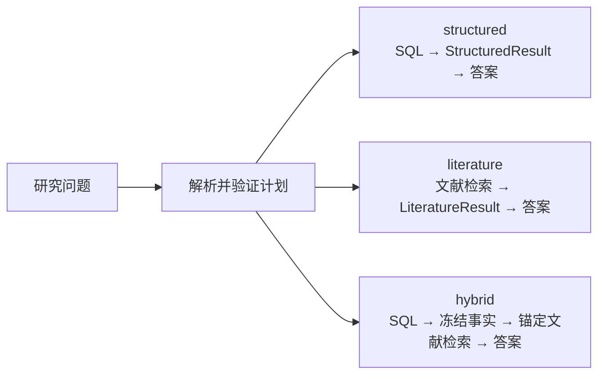
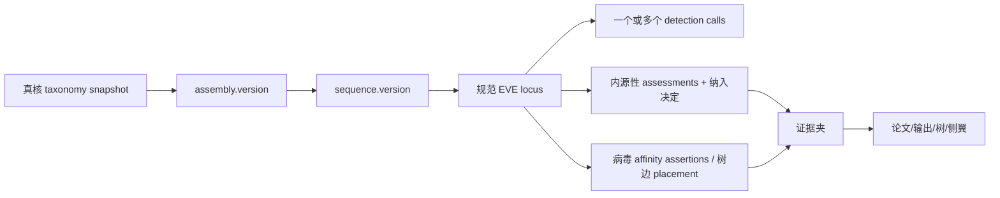
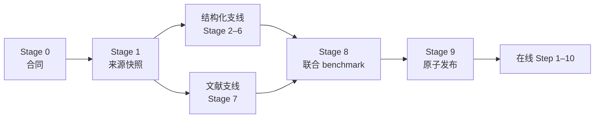
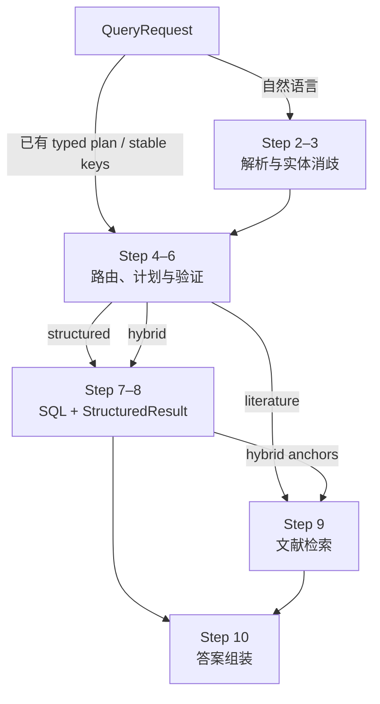

# EVE—真核生物系谱关系 RAG：病毒学研究者的 AI 入门流程

> **文档类型：** 面向具有病毒学基础、AI 与数据工程基础较弱的研究者  
> **更新日期：** 2026-08-13  
> **对应技术规范：** [EVE_RELATION_V0_EVE_LINEAGE_APPLICATION.md](./EVE_RELATION_V0_EVE_LINEAGE_APPLICATION.md)  
> **通用核心：** [EVE_RELATION_V0.md](./EVE_RELATION_V0.md)

本文默认你已经理解 EVE、genome assembly、序列比对、taxonomy、phylogeny 和基本病毒分类。正文不会重复讲病毒学教材内容；重点解释这些研究对象怎样进入数据库、RAG 怎样检索、LLM 在哪里参与，以及为什么不能让生成模型承担精确事实判断。

如果先快速理解 AI 架构，建议按 `0 → 1 → 4 → 6 → 8 → 12` 阅读；准备实现数据模型时，再读第 2、5、7、10、11、13 节。技术字段和约束以对应技术规范为准。

## 0. 系统目标与边界

目标不是训练一个“记住所有 EVE 的模型”，而是建立一个先查询、再取证、最后组织答案的科研信息系统：

> 用户问某类真核生物与某类病毒来源 EVE 有什么关系；系统先在固定数据发布版中查到具体基因组、序列和位点，再说明这些位点由谁、用什么方法、依据什么证据显示与哪个病毒类群有亲缘关系，最后用论文解释方法与限制。

系统应当输出这种可审计表述：

> “在数据发布版 R 中，这个真核生物组装里记录了位点 L；方法 M 将它关联到病毒类群 V，证据在文件或论文位置 E。”

不能自动升级成：

> “病毒 V 一定感染过这个现代物种，而且两者共同进化。”

后一句需要额外的演化研究，不能由一条数据库关联或大模型自动推出。

系统内部的核心分工如下：

| 部分 | 负责什么 | 不负责什么 |
|---|---|---|
| PostgreSQL 结构化数据库 | 精确保存和查询 assembly、locus、分类版本、方法、证据、集合与计数 | 不概括论文讨论 |
| 文献检索器 | 从固定论文语料中找相关段落、表格和图注 | 不决定结构化事实是否成立 |
| LLM | 解析有限范围的自然语言、概括已取回的文献内容 | 不直接判定 EVE、不执行任意 SQL、不重算数据库数字 |
| 验证器与固定模板 | 检查条件是否完整、引用是否支持答案，并锁定输出格式 | 不代替领域方法本身 |



---

## 1. 先建立 AI/RAG 的基本概念

### 1.1 RAG 不是一个模型，而是一条流程

RAG 是 Retrieval-Augmented Generation，直译是“检索增强生成”。它至少包含两个动作：

1. **Retrieval（检索）**：先从指定数据库或文献库取回相关内容；
2. **Generation（生成）**：再让模板或 LLM 根据取回内容组织回答。

因此，RAG 的质量不只取决于 LLM。数据版本错了、检索漏了、过滤条件丢了，后面换更大的模型也不会自动修好。本项目还把 retrieval 拆成两类：

| 检索类型 | 典型问题 | 结果性质 |
|---|---|---|
| 结构化检索 | “有多少 locus？”“位于哪个 assembly 和坐标？” | SQL 精确匹配，可做集合和计数验证 |
| 文献检索 | “论文如何解释这个判定？”“作者讨论了哪些限制？” | 找到相关文本片段，仍需检查是否真正支持答案 |

### 1.2 LLM 是概率语言模型，不是事实数据库

LLM 根据上下文预测接下来最合适的文字。它善于处理语言，但同一问题可能生成略有不同的表达；当上下文不足时，也可能产生语法通顺但没有依据的内容，这通常称为 **hallucination（幻觉）**。

在这个 V0 中，LLM 只允许承担两类受约束任务：

- 把自然语言问题转换成一个待验证的结构化计划 proposal；
- 概括系统已经取回、且带来源定位的文献片段。

位点集合、计数、坐标、版本和状态由数据库及固定程序产生。LLM 不直接执行任意 SQL，不修改 `StructuredResult`，也不代替 BLAST、profile search、系统发育推断或领域判定规则。

### 1.3 chunk、embedding 和向量检索是什么

- **chunk**：从论文中按章节、段落、表格或图注切出的可检索单元。切得太大容易混入无关内容，切得太小又会丢上下文。
- **embedding**：模型把一段文本转换成一串数字，即向量。语义相近的文本通常在向量空间中更接近。
- **vector retrieval**：用向量距离找意思相近的 chunks，即使它们没有使用完全相同的关键词。

向量相似度是“可能相关”的排序信号，不是科学真值。例如，一个 chunk 与问题高度相似，不代表它支持问题中的因果关系，也不能用向量近邻代替精确 accession、坐标或 taxon key 查询。

### 1.4 retriever、reranker 和 top_k 是什么

- **retriever**：第一轮找候选 chunks。这里同时使用关键词检索和向量检索。
- **RRF**：Reciprocal Rank Fusion，把两种检索的排名合并，而不是把不可直接比较的原始分数硬加在一起。
- **reranker**：第二个模型重新判断候选 chunk 与问题的相关性并排序；只有 benchmark 证明有收益才启用。
- **top_k**：最多取回排名前 k 个候选。k 太小容易漏证据，太大则会增加噪声和 LLM 上下文成本。

检索阶段回答的是“哪些材料值得进一步检查”，不是“最终科学结论是什么”。

### 1.5 QueryPlan、resolver、validator 和 compiler 分别做什么

自然语言不能直接变成数据库查询，中间需要一条可检查的转换链：

```text
自然语言问题
→ NL adapter：提取用户条件
→ resolver：把名称解析成固定版本中的 stable key
→ QueryPlan：把条件写成机器可读订单
→ validator：检查条件、权限、版本和语义是否完整
→ compiler：把通过检查的计划编译成参数化 SQL
→ StructuredResult：冻结数据库结果和来源信息
```

- **QueryPlan** 类似一份结构化实验设计：明确数据发布版、对象、过滤条件、统计单位和输出类型。
- **resolver** 处理同名、旧名、别名和版本，避免把无法识别的名称退化成“查询全部数据”。
- **validator** 不查事实，先检查计划是否自洽。例如 taxonomy 条件不能误用 phylogeny 字段，比例必须有合法分母。
- **compiler** 只支持预先注册的字段、操作符和指标，把合法计划转换成参数化 SQL；它不是让 LLM 自由写 SQL。

这条链采用 **fail-closed**：不知道、歧义或不支持时停止并说明原因，而不是删除失败条件后返回一份看似完整的答案。

### 1.6 release、provenance 和 checksum 为什么重要

- **release**：一次不可变的数据发布版。相同问题只有固定 release 才能复查。
- **provenance**：结果的来源链，包括使用了哪些输入、软件、参数、方法、数据库版本和处理步骤。
- **checksum**：文件内容的数字指纹；内容发生变化，指纹通常也会变化。

RAG 不等于“实时搜索最新网页”。V0 在线查询只读取已经离线校验并发布的数据与文献 corpus；新来源必须先进入下一次发布流程。

### 1.7 本指南保留的病毒学边界

这里不重新讲 EVE、taxonomy 或 phylogeny 的基础定义，只固定与系统实现直接相关的边界：

- detection call、规范 locus、内源性 assessment 和 release inclusion decision 是不同层级；
- assembly 必须使用完整 accession.version；
- EVE 片段到 ICTV taxon 保存为方法限定的 taxonomic affinity assertion，而不是正式 taxon membership；
- taxonomy lineage 与基于数据和模型的 phylogeny 分开保存；
- 未检出只属于明确成功且范围完整的 survey，不能自动解释为生物学不存在。

---

## 2. 把病毒学对象转换成机器可检查的数据对象

领域知识只有拆成带身份、版本和真实连接的记录，数据库才能可靠查询。这里的拆分不是重新定义病毒学，而是防止软件把不同层级的结果混为一谈：

| 工程对象 | 保存的内容 | 为什么单独建模 |
|---|---|---|
| `GenomeAssembly` / `AssemblySequence` | 完整 accession.version 与组成序列 | 阻止不同 assembly/sequence 版本串线 |
| `EVELocus` | 按固定 identity policy 规范化的物理位置 | 为跨来源去重和精确坐标查询提供对象 |
| `EVEDetectionCall` | 某篇来源或某次运行报告的候选 | 多次运行或多篇论文不应自动增加物理 locus 数 |
| `EndogeneityAssessment` | 某个版本化方法产生的评估结果 | 允许不同方法或冲突判断并存 |
| `LocusInclusionDecision` | 固定发布政策是否让 locus 进入公开关系视图 | 把科学评估与产品发布选择分开 |
| `ViralSequenceAnalysisSubject` | 实际分析的是整个 locus、segment、feature 或 query interval | 防止局部基因/片段结果扩展成整个 locus 结论 |
| `ViralAffinityAnalysis` | 一次 run 对一个 subject 的病毒亲缘分析 | 机械区分 targeted、no-target、未运行和失败 |
| `ViralTaxonomicAffinityAssertion` | 指向固定 ICTV snapshot 中 taxon 的方法限定断言 | 不把 EVE 片段冒充正式 ICTV taxon 成员 |
| `ViralPhylogeneticPlacementSet` | query 在固定参考树 edge 上的候选 placement 与权重 | 保留多个候选和不确定性，不只存一个最佳节点 |
| `EvidenceItem` | 论文 locator、表格行、alignment、jplace、分数或侧翼证据 | 每条公开断言能回到实际依据 |
| `ProcessRun` | 输入、软件、版本、参数、执行状态和输出 | 让分析过程可审计、可比较、尽可能可复现 |
| `TaxonomySnapshot` / `PhylogenySnapshot` | 固定分类快照与固定分析树 | 防止 taxonomy hierarchy 与 phylogenetic topology 混用 |
| `DatasetRelease` | 一次不可变的数据与依赖版本组合 | 确保同一查询可重跑，并避免在线读到混合版本 |

这些英文对象名是本 V0 为了把数据关系讲清楚而定义的工程实体，不是 ICTV、NCBI、FAIR 或 EVE 研究领域统一规定的标准术语。广泛使用的科学/数据库概念与本项目合同必须分层展示。



系统保存的是这些带版本对象之间的可审计连接，不是一条来历不明、无法复查的“病毒—宿主关系”。

---

## 3. 这个系统能回答什么

例如，用户问：

> 在发布版 R 中，真核类群 E（包含它的后代）里，有哪些位点被某个方法关联到病毒类群 V（包含它的后代）？它们的证据是什么？

这里的 E 可以是 `Mollusca` 等分类单元，但正式查询必须使用该 taxonomy snapshot 中的稳定 key；V 也必须是固定 ICTV release 中的 taxon key，不能只靠一个可能重名或改名的文字标签。

系统可以返回：

- 哪些 assembly 和 sequence；
- 每个位点的精确坐标和链方向；
- assembly 来源分类属于哪个真核类群；
- 位点有哪些病毒分类亲缘断言或树边 placement，并且这些结果覆盖整个 locus 还是某个 segment/query interval；
- 使用的 taxonomy、方法、纳入政策和 release；
- 支持、质疑或提供背景的证据；
- 相关论文如何描述方法和限制；
- 按 included locus、detection call、assembly、taxon 或 eligible survey attempt 分别计数。

### 有记录不代表什么

一条 EVE—真核类群关联默认只表示：

> 同一个 included locus 可以追到 assembly 的来源 taxonomy assignment，也可以追到带方法、证据和 subject scope 的病毒 taxonomic affinity assertion 或 edge-based placement set。

它默认不表示：

- 该现代病毒正在感染这个现代真核生物；
- assembly 来源物种就是已经证明的古代宿主；
- 每个个体都有这个位点；
- 两个位点来自同一次整合；
- 发生过共分化或宿主转换；
- 该 EVE 有功能；
- 数据库没有记录就等于现实中不存在。

### 更强结论怎么办

如果论文或可重复分析已经提出“两个位点正交”“整合早于某个分化节点”等结论，可以作为单独的 typed relation assertion 导入，并保存：

- 谁提出的；
- 用了什么输入和方法；
- 哪些位点参与；
- 证据在哪里；
- 结论是点估计、上界、下界还是一个假说；
- 是否存在其他来源的反对意见。

系统只是准确转述“来源提出了什么”，不会自动给争议判决。

---

## 4. 为什么不能做成纯向量 RAG

“纯向量 RAG”通常是：把论文切成 chunks，计算 embeddings，按向量相似度取回若干段，再让 LLM 回答。它适合找讨论和近义表达，但不适合单独承担本项目的结构化真值层。向量检索按相似度排序，底层可以使用精确最近邻或近似最近邻索引；这种“相似”不是数据库等值匹配或科学真值，也不会自动执行外键、版本、坐标、去重和分母约束。

| 任务 | 向量检索是否合适 | 本项目的执行方式 |
|---|---|---|
| 找“作者如何讨论内源化判据” | 合适，随后检查引用 | 文献关键词 + 向量检索 |
| 找精确 accession.version | 不合适 | stable key / SQL 精确匹配 |
| 统计 distinct loci | 不合适 | 固定 metric 的 SQL 聚合 |
| 展开某 taxonomy snapshot 的后代 | 不应依赖文本相似度 | closure table / 递归查询 |
| 判断一个段落是否支持某句话 | 可提供候选，不能单独裁定 | 检索 + claim-to-source 验证 + 必要时人工复核 |

如果只把论文切块后交给 LLM，会出现几个典型问题：

- 同一个 assembly 不同版本可能被混在一起；
- 论文说“3 个位点”，模型可能把 3 个证据片段数成 3 个新位点；
- taxonomy 的分类层级可能被说成系统发育树；
- 没有查到的记录可能被写成生物学不存在；
- 多个互相冲突的分类可能被模型强行合成一个答案；
- 数字、坐标和 ID 难以稳定复现。

所以 V0 采用“结构化事实优先的 Hybrid RAG”：

```text
精确记录、集合、数字、版本 → PostgreSQL
论文方法、讨论、限制       → 文献 RAG
语言组织                    → 可选 LLM
```

这里的 **系统级 Hybrid RAG** 指“结构化数据库事实 + 文献解释”。后文的 **hybrid retrieval** 则专指“关键词检索 + 向量检索”两种文献搜索的融合。这是两个不同层级的 Hybrid。

系统先由 SQL 确定 locus、assembly、method、DOI 等 anchors，再围绕这些 anchors 检索固定文献 corpus。结构化结果会先被冻结，后续生成步骤只能引用，不能修改。

图数据库也不是 V0 的必需品。taxonomy 后代展开可先用 PostgreSQL closure table 或递归查询完成。只有真实 benchmark 证明关系型方案不够，才增加可重建的只读图投影。

---

## 5. 数据从哪里来

| 来源 | 在系统中的用途 | 要记住的限制 |
|---|---|---|
| [NCBI Datasets](https://www.ncbi.nlm.nih.gov/datasets/docs/v2/reference-docs/data-packages/genome/) | 获得 assembly、组成序列和版本元数据 | 它不替我们证明一段序列是 EVE |
| [NCBI Taxonomy](https://www.ncbi.nlm.nih.gov/datasets/docs/v2/data-processing/taxonomy-processing/taxonomy/) | 获得真核分类层级、名称和同义名 | 分类层级不是真实系统发育树 |
| [ICTV MSL/VMR](https://ictv.global/vmr) | 固定病毒 taxonomy 版本并连接 exemplar/reference metadata | exemplar/host source 不等于 EVE 或古代宿主证据 |
| GenBank/RefSeq | 获得带版本的具体序列 | 注释和组装仍可能有错误或污染 |
| 原始论文和补充材料 | 获得已报告位点、方法、图表、树和解释 | 必须定位到具体页、节、表、图或文件 |
| 项目分析输出 | 获得候选位点、比对、profile、树和 QC | 必须保存软件、版本、参数、输入和输出 |
| 可选固定 phylogeny | 回答真正的树上关系 | 必须保存来源、方法、模型、定根和支持度 |

现有 EVE 专题数据库可以帮我们找到候选线索，但不能整库复制后就叫“最终真值”。一篇 [2024 年综述](https://pmc.ncbi.nlm.nih.gov/articles/PMC11631435/) 指出这类资源仍存在覆盖不全、格式不统一、长期未更新或不可访问等问题，所以记录最终还要回到原始论文、序列或可重复分析。

文献全文还要检查许可。[Europe PMC Open Access](https://europepmc.org/downloads/openaccess) 提供开放全文获取说明，但“网页上能看”不自动等于“可以批量复制进 RAG”。许可不清楚时，只保存允许的元数据、摘要和外部链接。

---

## 6. 离线建库与在线问答是两条不同流水线

- **离线流程**：下载、解析、校验、建立数据库与文献索引，最后生成不可变 release。它可以运行数小时或数天，但不会面对每一次用户提问临时重做。
- **在线流程**：针对一个问题读取已经发布的数据，完成解析、查询、文献检索和答案组装。它不得临时改变数据或重新运行未声明的全基因组分析。

离线过程也不是一条完全串行的直线，而是结构化数据和文献语料两条支线在评测与发布前汇合：



外部生物信息分析又是独立的一条上游流水线：

```text
原始基因组
→ 候选搜索/比对/profile/上下文检查/可选构树
→ 带版本和证据的结构化输出
→ 进入本 RAG 的离线发布流水线
```

RAG 可以调用或跳转到未来的分析服务，但查询层本身不假装完成这些分析。

### 哪些步骤真的使用 AI

| 环节 | 主要执行者 | 是否需要 LLM |
|---|---|---|
| Stage 0–6：合同、导入、标准化、约束和 QC | 人工定义 + 确定性程序 + PostgreSQL | 不需要 |
| Stage 7：论文建库 | parser + embedding model + 数据库索引 | 使用 embedding 模型，但不生成答案 |
| Stage 8–9：评测与发布 | 测试程序 + PostgreSQL transaction | 不需要 |
| Step 2：自然语言解析 | 规则，或可选 LLM structured output | 可选；输出只是草案 |
| Step 3–8：解析、验证、SQL 和结果冻结 | 确定性程序 + PostgreSQL | 不需要 |
| Step 9：文献检索 | 关键词索引 + embedding/vector search + 可选 reranker | 使用检索模型，不负责写结论 |
| Step 10：文献概括和答案组装 | 固定模板 + 可选 LLM + 引用验证程序 | 可选；只能使用已取回内容 |

这一区分很关键：系统中出现 embedding、reranker 或 LLM，不代表整条流程都由“AI 自主决定”。

---

## 7. 离线流程：先把数据做成可信发布版

### Stage 0：定义机器可执行的数据、查询与证据合同

**输入是什么**

- 这次试点研究哪个真核范围和哪个病毒范围；
- 准备使用哪些数据源；
- 什么对象叫 assembly、sequence、locus、detection call、survey design/attempt；
- 如何计数、如何处理冲突、哪些问题必须拒答。
- 代表性用户问题、预期答案形状和发布验收指标。

**使用什么技术**

- JSON Schema：规定对象有哪些字段、字段类型、必填项、允许值和组合规则；
- YAML/CSV 数据字典：配置版本化政策，并解释字段的科学与工程含义；
- Git：保存每次修改，能够比较两个版本具体改了什么；
- ADR（Architecture Decision Record）：记录关键设计选择、备选方案和取舍原因。

四者职责不同：Schema 负责“机器能否接收”；数据字典负责“字段是什么意思”；Git 负责“何时改了什么”；ADR 负责“为什么这样设计”。这些都不是 LLM prompt。

**解决什么问题**

防止今天按“位点”数，明天又把同一个数字解释成“整合事件”；也防止导入后才临时决定什么算 EVE。

**输出是什么**

- 领域数据合同；
- 字段、指标和查询操作白名单；
- 方法、纳入政策和证据政策；
- LLM、retriever 和确定性程序各自允许与禁止的动作；
- 明确的“不能自动推断”清单。

**这一步不能得出什么**

它只写规则，不产生任何 EVE 研究结论。

### Stage 1：固定原始数据快照与来源信息

**输入是什么**

- NCBI genome/taxonomy 数据；
- ICTV MSL/VMR；
- 参考序列；
- 论文、补充文件和已有分析输出。

**使用什么技术**

- 官方 API、CLI 或 FTP：三类数据获取接口；
- SHA-256 checksum：文件内容的数字摘要，用于验证后来处理的仍是同一份字节；
- manifest：机器可读的文件、版本、许可、URI 和 checksum 清单；
- 许可登记、失败重试和下载日志。

Checksum 只能证明内容是否一致，不能证明内容在科学上正确。Provenance 则记录文件从哪里取得、经过哪些处理才形成后续记录。

**解决什么问题**

网页和 `latest` 会变化。固定 snapshot 后才能知道当时到底用了哪份输入，也能检查是否有权把全文放进系统。

**输出是什么**

- 原始 source snapshot；
- 每个文件的 URI、版本、获取时间、许可和 checksum；
- 下载过程记录和完整 manifest。

**这一步不能得出什么**

下载到一段病毒相似序列并不等于确认 EVE。

### Stage 2：统一名字、版本、分类和坐标

**输入是什么**

- Stage 1 的原文件；
- 每种 ID 和坐标格式的转换规则。

**使用什么技术**

- NCBI/ICTV 格式解析器；
- accession.version 校验；
- taxonomy closure table：提前保存“祖先—后代”路径；
- GenBank/GFF3/BED 坐标转换；
- 内部统一的 `[start,end)` 坐标和可逆测试。

**解决什么问题**

同名不一定同对象，不同版本也不能混用；GenBank、GFF3 和 BED 的起点/终点算法不同，直接拼起来会差一个碱基或定位到错误版本。

**输出是什么**

- 固定真核和病毒 taxonomy snapshots；
- assembly、sequence 与外部 ID 表；
- 原始坐标和规范坐标；
- 无法可靠转换的 quarantine 清单。

这一阶段由确定性 parser 和映射规则执行，不使用 LLM 猜测。`quarantine` 是保留原始记录、错误原因和待审核状态的隔离区，不是静默删除数据。

**这一步不能得出什么**

taxonomy 后代关系只能说明分类层级，不能说明有支持度的系统发育拓扑。

### Stage 3：导入 survey attempts、calls 和规范 loci

**输入是什么**

- 论文里的位点表；
- 已运行候选搜索流程的输出；
- 对应的 assembly/sequence；
- 软件、参数、参考库和输入版本。

**使用什么技术**

- 每种来源单独的 importer；
- ProcessRun：记录一次真实运行；
- schema 校验和精确 accession/coordinate 对齐；
- 无法对齐的行进入 quarantine，不做自动推断。

`importer` 是针对某一种来源格式编写的确定性转换程序，不是大模型。典型数据流是：

```text
原始表的一行
→ importer 读取字段
→ 校验 accession.version 与坐标
→ 建立 detection call
→ 按版本化 identity policy 连接或建立 locus
→ 保存 ProcessRun 与错误记录
```

**解决什么问题**

把“一个物理地址”“某次命中/论文报告”和“对某个 assembly 完成一次 survey attempt”分开保存，避免重复报告重复计算位点，也避免把没分析、部分完成、失败和成功但没 call 混成一回事。

**输出是什么**

- `SurveyDesign`、eligible cohort 和每个 assembly 的 `GenomeSurveyAttemptRecord`；
- `EVEDetectionCallRecord`；
- 去重后的 `EVELocusRecord` 和一个或多个 locus segments；
- run 的输入、输出、软件、参数和状态；
- 导入问题报告。

**这一步不能得出什么**

一个 detection call 或 locus 仍不自动等于公开纳入的 EVE，也不自动属于某个病毒种。

### Stage 4：导入评估、纳入决定和病毒分类亲缘断言

**输入是什么**

- loci 和 detection calls；
- 比对、profile、基因组上下文或人工审核；
- 固定的病毒 taxonomy；
- 方法的输出规则和证据政策。

**使用什么技术**

- Assessment：保存某方法对某对象的结果；
- LocusInclusionDecision：按固定政策决定是否进入公开关系视图；
- ViralSequenceAnalysisSubject：先锁定实际分析的是整个位点、某段、某 feature，还是 query sequence 的一个区间；
- ViralAffinityAnalysis：用一张共同分析总单保证“有具体 taxon target”和“已分析但无 target”只能二选一；
- ViralTaxonomicAffinityAssertion：有 target 时连接某个病毒 taxon，但不声称 locus 是正式病毒 taxon 成员；
- typed evidence links：先声明目标类型，再用数据库外键保证证据确实连到存在的 assessment/assertion，而不是保存任意字符串 ID；
- 可选 ECO 术语描述证据类型。

**解决什么问题**

让“支持”“反对”“尚不确定”和多个分类并存，而不是用一个 `true/false` 抹掉方法差异；同一 mosaic locus 的不同片段也可以各自有结果，不会互相覆盖。

**输出是什么**

- 内源性 assessments；
- locus inclusion decisions；
- 带精确 subject scope 的 affinity analyses；
- 病毒 taxonomic affinity assertions；
- 已分析但没有具体 taxon target 的 outcomes；
- 每条断言对应的证据和来源链。

**这一步不能得出什么**

两个相似 loci 不会自动变成正交位点；一条 affinity assertion 也不自动证明现代感染宿主或精确到病毒 species。

### Stage 5：可选导入系统发育树

**输入是什么**

- 已发表或预先计算的 alignment 和 tree；
- 构树软件、模型、参数、定根和支持度说明；
- 树 tip 与 sequence/taxon/locus 的精确 typed 映射。

**使用什么技术**

- Newick/PhyloXML 解析；
- 树文件 checksum；
- node/edge 表和 exact tip mapping；
- tree QC。

**解决什么问题**

先建立一棵可引用的 reference tree 和稳定 edge keys，同时防止系统用 taxonomy hierarchy 替代系统发育树。

**输出是什么**

- 一个固定 PhylogenySnapshot；
- 节点、边、tip mapping、可复现等级和验证报告。

**这一步不能得出什么**

导入一棵树不等于自动证明共分化、宿主转换或整合年代；这些还要单独方法和断言。

### Stage 5b：把已有 placement 和树依赖断言接回 loci

这是技术规范为保证真实外键而单独列出的子阶段，在通俗流程中仍属于 Stage 5。

树验证后再导入 `ViralPhylogeneticPlacementSet`：一次 placement 可以有多个候选 edge 和各自权重，并保留完整 jplace 或等价输出。用户查询已经导入的 placement 走结构化数据库；要求为新序列重新构树或 placement 才需要外部分析。

**输入是什么**

- 已验证的 reference tree、edges 和 tip mappings；
- 完整 jplace 或等价 placement 输出；
- loci、query segment/sequence 和可能的正交/年代分析结果。

**使用什么技术**

- placement set + 多个 candidate edges；
- likelihood weight ratio 或 posterior（后验概率）：方法给每个候选边的不确定性权重；
- typed locus/event/timing assertions：按目标类型分表、能用真实外键检查对象确实存在的断言；
- evidence links。

**解决什么问题**

保证“先有树，后引用 edge”，并保留不确定性；不会把一个 segment 的 placement 擅自扩展成整个 locus 的确定分类。

**输出是什么**

- placement sets/candidates；
- 可选的 locus relation、integration-event hypothesis 和 timing assertions；
- 每条结果的 subject scope（结论覆盖整个 locus，还是只覆盖其中某段/feature/query interval）、方法、权重和证据。

**这一步不能得出什么**

一个最高权重 edge 不是自动真相；未定根树也不能用来声明某节点是祖先时间节点。

### Stage 6：做质量检查

**输入是什么**

- 前面所有候选表；
- 数据合同、数据库约束、预期统计和证据政策。

**使用什么技术**

- PostgreSQL 外键、唯一、非空和行内 CHECK；
- 跨表发布 validator；
- checksum 对账；
- exact set 检查和异常报告。

数据库约束各自拦截不同错误：主键/唯一约束防止重复身份，外键防止指向不存在的对象，非空约束防止遗漏必需字段，`CHECK` 检查当前行的值。跨记录、跨表或跨 release 的语义，例如“这个 taxon 是否属于该 snapshot”，由发布 validator 检查。

**解决什么问题**

拦住坐标越界、版本串线、分类快照混用、证据断链、同一分析总单同时出现“有 target/无 target”、失败 survey 冒充“未检出”等错误。

**输出是什么**

- validation report；
- 失败行和具体原因；
- evidence coverage：按版本化政策统计哪些公开记录或断言具有所要求的证据，以及缺失项；
- candidate release manifest。

**这一步不能得出什么**

数据库约束通过只说明数据结构自洽，不代表所有科学断言都正确。

### Stage 7：建立论文检索库

**输入是什么**

- 许可明确的 OA 或授权全文；
- DOI/PMID/PMCID、文章版本、许可、勘误/撤稿状态；
- 页面、章节、表格、图片和补充文件结构。

**使用什么技术**

- parser 保留文章的章节、页码、表图和补充材料结构；
- 结构感知分块：把全文切成可检索 chunks，同时保留上下文和 locator；
- PostgreSQL full-text 建立关键词倒排索引；
- embedding model 为每个 chunk 生成向量，pgvector 保存向量并寻找距离较近的候选；
- 固定候选 retrieval policy，包括允许的索引、过滤条件、RRF 配置和可选 reranker 版本；
- Stage 8 用标准问题评测这些策略，真正的 query embedding、RRF 和 reranking 在在线 Step 9 才执行。

```text
全文与补充材料
→ parser 保留文档结构
→ chunks + locators
├→ 关键词索引
└→ embedding model → 向量索引
→ candidate corpus build + retrieval policy
```

pgvector 本身不“理解病毒学”；语义来自 embedding model 产生的向量。检索分数只表示排序相关性，不代表论文质量、证据强度或结论置信度。

**解决什么问题**

既能找到专业术语，也能找到表达不同但意思接近的段落，并让引用能回到真实位置。

**输出是什么**

- candidate corpus build；
- document 与 chunk 表；
- 词法和向量索引；
- 许可、parser、embedding model 和 checksum manifest。

**这一步不能得出什么**

检索到一篇论文不等于论文支持用户想要的结论；还要检查具体段落是否真的支撑回答。

### Stage 8：建立评测集并执行发布门禁

**输入是什么**

- 故意放入陷阱的合成数据；
- 专家根据来源整理的真实问题和标准答案；
- 期望对象、QueryPlan、完整集合、数字、状态和引用。

**使用什么技术**

- exact equality：多一条、少一条都算错；
- PostgreSQL integration test；
- Recall@k、citation precision 和 source-support audit；
- prompt injection、SQL injection、超时和权限测试。

三类评测回答不同问题：

- **结构化查询**用 exact set equality：结果多一条或少一条都失败；
- **文献检索**用 Recall@k：标准证据中有多少进入前 k 个候选；
- **答案层**用 citation precision 和 claim-to-source support：引用位置是否存在、引用内容是否真正支持对应陈述。

`prompt injection` 是用户问题或文献文字试图命令模型突破系统规则；`SQL injection` 是恶意输入试图改变数据库查询。二者需要不同防护。

**解决什么问题**

防止系统只是“回答听起来不错”，却悄悄查错版本、漏条件、算错去重单位或引用不支持答案。

**输出是什么**

- benchmark report；
- 每个失败案例和原因；
- 覆盖矩阵；
- 是否允许发布的机器可读结论。

**这一步不能得出什么**

几十道 smoke test 全过不等于覆盖了整个生命科学领域。测试集和适用范围必须一起公开。

### Stage 9：原子发布不可变版本

**输入是什么**

- 通过所有 required gates 的 candidate；
- manifest、审批记录和上一版回滚目标。

**使用什么技术**

- 数据库单事务 publish：数据、依赖和 current 指针要么全部切换成功，要么全部回滚；
- published 内容不可变；
- 每个 Dataset 自己的 current 指针；
- 查询账号只读；
- 从空库重建测试。

`current` 只是每个 Dataset 指向当前 published release 的指针。回滚通常是经过校验后把指针切回旧 release，不是删除新数据。空库重建测试则验证代码能否仅依据 manifest 和原始 artifacts 重建相同发布内容。

**解决什么问题**

防止用户查到“一半新 taxonomy + 一半旧位点 + 另一版论文索引”的混合答案。

**输出是什么**

- 一个不可变数据 release；
- 一个固定文献 corpus release；
- manifest、benchmark report、发布时间和回滚指针。

**这一步不能得出什么**

“正式发布”只说明通过本 V0 的工程和证据门禁，不是对所有 EVE 科学结论的永久认证。

---

## 8. 在线流程：一个研究问题如何变成可审计答案

三类路线在验证后分开执行：



直接提交 typed plan 可以跳过自然语言解析，但不能跳过 release、stable key、权限和语义验证。

### Step 1：接收问题和发布版

**输入是什么**

用户问题，或客户端直接提交的 Typed QueryPlan；还要有 `release_key`、语言、权限和请求 ID。

**使用什么技术**

- FastAPI/Pydantic 或同类 API schema；
- 请求大小限制、身份验证、速率限制；
- UTF-8 和字段类型检查。

**解决什么问题**

先确认请求结构合法、用户能访问指定发布版，避免坏输入直接进入数据库。

**输出是什么**

合法 `QueryRequest`，或者明确的 `invalid / forbidden`；此时还没有查事实。

**这一步不能得出什么**

API 收到自然语言不代表系统已经理解了正确对象和计数单位。

### Step 2：可选的自然语言解析器

**输入是什么**

例如：

> Mollusca 及其后代里有哪些位点的证据显示与病毒类群 V 有亲缘关系？

**使用什么技术**

- 有限语言规则或 LLM structured output（让模型按规定 JSON 形状输出）；
- 条件编号和原文片段映射；
- route classifier。

**解决什么问题**

把自然语言拆成“真核类群条件、是否包含后代、病毒类群条件、想列出还是计数、用哪个 release”等明确槽位。例如：

```text
原句：Mollusca 及其后代里有哪些位点与病毒类群 V 有亲缘关系？
intent：list_records
真核 mention：Mollusca
include_descendants：true
病毒 mention：V
计数单位：eve_locus
```

**输出是什么**

- route proposal；
- 实体候选；
- `ParsedIntent / PlanDraft`；其中的名称仍是 mention 或 placeholder；
- 每个原始条件对应哪个 filter 的覆盖表。

**这一步不能得出什么**

LLM 或规则产生的 draft 还不是可执行计划。它没有权限删除无法识别的条件，也不能直接查询数据库。

### Step 3：精确解析名字

**输入是什么**

`Mollusca`、病毒名称、assembly accession、论文 ID 等文字或 stable key，以及指定 release/snapshot。

**使用什么技术**

- typed alias/label 表；
- namespace-specific normalization policy；
- exact accession.version parser；
- taxonomy/phylogeny snapshot scope。

例如，输入标签 `Mollusca` 后，resolver 只能在请求固定的 taxonomy snapshot 中查找 label/alias，并返回该快照里的唯一 stable key。若存在多个候选就返回候选列表并停止，不会用 OR 自动合并。纯文献路线只解析其检索计划真正需要的 DOI、method、taxon 等 anchors。

**解决什么问题**

同名、旧名、拼写错误和不同版本可能指向不同对象。解析器必须知道要查哪一个，而不是把多个候选用 OR 全算进去。

**输出是什么**

- 唯一 stable key；或
- `needs_clarification` 和候选列表；或
- `invalid`。

**这一步不能得出什么**

名称能解析只表示“找到了这个数据库对象”，不表示相关科学断言成立。

### Step 4：选择正确路线

**输入是什么**

已解析的对象、用户 intent 和问题中要求的动作。

**使用什么技术**

- 明确的 route policy；
- intent 白名单；
- unsupported inference registry。

**解决什么问题**

把不同任务交给正确工具：

| 问题 | 路线 |
|---|---|
| 位点、assembly、分类、数量 | structured |
| 某条记录的直接证据 | structured_evidence（StructuredPlan 的一种 intent） |
| 论文如何讲某方法 | literature |
| 先找记录、再解释论文 | hybrid |
| 请重新比对或构树 | 内部 route=`analysis_required`，对外 status=`unsupported` |
| 要求无证据的共分化/不存在 | 对外 `status=unsupported`，不执行检索 |

**输出是什么**

一个确定 route，或明确拒答/澄清状态。

**这一步不能得出什么**

选择 `hybrid` 仍只能访问计划中声明的 release、数据库字段、固定 corpus 和 anchors，不会授权 LLM 自由访问其他数据源。

### Step 5：做成 Typed QueryPlan

**输入是什么**

唯一 stable keys、intent、全部过滤条件、计数单位和分页要求。

**使用什么技术**

- JSON Schema tagged union：先用类型标签说明是哪一种计划，每种计划有自己的必填字段；
- field/operator/metric 白名单；
- 唯一 `filter_id`；
- condition-to-filter coverage mapping；
- assertion/subject-scope policy：明确哪些断言可用，以及结论覆盖整个位点还是其中一段；
- 文献路线使用 `LiteratureRetrievalPlan / HybridPlan`，固定 corpus、anchors、top_k 和检索版本。

计划有两层类型。第一层由顶层 `route` 区分执行路径：

| 计划类型 | 必需内容 | 执行路径 |
|---|---|---|
| `StructuredPlan` | release + 一个 intent-specific payload | validator → SQL compiler |
| `LiteratureRetrievalPlan` | corpus、问题、anchors、top_k、retrieval policy | validator → document retriever |
| `HybridPlan` | 待验证 StructuredPlan + 待验证文献检索计划 | Step 6 一并验证；执行时先 SQL，再把真实返回 keys 加入文献 anchors |

第二层是 StructuredPlan 内部的 `intent`：

| intent | 主要必填内容 |
|---|---|
| `record_detail` / `explain_record` | 唯一 `record_key` |
| `list_records` | filters + page/cursor；不要求 metric |
| `aggregate` | filters + `metric_key` + 可选 group_by |
| `compare` | base filters + group filters + `metric_key` |

因此存在两层 tagged union：顶层 `route` 决定走 SQL、文献还是两者；StructuredPlan 内部 `intent` 再决定 detail/list/aggregate/compare 所需字段。当前 JSON 例子是 `aggregate` variant，不代表所有 StructuredPlan 都需要 filters 或 metric。

StructuredPlan 中几个高频字段可以这样理解：

| 字段 | 含义 | 示例 |
|---|---|---|
| `field` | 查询哪个已注册字段 | `assembly_source_taxon` |
| `operator` | 怎样比较 | `eq`、`is_a` |
| `value` | 用哪个稳定对象或参数比较 | taxonomy snapshot + taxon key |
| `metric_key` | 最终数什么、如何去重 | `distinct_included_eve_locus_count` |
| `group_by` | 是否按 taxon、assembly 等分组 | 空数组表示只求总体 |
| `filter_id` | 给每个用户条件唯一编号 | 用于检查条件没有在解析或编译中丢失 |

文献计划中的 `anchor` 是限制检索范围或提高相关性的已知 record、DOI、method 或 taxon key；`top_k` 是最多返回的候选 chunks 数；`retrieval_policy` 固定允许的索引、过滤、融合和重排版本。

同一个 locus 可能有多个互相竞争的 affinity targets，而且某个结果可能只覆盖 locus 中的一小段。结构化计划必须写明采用哪个 assertion policy 和 subject-scope policy；不得隐式选择单一“主分类”。如果使用 `any-supported`，同一 locus 可能出现在多个病毒组中，组间数字不能简单相加，答案必须警告。

文献和 Hybrid 路线也必须使用机器可检查的计划：固定 corpus release、允许的 locus/method/document anchors、返回片段数 `top_k` 和 retrieval policy。自由文本不能绕过计划直接驱动检索器。这里产出的只是“订单”；实际用到的词法索引、embedding model（把文本转换成可比较数字向量的模型）、可选 reranker（对候选片段重新排序的模型）和 chunks 要等 Step 9 执行后记录，composer 与 citation validator 则等 Step 10 才记录。

**解决什么问题**

把研究意图变成机器能逐项检查、复现和审计的明确订单。

**输出是什么**

例如：

```json
{
  "plan_version": "1.0",
  "route": "structured",
  "release_key": "release:eve-relation-pilot-v0",
  "intent": "aggregate",
  "filters": [
    {
      "filter_id": "f-inclusion",
      "field": "locus_inclusion_decision",
      "operator": "eq",
      "value": {
        "policy_key": "policy:eve-pilot-v1",
        "decision_code": "include"
      }
    },
    {
      "filter_id": "f-euk",
      "field": "assembly_source_taxon",
      "operator": "is_a",
      "value": {
        "scheme_key": "scheme:euk-taxonomy-v1",
        "snapshot_key": "taxonomy:ncbi-example",
        "term_key": "taxon:<EUK_KEY>",
        "include_descendants": true,
        "host_assignment_policy_key": "host-assignment:source-metadata-v1"
      }
    },
    {
      "filter_id": "f-virus",
      "field": "viral_affinity_taxon",
      "operator": "is_a",
      "value": {
        "scheme_key": "scheme:ictv-taxonomy-v1",
        "snapshot_key": "taxonomy:ictv-example",
        "term_key": "taxon:<VIRUS_KEY>",
        "include_descendants": true,
        "affinity_assertion_policy_key": "affinity-policy:any-supported-v1",
        "subject_scope_policy_key": "scope-policy:explicit-v1"
      }
    }
  ],
  "metric_key": "distinct_included_eve_locus_count",
  "group_by": []
}
```

示例 key 是教学占位符，不能复制到生产环境当真实 ID。

这段 JSON 的意思是：在固定 release 中，只统计纳入政策判为 `include` 的 loci；assembly 来源 taxon 必须属于指定真核类群及其后代；病毒亲缘 target 必须属于指定 ICTV 类群及其后代；最终按 distinct included locus 去重计数，不分组。

**这一步不能得出什么**

QueryPlan 只是订单，还没执行，也不是答案。

### Step 6：做语义检查

**输入是什么**

计划联合类型（StructuredPlan、LiteratureRetrievalPlan 或 HybridPlan）、当前 release 的字段/指标注册表和固定依赖版本。

**使用什么技术**

- JSON/Pydantic schema validator；
- semantic validator；
- release dependency closure；
- 查询成本、权限和超时政策。

这里有两层不同检查：

- **Schema validator** 检查格式、类型和必填字段，例如 `include_descendants` 必须是布尔值；
- **Semantic validator** 检查内容含义，例如 taxon key 是否真的属于声明的 snapshot、该 metric 是否允许这些 filters。

两者都由确定性程序执行。LLM 可以提出 draft，但不能批准自己的输出。

**解决什么问题**

检查：

- taxon 是否真属于指定 snapshot；
- `is_a` 是否只用在允许层级查询的 scheme；
- taxonomy 和 phylogeny 是否被混用；
- metric 是否支持这些过滤条件；
- 每个用户条件是否都被消费；
- 比较查询的共同条件是否完整；
- 比例是否有完整分母、总体和缺失策略；
- 文献计划的 corpus、anchors、top_k、权限和 retrieval policy 是否都在白名单。

**输出是什么**

`ValidatedStructuredPlan | ValidatedLiteratureRetrievalPlan | ValidatedHybridPlan`，或者 `needs_clarification / invalid / unsupported / forbidden`。

**这一步不能得出什么**

检查失败时事实查询必须是 `not_attempted`；不得删除失败条件后继续查询。

### Step 7：编译并查询 PostgreSQL

**输入是什么**

只有结构化或 Hybrid 路线中的 `ValidatedStructuredPlan`；纯 `literature` 路线跳过 Step 7 和 Step 8，直接进入 Step 9。

**使用什么技术**

- SQLAlchemy expression API；
- 固定 intent/filter/metric compiler；
- 参数绑定；
- 只读数据库账号；
- statement timeout、最大页长和 cursor pagination；
- taxonomy closure 或递归 CTE。

执行链是：

```text
ValidatedStructuredPlan
→ 白名单 compiler 选择预先实现的查询模板
→ 把 stable keys 和数值作为 parameters 绑定
→ 使用只读账号执行
→ 返回记录或聚合值
```

参数绑定把“查询结构”和“输入值”分开，是防止 SQL injection 的关键措施。`cursor pagination` 用稳定游标取下一页，避免大结果一次全部返回；递归 CTE 是 PostgreSQL 在查询时展开祖先—后代关系的方式。LLM 不参与生成任意 SQL。

**解决什么问题**

让相同 release 和相同计划得到相同集合与数字，同时阻止 SQL 注入、任意 join 和漏掉 release 条件。

**输出是什么**

- 精确记录集合或聚合结果；
- 应用过的全部 filter IDs；
- compiler 版本、SQL template hash 和执行状态。

**这一步不能得出什么**

SQL 查出 included locus 与两个类群连接，不等于 SQL 已经证明感染、共分化或独立事件。

### Step 8：冻结 StructuredResult

**输入是什么**

数据库返回值、QueryPlan、release metadata、证据覆盖和执行记录。

**使用什么技术**

- intent-specific response schema；
- deterministic serialization；
- query fingerprint；
- evidence/provenance join。

**解决什么问题**

这里的“冻结”不是锁住整张数据库，而是把结果写入固定 response schema、稳定排序并序列化，再计算 fingerprint。后面的 LLM 只能引用这个对象，不能重新计算或修改数字。

**输出是什么**

至少包含：

- status；
- records 或 metric value；
- counted unit；
- release 和 taxonomy/phylogeny basis；
- 方法、纳入政策和 evidence coverage；
- query/compiler provenance；
- warnings 与 limitations。

`query fingerprint` 是由 canonical QueryPlan、release 和 compiler 版本等计算出的稳定标识，用于判断两次执行是否真的是同一个查询合同。Provenance 则说明结果使用了哪些版本、模板和数据来源。

**这一步不能得出什么**

`value=0` 只表示这个 release 的这个查询匹配 0 条。它不是现实世界的“绝对没有”。

### Step 9：执行文献检索计划

**输入是什么**

- `literature`：ValidatedLiteratureRetrievalPlan 中固定的 corpus、文献/方法/taxon anchors 和问题；
- `hybrid`：ValidatedHybridPlan，加上 StructuredResult 中确认的 record、DOI/PMID/PMCID、method 和 taxon anchors。

**使用什么技术**

- 固定 corpus release；
- 关键词 + dense vector hybrid retrieval；
- RRF；
- 可选经过 benchmark 的 reranker；
- document/section/table/figure anchors。

实际顺序是：

```text
问题文本
├→ 关键词索引返回 lexical ranking
└→ embedding model 生成 query vector
    → pgvector 返回 vector ranking
两份 ranking → RRF 合并 → 可选 reranker → top-k chunks
```

Anchors 会把搜索约束在已经确认的 DOI、method、taxon 或 record 周围，降低检索漂移。向量分数与 reranker 分数都只是相关性排序信号，不是论文可靠性、EVE 置信度或证据等级。

**解决什么问题**

纯文献路线在固定语料中按已验证 anchors 检索；Hybrid 路线围绕刚查到的真实记录和方法找相关段落。两者都不是在整个互联网里泛搜。

**输出是什么**

- 一组带 document ID、locator、checksum 和许可信息的 chunks；
- `LiteratureRetrievalResult`：检索是否成功、计划 hash、corpus/index 版本、词法/向量检索器、embedding/reranker 版本、chunk keys/scores 和检索时间。

**这一步不能得出什么**

相似度高的段落不自动支持答案；它还需要 claim-to-source 检查。

### Step 10：写答案并检查引用

**输入是什么**

结构化/Hybrid 路线使用被冻结的 StructuredResult；literature/Hybrid 路线使用 `LiteratureRetrievalResult` 及其带 locator 的 chunks。纯文献路线没有 StructuredResult，但仍必须有 ValidatedLiteratureRetrievalPlan 和检索 provenance。

**使用什么技术**

- 固定事实模板；
- 受约束的 LLM 文献概括；
- citation validator：检查引用对象和 locator 存在，并评估 chunk 是否支持对应 claim；
- unsupported-claim filter：删除、降级或标记缺少支持的句子；
- `AnswerCompositionProvenance`：另记 composer/LLM、prompt/template、citation validator、claim-to-chunk 对应关系和生成时间，不回填伪造 Step 9 的执行历史。

**解决什么问题**

按实际路线组合答案，同时约束每个数字来自数据库、每个文献解释绑定来源、每个限制均被展示。机械校验可以确认 document、locator 和 checksum；语义支持检查仍不能数学保证科学结论正确，高风险陈述需要人工复核。

答案层的数据流是：

```text
StructuredResult / LiteratureRetrievalResult
→ 生成候选表述
→ 拆成可核对 claims
→ 每个 claim 绑定数据库字段或文献 chunk
→ 验证引用与支持关系
→ 删除或降级无支持 claim
→ 输出答案与 provenance
```

**输出是什么**

- `StructuredAnswer`：结构化事实 + 限制；
- `LiteratureAnswer`：文献解释 + 限制，结构化事实字段不存在，`fact_retrieval_executed=false`；
- `HybridAnswer`：结构化事实 + 文献解释 + 限制；
- 三者都带答案组装 provenance；需要文献的两者还带独立的检索 provenance。

**这一步不能得出什么**

没有 chunk 支持的结论必须删掉或写成“当前语料不足以回答”，不能由语言模型补全。

### 一个问题走完全程：每一步的对象如何变化

以这个 Hybrid 问题为例：

> 在 release R 中，列出 Mollusca 及其后代里与病毒类群 V 有亲缘关系的 included loci，并说明论文使用了什么证据。

| 阶段 | 对象形态 | 谁执行 | 关键变化 |
|---|---|---|---|
| 请求 | `QueryRequest` + 原始问题 | API | 固定 release、权限和请求 ID |
| 自然语言解析 | `PlanDraft` | 规则或可选 LLM | 抽取 intent、mentions、后代范围与计数单位；尚不可执行 |
| 实体解析 | stable taxon keys | resolver | 在固定 NCBI/ICTV snapshots 中把文字名称换成唯一 key |
| 正式计划 | `HybridPlan` | 确定性 planner/validator | 每个条件成为 filter，并固定 metric、policies 和 corpus |
| 结构化执行 | SQL records/aggregate | 白名单 compiler + PostgreSQL | 返回 loci、assembly、坐标、方法和证据 keys |
| 事实冻结 | `StructuredResult` | 固定 serializer | 锁定集合、数字、release、计数单位和 fingerprint |
| 文献检索 | `LiteratureRetrievalResult` | 关键词/向量检索 + 可选 reranker | 用 DOI、method、locus 等 anchors 返回带 locator 的 chunks |
| 答案组装 | claims + citations | 模板 + 可选 LLM + validator | 每个数字绑定 StructuredResult，每个解释绑定 chunk |
| 输出 | `HybridAnswer` | deterministic renderer | 展示事实、文献解释、限制与完整 provenance |

这个例子中，LLM 最多参与“PlanDraft”和文献表述；真正批准计划、查询数据库、固定数字和检查引用的是确定性程序。

---

## 9. 用户最后会看到什么

建议将答案分为“研究结论摘要”和“可展开的技术审计信息”，避免把内部字段全部塞进第一段。

研究者首先看到：

> 在当前发布版中，真核类群 E 及其后代与病毒类群 V 及其后代之间共有 N 个符合纳入政策的 EVE loci。结果按物理 locus 去重，不是 detection call 或独立整合事件数。
>
> 相关论文使用了……方法，并指出……限制。[论文 P，Methods §2 / Supplementary Table S3]
>
> 该结果描述当前数据覆盖和方法条件下的记录关联，不代表现代感染宿主、物种 prevalence 或共分化。

展开“技术详情”后再显示：

- data/corpus release keys；
- taxonomy 或 phylogeny snapshot keys；
- metric、去重单位、inclusion/assignment/scope policies；
- QueryPlan fingerprint、compiler/retriever 版本；
- record、evidence 和文献 locator；
- warnings、evidence coverage 和执行状态。

### 当结果为 0

聚合查询应该说：

> 查询成功执行；在这个 release、纳入政策和这些条件下，匹配 included locus 数为 0。这不代表现实世界中不存在相应 EVE。

如果某 assembly 有一条成功、范围明确的 survey，还可以更具体地说：

> Survey design D 的方法 M 在 assembly A 上成功完成范围 T，但未产生对应于政策 P 所纳入 locus 的 qualifying call。

仍然不能说：

> 物种 A 没有这种 EVE。

### 当名称不清楚

系统应该说：

> “名称 X 在指定快照中对应多个候选；事实查询尚未执行。请从这些 stable keys 中选择。”

系统必须终止事实查询，不得清空无法解析的条件后返回全库数字。

### 当论文冲突

系统应该并列展示：

- 来源 P1 按方法 M1 给出结果 R1；
- 来源 P2 按方法 M2 给出不同结果 R2；
- 两者直接证据和方法差异是什么。

系统不得让 LLM 以多数来源替代方法与证据评估后只保留一个“最终真相”。

### 当用户要“关系图”

系统先生成一张明细表：每一行都包含真核 taxon、assembly、included locus、相关 detection calls、病毒 affinity taxon 或 placement edge、所用快照和证据。类群 × 类群矩阵或双部网络只能从这张明细表按明确计数单位汇总。

图上的一条边必须可以点回具体 locus、calls、纳入决定和证据，并标明：

> 这是当前发布版中的记录关联，不代表现代感染、独立整合事件或共分化。

不同 release、不同 taxonomy snapshot，或者 taxonomy 与 phylogeny 两种依据的边，默认不能混在一起画成同一种关系。

---

## 10. 到底在数什么

这是最容易犯错的地方：

| 名称 | 数的是什么 | 不能叫成什么 |
|---|---|---|
| included locus count | 按固定 identity policy 去重、并被本 release 纳入的物理位点 | detection call 数或独立整合次数 |
| detection call count | 某次方法/来源报告的候选次数 | 物理位点数；复跑或多篇来源可能增加 call |
| assembly count | 至少有一个 included locus 的组装 | 物种数或 prevalence |
| taxon count | 按固定 rank/policy 去重的分类单元 | 个体数 |
| completed eligible survey-member count | 按固定 attempt-selection policy 为每个 eligible cohort member 选一个成功且完整 attempt | 重试次数或所有可用基因组 |
| survey detection fraction | 选中 attempt 有 qualifying locus 的 distinct cohort members / 全部兼容合格 cohort members | 未经说明的生物学 prevalence |
| relation assertion count | 来源明确提出的关系断言 | 自动证明的演化事件 |

任何比例都必须先回答：

1. 分子是什么？
2. 分母是什么？
3. 哪些 assembly 有资格进入分母？
4. 方法、目标和纳入政策是否可比？
5. 失败、缺失和未执行如何处理？
6. 同一 assembly 重试多次时选择哪一次？

条件不完整时返回 `unsupported`，不输出缺少合格分母的百分比。

---

## 11. 最小可行 V0 怎么做

不要一开始就做“所有真核生物 × 所有病毒”。先选一个能人工核对的窄范围：

1. 一个明确的真核类群；
2. 一个可管理的 ICTV 病毒分类范围；
3. 一套固定候选/评估方法或一组来源清楚的已发表 loci/calls；
4. 一小组有许可、可定位的论文和补充材料；
5. 一份固定 NCBI Taxonomy、NCBI assembly/sequence 和 ICTV snapshot；
6. 至少 30 个结构化 gold cases 与 20 个文献/Hybrid cases，随后扩展到 100 个以上真实问题。

### Phase 0：先定合同

交付对象、字段、两类系谱、方法/纳入/证据政策、指标和拒答清单。退出条件是所有定义机器可读且没有隐藏的私人阈值。

### Phase 1：做通一条真实数据链

让一条公开 included locus 能从：

```text
release
→ assembly.version
→ sequence.version
→ locus coordinates
→ one or more detection calls
→ assessment / inclusion decision
→ viral affinity assertion / optional placement set
→ ProcessRun
→ evidence / source
```

完整走通。

### Phase 2：先把精确查询做对

完成 resolver、validator、固定 SQL compiler、只读 API 和 exact benchmark。所有 required structured cases 必须 100% 通过。

### Phase 3：再加入论文 RAG

建立固定 corpus、结构化 chunk、关键词+向量检索和引用检查。RAG 只解释，不改结构化事实。

### Phase 4：做 Hybrid 编排

让系统先查记录，再用 record/DOI/method 作为文献检索锚点。任何数字和 ID 都必须和 StructuredResult 完全一致。

### Phase 5：发布 V0

发布不可变 data release、corpus release、manifest、benchmark report、重建报告、性能与安全报告，并保留上一版回滚指针。

---

## 12. AI、检索与数据库术语速查

| 术语 | 它是什么 | 本项目怎么用 | 它不能保证什么 |
|---|---|---|---|
| API / FastAPI | 程序之间接收请求和返回响应的接口；FastAPI 是 Python Web 框架 | 接收 QueryRequest，执行认证和类型检查 | 不判断科学问题是否成立 |
| Schema / Pydantic / JSON Schema | 字段、类型、必填项和允许组合的机器合同 | 校验导入对象、QueryPlan 和响应形状 | 格式正确不代表内容或外键正确 |
| PostgreSQL | 关系数据库 | 保存位点、版本、分类、方法、证据并执行精确查询 | 不理解论文自然语言 |
| 主键 / 外键 / UNIQUE / CHECK | 数据库身份与约束机制 | 防止重复身份、断链和非法值 | 单行约束不能覆盖全部跨表科学语义 |
| SQL | 关系数据库查询语言 | 过滤、连接、排序、分页和聚合结构化记录 | 不负责文献概括或新生物信息分析 |
| SQLAlchemy / 参数绑定 | 用程序表达 SQL，并把查询结构和用户值分开 | 将白名单 QueryPlan 编译成安全的参数化 SQL | 只有 compiler 白名单正确时才安全、语义正确 |
| Transaction | 一组数据库操作全成或全败 | 原子发布 release 与切换 current 指针 | 不自动验证科学结论 |
| Alembic migration | 数据库 schema 的版本化变更脚本 | 可追踪地增加表、字段和约束 | 不是数据内容的 release 管理器 |
| closure table / recursive CTE | 预存或查询时递归展开层级关系 | 展开固定 taxonomy snapshot 的祖先与后代 | taxonomy 路径不等于 phylogeny |
| corpus | 允许被检索的一批固定版本文档 | 建立可复现的论文检索范围 | 不代表领域全部文献 |
| chunk | 从文档切出的可检索片段 | 保存正文、表图或补充材料的一段及 locator | 单个 chunk 可能缺上下文 |
| embedding | 把文本映射成数值向量的模型输出 | 为问题和 chunks 建立语义相似度表示 | 相似度不是证据强度或科学置信度 |
| pgvector | PostgreSQL 的向量存储与近邻检索扩展 | 保存 embeddings 并找距离较近的 chunks | 它本身不理解文本，也不做精确事实查询 |
| full-text / 倒排索引 | 按词、词形和短语快速查文档 | 找病毒名、方法名和专业术语 | 容易漏掉措辞不同但语义相近的文本 |
| RRF | 按名次融合多个候选列表的方法 | 合并关键词与向量检索榜单 | 融合排名不证明引用支持结论 |
| reranker | 对问题—候选 chunk 对进行第二轮相关性排序的模型 | 在 benchmark 有收益时提高 top-k 质量 | 不能评价研究设计质量或替代人工审阅 |
| LLM | 根据上下文概率生成文本的大语言模型 | 可选地产生 PlanDraft、概括已取回文献 | 不是数据库、统计程序或系统发育软件 |
| Structured output | 限制 LLM 按 JSON/schema 形状输出 | 让自然语言解析结果可由程序继续检查 | 形状合法不代表名称、条件或结论正确 |
| Validator | 批准或拒绝计划/数据的确定性程序 | 检查 schema、stable keys、版本、语义和权限 | 不替代领域 MethodDefinition |
| Provenance | 数据和答案的来源与处理链 | 记录输入、运行、版本、检索和答案组装过程 | 来源完整不等于来源本身正确 |
| Checksum / manifest | 内容摘要与机器可读清单 | 核对 artifacts 和 release 依赖是否一致 | 不能判断许可或科学质量，除非另有字段和规则 |
| Gold case / benchmark | 专家给定输入、预期结果和评分规则的评测集 | 测试解析、集合、检索、引用和安全边界 | 小测试集通过不代表覆盖所有真实问题 |
| GraphRAG | 使用图结构参与检索或推理的一类架构 | 未来可借鉴只读图投影与受控遍历 | 不自动解决版本、证据、分母和 EVE 判定 |

Neo4j/GraphRAG 可以留作以后只读投影。只有真实多跳 benchmark 证明 PostgreSQL 不够时再加；V0 不同时维护两个可修改的真值源。

---

## 13. 上线前检查表

### 数据

- [ ] assembly 和 sequence 都保存完整 accession.version；
- [ ] 每个 source artifact 有版本、时间、许可和 checksum；
- [ ] taxonomy 与 phylogeny 完全分开；
- [ ] 坐标有原始形式、规范形式、参考序列版本和边界测试；
- [ ] multipart locus 没被压成错误的单区间；
- [ ] locus 与 detection call 分开，多篇来源或复跑不会重复计算物理 locus；
- [ ] 每次病毒序列分析先锁定精确 subject scope 和 query checksum；
- [ ] 同一 affinity analysis 的 targeted/no-target 严格二选一，未运行/失败不冒充 no-target；
- [ ] 一个 locus 可以有多个或冲突 affinity assertions/placement candidates；
- [ ] assessment、inclusion decision、affinity/placement 和 typed relation assertions 都能找到方法、运行和证据；
- [ ] survey design/cohort/attempt 分开，未执行、部分完成、失败、成功零 call 和成功有 call 可区分。

### 查询

- [ ] 未知或歧义对象会停下来，不查全库；
- [ ] 每个自然语言条件都有对应 filter；
- [ ] compare 的共同条件不会丢；
- [ ] 数字声明计数单位和去重规则；
- [ ] aggregate 零匹配返回 `ok + 0`；
- [ ] no-match 不被写成现实世界不存在；
- [ ] taxonomy 与 phylogeny 路线必须显式选择，不能互相替代。
- [ ] pure literature 响应不伪造 StructuredResult，并明确 `fact_retrieval_executed=false`。

### RAG

- [ ] 全文许可允许进入语料库；
- [ ] 每个 chunk 有 document、section/page/table/figure locator 和 checksum；
- [ ] 结构化事实先冻结，再做文献检索；
- [ ] LLM 不能修改数字、ID、状态或 release；
- [ ] 每个文献断言有真实引用；
- [ ] 检索执行 provenance 与答案组装/引用验证 provenance 分开记录；
- [ ] 冲突来源并列显示；
- [ ] 证据不足时明确拒答。

### 运维

- [ ] published release 不可原地修改；
- [ ] query role 只读且有 timeout；
- [ ] migration、PostgreSQL integration、container 和 rebuild tests 进入 CI；
- [ ] 密钥不进源码、镜像和日志；
- [ ] 从空库能重建同一 manifest；
- [ ] benchmark 的失败项和适用范围公开。

---

## 14. V0 设计原则摘要

1. **像病毒的片段，不自动等于已确认 EVE。**
2. **assembly 来源分类，不自动等于已证明的古代病毒宿主。**
3. **taxonomy hierarchy 与带方法、模型和支持度的 phylogeny 必须分开。**
4. **locus 数、detection call 数和独立整合事件数是三件事。**
5. **没查到，只说明这个 release 没有匹配；未检出也只属于某个成功 survey。**
6. **数据库负责精确事实，论文 RAG 负责解释，LLM 负责表达；三者不能互相越权。**

满足这些约束后，系统才具备科研使用所需的可追溯性、可复现性和结论边界；语言流畅不能替代这些条件。
