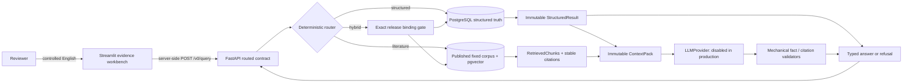

# EndoViHo-RAG

An auditable V0 hybrid RAG engineering foundation for assembly-local endogenous viral element
(EVE) records, exact fixed literature corpora, and provenance-preserving answers.

## Current state

Milestones 1–5 engineering mechanisms are fulfilled locally. Milestone 5 provides the Streamlit
evidence workbench, Docker quick start, machine-readable benchmark and release checklist,
software/data licensing boundaries, citation metadata, and audited distribution packaging.

This is an **engineering preview**, not a scientifically activated V0 release:

- Zhao structured release `release:endoviho-rag:v0:20260826:001` remains candidate-only.
- The approved M3 literature corpus is published, but its source bytes and pinned BGE model are
  not redistributed by Git or the container image.
- No real dataset/corpus binding or structured-target anchors are approved.
- Production accepts only `EVE_RAG_LLM_PROVIDER=disabled`; no prompt, credential, or egress policy
  is approved.
- Human semantic-support review is not approved and has not run.

Synthetic successes remain under `tests/` and cannot be selected through API, CLI, Demo, settings,
or Compose. See the [V0 release checklist](docs/v0_release_checklist.md) for the exact split between
packaging gates and blocked activation gates.

## Architecture



PostgreSQL is the only structured truth source. Literature is explanatory evidence. Generated
text is a presentation layer over immutable upstream results and is accepted only after exact
mechanical checks. Mechanical validation does not prove semantic entailment or biological truth.

The Demo is an HTTP client, not a second application backend: it cannot import the database,
construct an LLM, execute the CLI, choose a route, submit SQL, or use a tests-only capability.

## Docker quick start

Prerequisites: Git and Docker Compose.

```sh
git clone https://github.com/Hongda-Zhao/EndoViHo-RAG.git
cd EndoViHo-RAG
cp .env.example .env
docker compose up --build
```

Open:

- Demo: <http://127.0.0.1:8501>
- API documentation: <http://127.0.0.1:8000/docs>
- process liveness: <http://127.0.0.1:8000/health>

Compose starts `db → migrate → api → demo`. The migration is a one-shot service. API and Demo run
as UID/GID `10001`, with read-only filesystems, dropped capabilities, no-new-privileges, loopback
host ports, and separated backend/frontend networks. `/health` proves process liveness only; it
does not claim that data, a release, a model, or a provider is ready.

A fresh volume is intentionally empty. Compose does not stage Zhao rows, publish a structured
release, ingest literature, download a model, create a binding, add anchors, or enable generation.
Its data-dependent examples therefore return typed fail-closed envelopes. That is the correct
quick-start result, not a degraded success mode.

Stop while preserving the PostgreSQL volume:

```sh
docker compose down
```

To deliberately delete only this Compose project's local database volume, use
`docker compose down --volumes` after confirming no local state is needed.

## Evidence-workbench examples

The Demo ships four fixed selector/question profiles. Users may edit only the English question;
the server still decides the route.

| Family | Example | Fresh-volume outcome |
|---|---|---|
| Structured | `Count distinct included loci in this release.` | `structured_refused` / `release_not_found`; a separately staged pilot is still `release_not_published` |
| Literature | `Explain the literature evidence for endogenous viral elements` | `literature_refused` / `corpus_not_found` because real corpus/model bytes are not bundled |
| Hybrid | `Count distinct included loci in this release. and explain the literature limitations` | `hybrid_binding_unavailable` before structured or literature retrieval |
| Unsupported | `Which host lineage has the highest EVE prevalence?` | `unsupported_request` with all execution flags false |

Every result displays an execution rail:

```text
01 Structured truth  -> 02 Literature evidence -> 03 Constrained generation
```

Each stage is marked `EXECUTED` or `HELD` from canonical server flags. Refusal codes, upstream
codes, structured limitations, anchor diagnostics, generation limitations, validation scope,
document/chunk/checksum provenance, and the validated response envelope remain inspectable.

## API route contract

The outer grammar is deliberately narrow:

| Route | Question shape | Exact selectors |
|---|---|---|
| Structured | M2 `show`, `list`, or `count` grammar | `release_key` only |
| Literature | `Explain the literature evidence/methods/limitations for <topic>` | `corpus_release_key` only |
| Hybrid | one M2 clause plus exactly one terminal literature suffix | both exact release keys |
| Unsupported | any selector mismatch, prohibited topic, or other grammar | no downstream call |

The public routed endpoint is `POST /v0/query`. Clients cannot submit route, SQL, `QueryPlan`,
anchors, provider/model/prompt parameters, citation IDs, or sampling settings.

```sh
curl -sS http://127.0.0.1:8000/v0/query \
  -H 'content-type: application/json' \
  -d '{"release_key":"release:endoviho-rag:v0:20260826:001","question":"Count distinct included loci in this release."}'
```

The CLI uses the same application service:

```sh
uv run eve-relation-rag rag query \
  --release-key release:endoviho-rag:v0:20260826:001 \
  --question "Count distinct included loci in this release."
```

## Frozen scientific state

### Structured pilot

The frozen Zhao et al. v4 candidate covers ten assembly accession.versions and 39,495 selected
VR rows matching `Viral Major Taxon = Orthopolintovirales` and `Class = Bivalvia`.

| Staging result | Verified count |
|---|---:|
| Source calls / coordinate-free locus keys | 39,495 |
| `HCVR = Yes` → source-relative `source_high` | 71 |
| Other HCVR values → source-relative `source_low` | 39,424 |
| `Integration` rows with exact placements | 38,968 |
| `Viral contig` rows retained in quarantine | 527 |
| Exact assemblies / distinct source contigs | 10 / 12,233 |

These confidence labels do not create inclusion decisions or public membership. The repository
contains no flank assessments, inclusion decisions, or published structured memberships.

### Literature pilot

The explicitly approved corpus `corpus:endoviho-rag:v0:20260828:001` contains 11 Europe PMC
CC-BY-4.0 documents, 1,464 chunks, 1,464 embeddings, and 22 curated document/keyword anchors.
Its 13-question pinned-model pilot measured Recall@5 `0.846153846154`, Recall@10 `1.0`,
citation-ID validity `1.0`, and locator validity `1.0`. These metrics describe only that fixed
corpus and model.

The release is bound to:

- corpus manifest `1497ea3383bea64d2bc4f17d2376dceb537b4f6c6f57ccb6eaf667b6589732f0`;
- anchor manifest `75a523bc6408f13b07ba283e6539734ec3b694f3dab59994a464d40d98b01fca`;
- model artifact manifest `0dc66d301fc8305bae93aa197200a176a61be13a302c3fee430cd2efc744241a`;
- trusted receipt `28f436d57630edd8403b71a503d23528fb7a1640432d8f623eca256b68858e7e`.

## Benchmarks and release metadata

- [Benchmark report](docs/benchmark_report.md) and canonical
  [benchmark JSON](benchmark/v0_benchmark_report.json)
- [V0 release checklist](docs/v0_release_checklist.md) and canonical
  [checklist JSON](release/v0_release_checklist.json)
- [Milestone 5 contract](docs/milestone_5_contract.md)
- [Software license](LICENSE), [data/model notice](DATA_LICENSE),
  [citation metadata](CITATION.cff), and [changelog](CHANGELOG.md)

The machine reports use self-excluding canonical SHA-256 values. SHA-256 establishes content
identity; it is not approval, legal permission, semantic proof, or a release signature.

## Key locked parameters

| Parameter | V0 value |
|---|---|
| Python | `>=3.12,<3.13`; container `3.12.13-slim-bookworm` |
| dependency manager | uv `0.12.5`; `uv.lock` |
| Demo | Streamlit `1.62.0`; HTTP timeout 20 s; response cap 2 MiB; identity encoding; zero retries/redirects |
| database | PostgreSQL 16 + pgvector; Alembic head `0010_m3_lock_hardening` |
| literature chunking | pinned BGE tokenizer; target/overlap/hard max `384/64/448` tokens |
| retrieval | English weighted FTS + full-chunk dense + summary dense; RRF60; depth 100 per branch |
| M4 context | maximum 131,072 UTF-8 bytes; maximum 8 chunks and 16 generated claims |
| generation output | maximum 32,768 UTF-8 bytes; temperature 0; retry count 0 |
| local ports | PostgreSQL `5432`, API `8000`, Demo `8501`, all loopback-bound |
| local image | `EVE_RAG_IMAGE=eve-relation-rag:v0-local`; smoke uses a disposable unique tag |

Exact dependency versions and dependency-archive hashes are in `uv.lock`. The locally built
project wheel and sdist are content-audited but neither published nor assigned release hashes.
Container image tags are version-constrained quick-start inputs; they are not claimed to be
byte-reproducible registry digests.

## Development and verification

```sh
. scripts/local-dev-env.sh
uv sync --locked --dev --extra demo
docker compose up -d db
uv run alembic upgrade head
uv run pytest
uv run ruff check .
uv run mypy src app
uv lock --check
uv run alembic check
uv run python scripts/check_m5_artifacts.py --check
```

Install the separately locked local embedding runtime only on a host holding the exact approved
model package:

```sh
uv sync --locked --dev --extra demo --extra local-embeddings
```

Then explicitly configure `EVE_RAG_EMBEDDING_MODEL_PATH`,
`EVE_RAG_EMBEDDING_ARTIFACT_MANIFEST_PATH`, and
`EVE_RAG_EMBEDDING_ARTIFACT_MANIFEST_SHA256`. No document, corpus, model, checksum, release, or
binding is discovered or downloaded automatically.

When the wheel or container is used for the administrative `literature benchmark` or
`corpus-validate` command, pass the exact approved checkout lock as `--uv-lock-path`; a source
checkout uses its root `uv.lock` by default. The lock bytes remain part of the recorded runtime
fingerprint.

## Security and coverage boundary

The Compose profile is a loopback local demo, not production-hardened deployment. It does not add
authentication, authorization, rate limiting, a dedicated read-only query role, TLS, readiness,
backup/restore, multi-tenant isolation, or public hosting. Real deployment requires a separate
threat model and approvals. The separated Compose networks prevent Demo from resolving the
database, but are not claimed as a production outbound firewall; no external provider, credential,
or data-egress path is configured.

The system describes what exact published database/corpus releases contain and where evidence is
located. It must not claim that an LLM proved infection, prevalence, biological absence,
co-divergence, independent integration, or a novel EVE.

Detailed boundaries are in [scientific semantics](docs/data_semantics.md),
[development status](docs/development_status.md), and the repository's
[data provenance](https://github.com/Hongda-Zhao/EndoViHo-RAG/blob/main/data/README.md).
