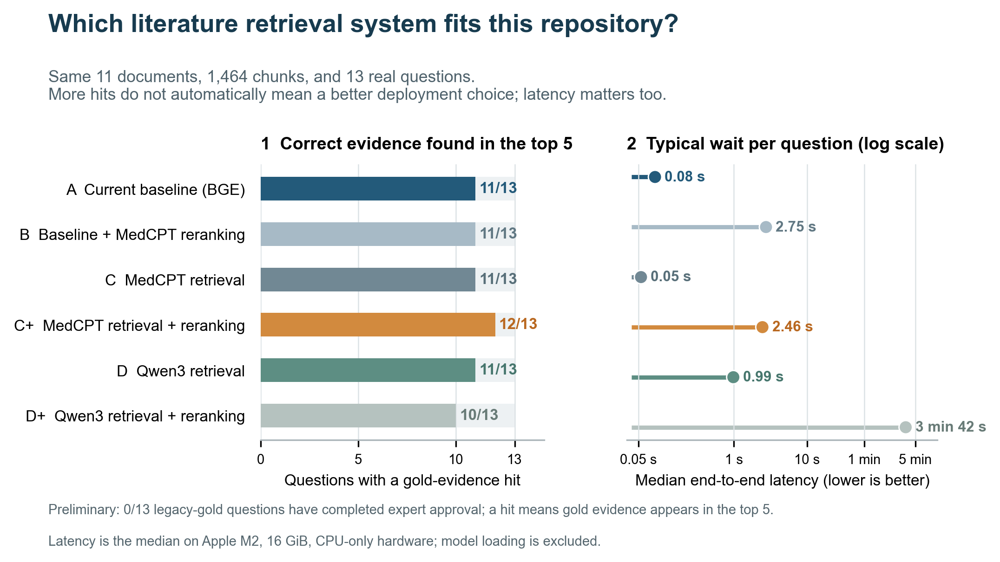

**English** | [简体中文](docs/repository/README.cn.md) | [日本語](docs/repository/README.ja.md)

[](https://github.com/Hongda-Zhao/EndoViHo-RAG/actions/workflows/ci.yml)
[](https://www.python.org/)
[](LICENSE)

# EndoViHo-RAG

**A local research tool that checks EVE data and scientific papers before answering with supporting evidence.**

> This is currently an engineering preview. It is not a published biological knowledge base and
> should not be used to draw new biological conclusions automatically.

## The project in 30 seconds

You can think of RAG as an “open-book exam”: instead of answering only from an AI model's memory,
the system first searches databases and papers, builds an answer from the evidence it finds, and
keeps track of the sources.

```text
You ask a question → Search the EVE database and papers → Find relevant evidence → Assemble an answer → Attach the sources
```

An EVE, or endogenous viral element, is a sequence record in a host genome that originated from a
virus. EndoViHo-RAG is intended to help researchers trace where a record came from, which passage
in a paper supports it, and why the system answered—or declined to answer—the way it did.

This repository mainly provides:

- Source-traceable, structured EVE records in PostgreSQL;
- Keyword and semantic search over a fixed corpus of papers;
- A FastAPI service, command-line interface, and Streamlit web demo;
- A citation-backed answer workflow, with explicit refusals when data or evidence is incomplete;
- Offline, version-pinned, reproducible model-comparison experiments.

It is not an open-ended chatbot. On its own, it also cannot establish infection, prevalence,
independent integration, coevolution, or any other new biological conclusion.

## Latest results: Which literature-retrieval setup is the better fit?

To help the system find the correct passages more reliably, we compared BGE, MedCPT, and Qwen3.
You can think of them as different electronic librarians: a *retrieval model* first selects
candidate passages from all available material, and a *reranking model* then sorts those
candidates again.

All six setups used the same source material, the same questions, and the same retrieval rules.
Only the model combination changed.



*The left panel shows whether the correct evidence was found among the top five results. The right
panel shows how long each question typically took. The right panel uses a logarithmic scale, so
moving farther to the right represents a much larger slowdown.*

### Conclusions first

1. **Keep the current BGE setup for now.** It found the correct evidence for 11 of 13 questions,
   with a typical wait of about 0.08 seconds. It currently offers the best balance of quality and
   speed.
2. **MedCPT retrieval with reranking found the most evidence.** It found the correct evidence for
   12 of 13 questions—one more than the current setup—but its typical wait was about 2.46 seconds,
   making it approximately 29 times slower.
3. **Qwen3 retrieval alone generally ranked the correct evidence higher.** However, it did not
   increase the number of questions with a correct top-5 result, and its typical wait was about
   0.99 seconds, approximately 12 times slower.
4. **The current Qwen3 reranking combination is not a worthwhile tradeoff.** It found the correct
   evidence for only 10 questions, with a typical wait of about 3 minutes 42 seconds.

| Setup | Correct evidence found in top 5 | Evidence-ranking score | Typical wait | Plain-language summary |
|---|---:|---:|---:|---|
| A · Current BGE setup | **11 / 13** | 0.716 | **0.08 seconds** | Best balance at present |
| B · Current setup + MedCPT reranking | 11 / 13 | 0.541 | 2.75 seconds | Slower, with worse ranking |
| C · MedCPT retrieval | 11 / 13 | 0.651 | **0.05 seconds** | Fastest requests, but slightly weaker overall ranking |
| C+ · MedCPT retrieval + reranking | **12 / 13** | 0.599 | 2.46 seconds | Finds one more answer, but is noticeably slower |
| D · Qwen3 retrieval | 11 / 13 | **0.742** | 0.99 seconds | Best ranking, but no additional questions found |
| D+ · Qwen3 retrieval + reranking | 10 / 13 | 0.526 | 3 minutes 42 seconds | Not currently worth adopting |

The “evidence-ranking score” is MRR@10. It ranges from 0 to 1, and a higher value means that the
correct evidence usually appears closer to the top. “Typical wait” is the median end-to-end
latency and does not include the model's initial loading time. A model should not be selected only
by whether it finds the correct evidence somewhere in the top 10, because readers usually care
more about whether the first few results are correct and how long they have to wait.

### Was the comparison fair?

All six setups used:

- The same 11 papers, with byte-for-byte identical files;
- The same 1,464 text chunks, without re-splitting papers for any particular model;
- The same 13 real questions;
- The same keyword retrieval, anchors, RRF fusion rules, and number of returned results;
- The same Apple M2 system with 16 GiB of memory and CPU-only execution;
- Locally stored model files pinned to fixed versions and verified by checksums, with no network
  access at runtime.

The experiment ran in an isolated sidecar environment. It did not overwrite the released corpus,
production embeddings, database dimensions, or production defaults.

> **Important limitation: these are preliminary results, not a formal model-selection
> conclusion.** The existing 13 questions form the legacy gold set. No question has yet completed
> expert approval (`approved = 0`), and there are not enough annotations for question categories,
> alternative evidence, or exclusion evidence. The next step should be to expand the evaluation
> to 30–50 expert-approved questions before deciding whether to replace the current setup.

Full metrics, model versions, resource usage, and reproducibility details are available in the
[technical report](docs/embedding_reranker_ablation.md) and the
[machine-readable results](benchmark/embedding_ablation/).

## What works today?

The code, database migrations, API, CLI, web demo, Docker Compose setup, and automated tests can
all run. However, this repository does not distribute real structured data, full-text papers, or
model weights, and it does not download models automatically. A fresh installation starts with an
empty database. Requests that require unavailable data return an explicit reason for refusal
instead of presenting sample data as though it were real.

The production configuration currently disables the text-generation model. In other words, this
repository already provides an auditable engineering framework and real retrieval experiments,
but it is not yet a complete scientific data product that works out of the box.

## Quick start

You need Git and Docker Compose. The first build requires internet access to download
version-pinned container images and dependencies.

```sh
git clone https://github.com/Hongda-Zhao/EndoViHo-RAG.git
cd EndoViHo-RAG
cp .env.example .env
docker compose up --detach --build --wait
```

After startup, open:

- Web demo: <http://127.0.0.1:8501>
- API documentation: <http://127.0.0.1:8000/docs>
- Health check: <http://127.0.0.1:8000/health>

Check whether the service has started:

```sh
curl -sS -w '\nHTTP %{http_code}\n' http://127.0.0.1:8000/health
```

Expected output:

```text
{"status":"ok","service":"EVE Relation RAG","version":"V0"}
HTTP 200
```

This confirms only that the application has started. It does not mean that real data, papers, or
models have been loaded. To stop the services while keeping the local database:

```sh
docker compose down
```

## Development and verification

The project uses Python 3.12, uv, PostgreSQL 16, and pgvector. The standard validation commands
are:

```sh
. scripts/local-dev-env.sh
uv sync --locked --dev --extra demo
docker compose up -d db
uv run alembic upgrade head
uv run pytest
uv run ruff check .
uv run mypy src app
uv lock --check
uv run alembic check
```

The local embedding runtime must be installed separately:

```sh
uv sync --locked --dev --extra demo --extra local-embeddings
```

Models must be loaded explicitly from a local directory pinned to a fixed revision and verified
against a SHA-256 manifest. The system does not automatically discover or download models, data,
papers, releases, or bindings.

## Further reading

- [Full embedding and reranker experiment report](docs/embedding_reranker_ablation.md)
- [Experiment design and safety boundaries](docs/embedding_ablation_design.md)
- [Location of the experiment code in this repository](docs/embedding_ablation_repo_mapping.md)
- [Phase 1 implementation notes](docs/embedding_ablation_phase1.md)
- [MedCPT 768-dimensional sidecar proposal](docs/embedding_ablation_768_sidecar_proposal.md)
- [Machine-readable experiment output](benchmark/embedding_ablation/)
- [Script used to generate the README figure](scripts/plot_readme_embedding_ablation.py)
- [Data semantics and scientific boundaries](docs/data_semantics.md)
- [Data source information](data/README.md)

## License and citation

The software is available under the [MIT License](LICENSE). Data, papers, and models remain subject
to their respective source licenses; see [DATA_LICENSE](DATA_LICENSE). Citation information is
provided in [CITATION.cff](CITATION.cff).
