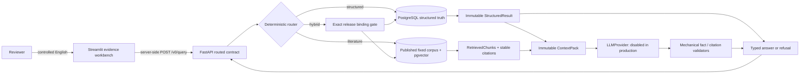

# EndoViHo-RAG

An auditable V0 hybrid RAG engineering foundation for assembly-local endogenous viral element
(EVE) records, exact fixed literature corpora, and provenance-preserving answers.

## 30 秒看懂这个项目

> **RAG 就是“先查资料，再回答问题”。** AI 不直接凭记忆猜答案，而是先查数据库和论文，
> 然后根据找到的证据回答，并告诉你证据来自哪里。

EndoViHo-RAG 用来查询和解释内源性病毒元件（EVE）资料：

```text
你提出问题 → 查询 EVE 数据库 → 查找相关论文 → 整理证据 → 返回带引用的回答
```

它主要做五件事：

1. 保存 EVE 记录，并保留每条记录的来源、坐标和检查状态；
2. 回答固定范围内的数量、列表和详情问题；
3. 从经过批准的论文语料中寻找相关段落；
4. 把数据库事实和论文解释组合成带引用的答案；
5. 当数据、版本或证据对不上时，明确拒绝回答，而不是编造结果。

**当前状态：**核心代码、API、命令行、网页 Demo、Docker 和自动测试可以运行。仓库默认
不附带已发布的结构化数据、论文语料或模型，因此适合本地开发和研究验证，但不能被描述为
已经正式发布的完整生物学知识产品。

这个项目不是开放式聊天机器人，也不能证明感染、流行率、独立整合或其他新的生物学结论。
它的目标是：**在一个固定、可追踪的数据范围内，给出能够回到原始记录和论文段落核对的答案。**

## Current state

This is an **engineering preview**, not a scientifically activated release:

- Zhao structured release `release:endoviho-rag:v0:20260826:001` remains candidate-only.
- Literature source bytes and the pinned BGE model are not redistributed by Git or the container
  image.
- No real dataset/corpus binding or structured-target anchors are approved.
- Production accepts only `EVE_RAG_LLM_PROVIDER=disabled`; no prompt, credential, or egress policy
  is approved.
- Synthetic fixtures remain isolated under `tests/` and cannot be selected through API, CLI,
  Demo, settings, or Compose.

## Architecture



PostgreSQL is the only structured truth source. Literature is explanatory evidence. Generated
text is a presentation layer over immutable upstream results and is accepted only after exact
mechanical checks. Mechanical validation does not prove semantic entailment or biological truth.

The Demo is an HTTP client, not a second application backend: it cannot import the database,
construct an LLM, execute the CLI, choose a route, submit SQL, or use a tests-only capability.

## 运行方法（Docker Compose quick start）

**可以运行。** 容器镜像可构建，`db → migrate → api → demo` 可依次启动并通过健康检查；
测试、Ruff 和严格 mypy 由 GitHub CI 持续验证。这说明工程预览可以本地运行，不代表尚未
随仓库分发的数据、模型和真实生成能力已经激活。

Prerequisites: Git and Docker Compose. The first build needs network access to pull the pinned
base images and dependency archives.

### 1. 启动服务

```sh
git clone https://github.com/Hongda-Zhao/EndoViHo-RAG.git
cd EndoViHo-RAG
cp .env.example .env
docker compose up --detach --build --wait
```

`.env.example` 只包含本地 Demo 默认值，不能作为生产配置。启动完成后打开：

- Demo: <http://127.0.0.1:8501>
- API documentation: <http://127.0.0.1:8000/docs>
- process liveness: <http://127.0.0.1:8000/health>

### 2. 确认启动输出

```sh
curl -sS -w '\nHTTP %{http_code}\n' http://127.0.0.1:8000/health
```

Expected output:

```text
{"status":"ok","service":"EVE Relation RAG","version":"V0"}
HTTP 200
```

Compose starts `db → migrate → api → demo`. The migration is a one-shot service. API and Demo run
as UID/GID `10001`, with read-only filesystems, dropped capabilities, no-new-privileges, loopback
host ports, and separated backend/frontend networks. `/health` proves process liveness only; it
does not claim that data, a release, a model, or a provider is ready.

A fresh volume is intentionally empty. Compose does not stage Zhao rows, publish a structured
release, ingest literature, download a model, create a binding, add anchors, or enable generation.
Its data-dependent examples therefore return typed fail-closed envelopes. That is the correct
quick-start result, not a degraded success mode. A `200` response from `/health` proves only that
the API process is alive; the data-dependent example below is the expected way to verify the
empty-volume behavior.

### 3. 停止服务

Stop while preserving the PostgreSQL volume:

```sh
docker compose down
```

To deliberately delete only this Compose project's local database volume, use
`docker compose down --volumes` after confirming no local state is needed.

## Evidence-workbench examples

The Demo ships four fixed selector/question profiles. Users may edit only the English question;
the server still decides the route.

| Family | Example | Fresh-volume outcome |
|---|---|---|
| Structured | `Count distinct included loci in this release.` | `structured_refused` / `release_not_found`; a separately staged pilot is still `release_not_published` |
| Literature | `Explain the literature evidence for endogenous viral elements` | `literature_refused` / `corpus_not_found` because real corpus/model bytes are not bundled |
| Hybrid | `Count distinct included loci in this release. and explain the literature limitations` | `hybrid_binding_unavailable` before structured or literature retrieval |
| Unsupported | `Which host lineage has the highest EVE prevalence?` | `unsupported_request` with all execution flags false |

Every result displays an execution rail:

```text
01 Structured truth  -> 02 Literature evidence -> 03 Constrained generation
```

Each stage is marked `EXECUTED` or `HELD` from canonical server flags. Refusal codes, upstream
codes, structured limitations, anchor diagnostics, generation limitations, validation scope,
document/chunk/checksum provenance, and the validated response envelope remain inspectable.

## API 与 CLI 输入/输出示例

The outer grammar is deliberately narrow:

| Route | Question shape | Exact selectors |
|---|---|---|
| Structured | controlled `show`, `list`, or `count` grammar | `release_key` only |
| Literature | `Explain the literature evidence/methods/limitations for <topic>` | `corpus_release_key` only |
| Hybrid | one structured clause plus exactly one terminal literature suffix | both exact release keys |
| Unsupported | any selector mismatch, prohibited topic, or other grammar | no downstream call |

The public routed endpoint is `POST /v0/query`. Clients cannot submit route, SQL, `QueryPlan`,
anchors, provider/model/prompt parameters, citation IDs, or sampling settings.

The request fields are:

| Field | Required | Meaning |
|---|---|---|
| `question` | yes | One printable-ASCII English line, 1–2,000 characters |
| `release_key` | structured/hybrid only | Exact published structured-release selector |
| `corpus_release_key` | literature/hybrid only | Exact published corpus selector |
| `page` | no | Structured-list pagination; valid only with `release_key` |
| `literature_top_k` | no | Literature retrieval depth `1..8`; valid only with `corpus_release_key` |

### Asfarviridae 与 asfa-like：三个相互隔离的谱系级别

病毒谱系查询现在保留三个明确角色，避免把“相似/亲缘”标签冒充正式分类：

| Query qualifier | Result role | Scheme | Meaning |
|---|---|---|---|
| `formal viral lineage` | `formal_viral_taxonomy` | `formal_taxonomy` | 精确的版本化 ICTV 分类，例如正式 `Asfarviridae` |
| `study viral lineage` | `study_viral_lineage` | `study_defined` | 某一研究或来源直接使用的谱系标签 |
| `extended viral lineage` | `extended_viral_lineage` | `study_defined` | 版本化的扩展亲缘组，例如 `asfa-like`；不是 ICTV taxon |

严格查询不会被自动扩大：

```text
List loci with formal viral lineage Asfarviridae including descendants.
```

需要把正式 Asfarviridae 与有证据支持的 asfa-like 分支一起纳入时，应显式查询扩展层：

```text
List loci with extended viral lineage asfa-like including descendants.
```

发布数据必须在扩展 snapshot 中为每个纳入 locus 提供独立的
`extended_viral_lineage` assertion、supporting evidence 和 public membership。系统不会通过
别名或字符串相似度把 formal 与 asfa-like 自动合并；`including descendants` 也只有在该
release receipt 证明扩展谱系 closure 完整时才能执行。

成功响应中的每个扩展标签都会保留来源层级。以下 JSON 是结构伪例，不是当前仓库的真实
Asfarviridae/asfa-like locus 记录：

```json
{
  "canonical_name": "Asfarviridae-like",
  "rank": "extended lineage",
  "snapshot_key": "lineage-snapshot:extended:<approved-snapshot>",
  "authority_namespace": "curated-extended-viral-lineage",
  "snapshot_version": "example-v1",
  "scheme_kind": "study_defined",
  "role": "extended_viral_lineage",
  "term_key": "extended:asfarviridae-like"
}
```

当前 Git 仓库只加入了上述查询、约束和发布校验机制；尚未加入或发布真实 asfa-like
structured loci。真实结果仍需要新的 checksum-pinned 来源、逐 locus 证据、人工审阅和新的
immutable dataset release。全新 Compose volume 对这两个查询仍按下例返回
`release_not_found`，不会生成示例 accession、坐标或数量。

### Example 1 — structured input on a fresh volume

```sh
curl -sS -w '\nHTTP %{http_code}\n' http://127.0.0.1:8000/v0/query \
  -H 'content-type: application/json' \
  -d '{"release_key":"release:endoviho-rag:v0:20260826:001","question":"Count distinct included loci in this release."}'
```

Expected output from a newly created Compose volume:

```text
{"code":"structured_refused","execution":{"generation_executed":false,"literature_retrieval_executed":false,"structured_retrieval_executed":false},"message":"The exact structured query was refused.","requested_corpus_release_key":null,"requested_release_key":"release:endoviho-rag:v0:20260826:001","response_kind":"error","response_schema_version":"rag-error-v1","route":"structured","upstream_code":"release_not_found"}
HTTP 404
```

`structured_refused` / `release_not_found` is expected: the image contains the application and
schema migrations, but it does not silently stage or publish the candidate Zhao dataset.

### Example 2 — unsupported input is rejected before execution

```sh
curl -sS -w '\nHTTP %{http_code}\n' http://127.0.0.1:8000/v0/query \
  -H 'content-type: application/json' \
  -d '{"question":"Which host lineage has the highest EVE prevalence?"}'
```

Expected output:

```text
{"code":"unsupported_request","execution":{"generation_executed":false,"literature_retrieval_executed":false,"structured_retrieval_executed":false},"message":"The question is outside the approved routed query grammar.","requested_corpus_release_key":null,"requested_release_key":null,"response_kind":"error","response_schema_version":"rag-error-v1","route":"unsupported","upstream_code":null}
HTTP 422
```

All three execution flags are `false`, so this refusal occurs before structured retrieval,
literature retrieval, or generation.

### CLI input and output

The CLI uses the same application service. After Docker quick start, run it inside the API
container from a second terminal:

```sh
docker compose exec -T api eve-relation-rag rag query \
  --release-key release:endoviho-rag:v0:20260826:001 \
  --question "Count distinct included loci in this release."
```

On a fresh volume, `stdout` is empty, `stderr` is the same `structured_refused` JSON shown in
Example 1 (without the `HTTP 404` line), and the process exit code is `4`. Source-checkout
developers can run the equivalent command with `uv run eve-relation-rag rag query ...` after
installing the locked development environment below.

## Data availability

Large source datasets, literature bytes, embeddings, and model weights are intentionally not
stored in Git. Small source manifests and audit records remain under [`data/`](data/README.md) so
local imports can verify exact provenance. See [scientific semantics](docs/data_semantics.md) for
the distinction between source claims, evidence, public membership, and generated answers.

Software licensing, data/model notices, and citation metadata are recorded in [LICENSE](LICENSE),
[DATA_LICENSE](DATA_LICENSE), and [CITATION.cff](CITATION.cff).

## Key locked parameters

| Parameter | V0 value |
|---|---|
| Python | `>=3.12,<3.13`; container `3.12.13-slim-bookworm` |
| dependency manager | uv `0.12.5`; `uv.lock` |
| Demo | Streamlit `1.62.0`; HTTP timeout 20 s; response cap 2 MiB; identity encoding; zero retries/redirects |
| database | PostgreSQL 16 + pgvector; Alembic head `0012_extended_viral_lineage` |
| literature chunking | pinned BGE tokenizer; target/overlap/hard max `384/64/448` tokens |
| retrieval | English weighted FTS + full-chunk dense + summary dense; RRF60; depth 100 per branch |
| context pack | maximum 131,072 UTF-8 bytes; maximum 8 chunks and 16 generated claims |
| generation output | maximum 32,768 UTF-8 bytes; temperature 0; retry count 0 |
| local ports | PostgreSQL `5432`, API `8000`, Demo `8501`, all loopback-bound |
| local image | `EVE_RAG_IMAGE=eve-relation-rag:v0-local`; smoke uses a disposable unique tag |

Exact dependency versions and dependency-archive hashes are in `uv.lock`. The locally built
project wheel and sdist are content-audited but neither published nor assigned release hashes.
Container image tags are version-constrained quick-start inputs; they are not claimed to be
byte-reproducible registry digests.

## Development and verification

```sh
. scripts/local-dev-env.sh
uv sync --locked --dev --extra demo
docker compose up -d db
uv run alembic upgrade head
uv run pytest
uv run ruff check .
uv run mypy src app
uv lock --check
uv run alembic check
```

Install the separately locked local embedding runtime only on a host holding the exact approved
model package:

```sh
uv sync --locked --dev --extra demo --extra local-embeddings
```

Then explicitly configure `EVE_RAG_EMBEDDING_MODEL_PATH`,
`EVE_RAG_EMBEDDING_ARTIFACT_MANIFEST_PATH`, and
`EVE_RAG_EMBEDDING_ARTIFACT_MANIFEST_SHA256`. No document, corpus, model, checksum, release, or
binding is discovered or downloaded automatically.

When the wheel or container is used for the administrative `literature benchmark` or
`corpus-validate` command, pass the exact approved checkout lock as `--uv-lock-path`; a source
checkout uses its root `uv.lock` by default. The lock bytes remain part of the recorded runtime
fingerprint.

## Security and coverage boundary

The Compose profile is a loopback local demo, not production-hardened deployment. It does not add
authentication, authorization, rate limiting, a dedicated read-only query role, TLS, readiness,
backup/restore, multi-tenant isolation, or public hosting. Real deployment requires a separate
threat model and approvals. The separated Compose networks prevent Demo from resolving the
database, but are not claimed as a production outbound firewall; no external provider, credential,
or data-egress path is configured.

The system describes what exact published database/corpus releases contain and where evidence is
located. It must not claim that an LLM proved infection, prevalence, biological absence,
co-divergence, independent integration, or a novel EVE.

Detailed boundaries are in [scientific semantics](docs/data_semantics.md) and the repository's
[data provenance](data/README.md).
